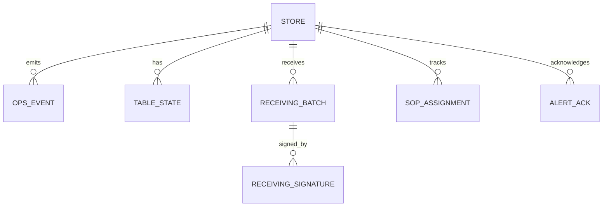

# Phase 1 数据模型

**OpsEvent · 持久化 · 规划实体**

| 项目 | 内容 |
|------|------|
| 版本 | V1.0 |
| 代码 | `shared/schemas.py` · `cloud/event_hub/db.py` · `pg_db.py` |
| 更新 | 2026-06-15 |

---

## 1. 统一事件 OpsEvent

所有子系统产出同一结构（`shared/schemas.py`）：

| 字段 | 类型 | 必填 | 说明 |
|------|------|:----:|------|
| event_id | UUID string | 自动 | 全局唯一 |
| event_type | string | ✅ | 业务类型，见 §2 |
| source | string | ✅ | vision / iot / pos / system |
| level | string | ✅ | info / warn / critical |
| store_id | string | ✅ | 租户 |
| message | string | ✅ | 人类可读摘要 |
| timestamp | ISO8601 | 自动 | UTC |
| zone | string | | front / kitchen / storage / receiving |
| table_id | string | | 桌号 |
| confidence | float | | 0~1 |
| metadata | object | | 扩展 |

**设计原则**：禁止各模块私有 JSON 直写 Hub；扩展走 `metadata`。

---

## 2. event_type 词表（Phase 1）

| 域 | 类型常量 | 示例 event_type |
|----|----------|-----------------|
| 桌态 | TABLE_STATES | 状态变更事件 |
| 后厨穿戴 | KITCHEN_VIOLATIONS | kitchen_no_hat, kitchen_smoke |
| IoT 告警 | IOT_ALERT_TYPES | cold_chain_high, gas_leak |
| SOP | SOP_EVENT_TYPES | sop_violation, sop_completed |
| 成本 | COST_EVENT_TYPES | cost_weight_short, cost_quality_reject |
| 全链路 | IOT_LIFECYCLE_EVENTS | iot_weight_short, iot_door_open_timeout |

---

## 3. 桌态 TableState

| 字段 | 说明 |
|------|------|
| table_id | T01~T08（可配置） |
| state | empty \| dining \| need_clean \| checkout |
| confidence | CV 置信度 |
| updated_at | ISO8601 |

存储：`store_snapshots` kind=`tables` 或内存聚合。

---

## 4. 已实现表结构

### 4.1 events

| 列 | SQLite/PG | 说明 |
|----|-----------|------|
| event_id | TEXT PK | |
| store_id | TEXT | 索引 |
| level | TEXT | |
| source | TEXT | |
| payload | TEXT/JSONB | 完整 OpsEvent JSON |
| created_at | TEXT/TIMESTAMPTZ | 索引 DESC |

保留：每店最多 500 条热数据（`MAX_EVENTS_PER_STORE`），超出滚动。

### 4.2 store_snapshots

| 列 | 说明 |
|----|------|
| store_id + kind | PK；kind 如 tables, sop, cost, pos, erp, iot |
| payload | JSON 快照 |
| updated_at | |

### 4.3 alert_pushes / alert_acks（AlertGateway SQLite 侧车）

| 表 | 用途 |
|----|------|
| alert_pushes | 企微推送记录 |
| alert_acks | ack 人、时间、note |

路径：`demo/data/alert_push.log` + DB 表（gateway 内）。

---

## 5. Phase 1 规划表（DEV-420~422）

| 表 | 用途 | DEV |
|----|------|-----|
| `receiving_batches` | PDA 验收批次 | DEV-419 |
| `receiving_signatures` | 双人签字 | DEV-420 |
| `sop_assignments` | 违规指派工单 | DEV-421 |
| `daily_reports` | 日报 Markdown + meta | DEV-423 |
| `iot_readings` | 时序温湿度（可选简化） | DEV-412 |

### 5.1 receiving_batches（草案）

| 列 | 类型 | 说明 |
|----|------|------|
| batch_id | TEXT PK | RCV-xxx |
| store_id | TEXT | |
| po_id | TEXT | ERP PO |
| sku | TEXT | |
| weight_kg | REAL | 实收 |
| po_weight_kg | REAL | PO |
| variance_pct | REAL | |
| vlm_grade | TEXT | A/B/C/D |
| temp_c | REAL | 探针 |
| status | TEXT | submitted / rejected |
| created_at | TIMESTAMPTZ | |

### 5.2 receiving_signatures

| 列 | 说明 |
|----|------|
| batch_id | FK |
| role | receiver / chef |
| signed_by | 用户名 |
| signed_at | |

### 5.3 sop_assignments

| 列 | 说明 |
|----|------|
| assignment_id | PK |
| store_id | |
| sop_id | |
| assignee | |
| due_at | |
| status | open / done / verified |

---

## 6. 店级配置（JSON，非 DB）

路径：`demo/data/stores/<store_id>/`

| 文件 | 内容 |
|------|------|
| seed.json | 灌库初始数据 |
| sop_signals_noon.json | SOP 输入信号 |
| live/*.json | 管道运行时产物 |

**生产目标** `config.json`（见 design_dev §1.3.1）：

```json
{
  "store_id": "store_yuhuan",
  "store_name": "冯校长火锅·玉环店",
  "cameras": [{ "id": "front_01", "rtsp": "rtsp://...", "rois": [] }],
  "iot_gateway": { "mqtt_broker": "mqtt://127.0.0.1:1883", "topics": [] },
  "hub_url": "http://10.1.12.17:8088",
  "model_version": "table_v1.0.0"
}
```

DEV-407/408 交付两店正式 config。

---

## 7. 存储选型（Phase 1）

| 数据 | 试点推荐 | 全国目标 |
|------|----------|----------|
| 事件+快照 | PostgreSQL（staging）/ SQLite（dev） | PostgreSQL |
| IoT 时序 | Hub 快照 + 可选 iot_readings 表 | TimescaleDB |
| 截图 | 本地目录 demo | OSS |
| 推送日志 | SQLite 侧车 | PG 表 |

**ADR**：见 [architecture_decisions.md](architecture_decisions.md) ADR-003。

---

## 8. ER 关系（Phase 1 子集）


