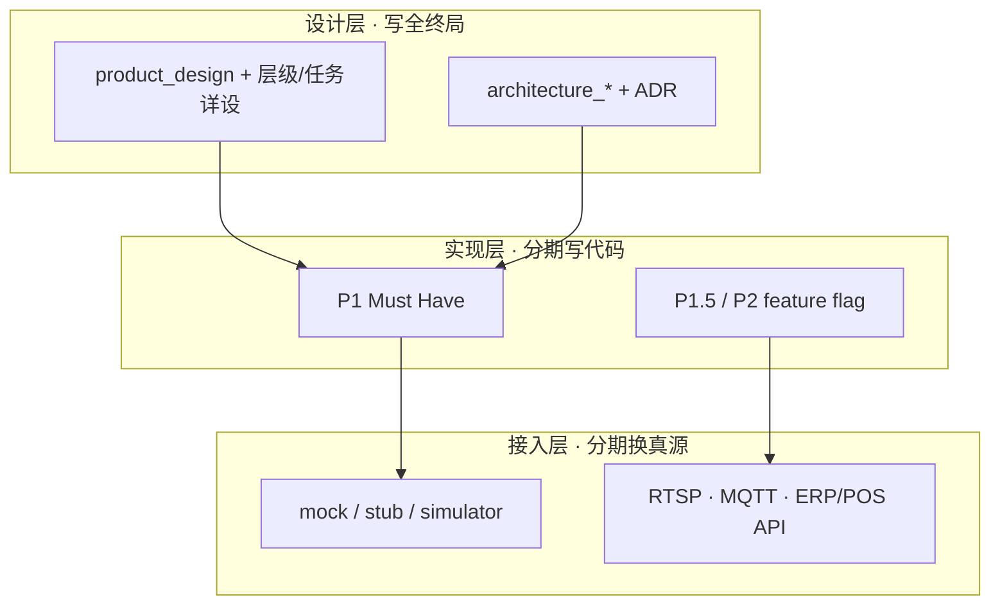
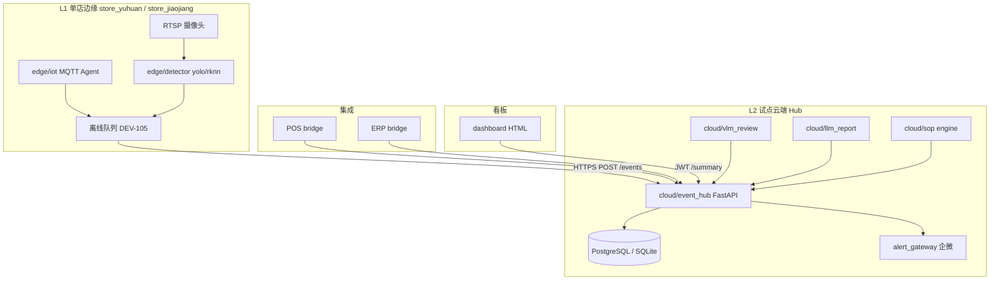

# 架构设计文档索引

**冯校长火锅 · 智能运营 · Phase 1 试点**

| 项目 | 内容 |
|------|------|
| 版本 | V1.6 |
| 更新 | 2026-06-19 |
| 前置 | 产品设计规格 OK · [product_design_index.md](product_design_index.md) |
| 评审 | [architecture_review_checklist.md](architecture_review_checklist.md)（AR-401） |
| 会议 | [ar401_meeting_invite_20260618.md](ar401_meeting_invite_20260618.md) · **6/18 10:00** |

---

## 1. 架构 vs 产品：分工

| 维度 | 产品（已完成规格） | 架构（本阶段） |
|------|-------------------|----------------|
| 回答 | 用户要什么、页面与验收 | 怎么建、怎么部署、怎么扩展 |
| 文档 | product_design.md · user_story_map | design_dev_implementation_plan §1 · solution §9~11 |
| 评审 | PM-401 / PM-402 | **AR-401 架构评审** |
| 产出 | F-xxx · US-xxx | 模块边界 · API/DB · 部署 · 差距关闭计划 |

### 1.1 设计 · 实现 · 接入三轨道

> **总原则**：[architecture_decisions.md ADR-013](architecture_decisions.md#adr-013设计先行实现与真数据接入分期) · 产品侧 [product_design.md §2.1](product_design.md#21-设计完整性-vs-分期交付)

| 轨道 | 何时读 | 评审问什么 |
|------|--------|------------|
| 设计 | 立项、AR-401、新功能族 | 终局是否写清？API/事件契约是否预留？ |
| 实现 | Sprint、UAT、Go-Live | 当前 Phase 交付物是否满足验收表？ |
| 接入 | BL-01~04、现场部署 | stub 替换路径与 DEV 任务是否对齐？ |

**禁止**：用「还在打桩」缩小产品设计范围；用「文档未写」为临时实现开绿灯。

### 1.2 产品 ↔ 架构 对齐检查（评审用）

| 检查项 | 产品文档 | 架构文档 | 状态 |
|--------|----------|----------|------|
| 功能 ID 完整 | `product_design.md` §5 | `architecture_api_spec.md` §6 | ✅ V1.2 |
| 全国层级 | `product_hierarchy_national_chain.md` | `architecture_hierarchy_phase_plan.md` | ✅ |
| F-EXEC01 vs F-HQ12 | 驾驶仓 P1 · national UI P2 | API 双挂 §2.7 | ✅ |
| F-TASK | §5.4.1 · task 详设 | api §3 · data §5.4~5.5 | ✅ |
| DEV 编号 | `sprint_task_backlog` §12.1 | hierarchy §8 · task §13 | ✅ |
| 角色目标态 | PRD §9 + §9.1 | DEV-503/528~530 | ✅ |
| ADR | product §2.1 P8 | ADR-001~016 | ✅ |
| 后厨损耗预测切入口 | PRD §1.3.1 · F-C06~07 | ADR-016 · phase1 C-05 lead loop | ✅ |

---

## 2. 读什么、什么时候读

| 场景 | 文档 | 章节 |
|------|------|------|
| **设计 vs 分期交付（总原则）** | [architecture_decisions.md ADR-013](architecture_decisions.md#adr-013设计先行实现与真数据接入分期) | product_design §2.1 |
| **开发交付主计划** | [development_delivery_plan.md](development_delivery_plan.md) | 全文 · 同步机制 §2 |
| **15 分钟 Phase 1 规格** | [architecture_design_phase1.md](architecture_design_phase1.md) | **V1.2** 全文 |
| **后厨损耗预测 lead loop** | [kitchen_loss_prediction_wedge_plan.md](kitchen_loss_prediction_wedge_plan.md) | P1A/P1B/P1C |
| **全国连锁层级 · 分阶段** | [architecture_hierarchy_phase_plan.md](architecture_hierarchy_phase_plan.md) | 全文 |
| 30 分钟架构总览 | [design_dev_implementation_plan.md](design_dev_implementation_plan.md) | §1.1~1.2 目标与三层架构 |
| 模块与数据流 | 同上 | §1.3 模块 · §1.2.3 六闭环 C-01~C06 |
| REST API 目录 | [architecture_api_spec.md](architecture_api_spec.md) | **V1.2** 全量 · PRD 主映射 §6 |
| 数据模型 / 表结构 | [architecture_data_model_phase1.md](architecture_data_model_phase1.md) | **V1.2** OpsEvent · tasks · 组织 · 追溯 · loss features |
| 部署拓扑 | [architecture_deployment_phase1.md](architecture_deployment_phase1.md) | docker · systemd · 两店 |
| **业务/Admin 分离（nginx）** | [deploy/nginx/README.md](../deploy/nginx/README.md) | combined · 子域 · 双端口 |
| 架构决策 ADR | [architecture_decisions.md](architecture_decisions.md) | ADR-001~016 |
| 事件模型 / ER / 存储 | design_dev | §1.4 数据设计 |
| 部署与安全 | design_dev | §1.5~1.6 |
| PoC → 生产差距 | [poc_to_production_gap.md](poc_to_production_gap.md) | 全文 |
| 代码模块映射 | design_dev §2.5 | 对照仓库目录 |
| 研发排期 | [sprint_task_backlog.md](sprint_task_backlog.md) | §6.1 UAT 阻塞 = 架构落地项 |
| 硬件与现场 | [solution.md](solution.md) | §11 部署架构 |
| **架构评审会议** | [architecture_review_checklist.md](architecture_review_checklist.md) | AR-401 |
| 会后回填 | [architecture_review_outcome_template.md](architecture_review_outcome_template.md) | 通过/有条件/不通过 |
| **AR-401 文档复核结论（6/16）** | [ar401_review_outcome_20260616.md](ar401_review_outcome_20260616.md) | 文档层有条件通过 · phase1 V1.1 |

---

## 3. 逻辑架构（Phase 1 试点范围）

**Phase 1 刻意不做**：L3 总部中台、K8s 多区域、SOP OTA 配置中心（见 PRD Won't Have）。

---

## 4. 架构评审范围（AR-401 Must Confirm）

| # | 评审域 | 设计依据 | PoC 现状 | 评审要问 |
|---|--------|----------|----------|----------|
| A1 | 三层边界 L1/L2/L3 | §1.2.1 | L1+L2 雏形，L3 无 | Phase 1 是否仅 L1+L2 单 Hub |
| A2 | 六业务闭环 C-01~C06 | §1.2.3 | 逻辑可演示 | 每闭环真数据断点 |
| A3 | OpsEvent 统一模型 | §1.4.1 · shared/schemas | ✅ 已有 | 字段是否够生产 |
| A4 | Hub API 与版本化 | §1.4.4 | 无 /v1 前缀 | 是否 Phase 1 统一 /v1 |
| A5 | 持久化 PostgreSQL | §1.4.3 | SQLite 可切换 | 试点默认 PG 还是 SQLite |
| A6 | 边缘离线 24h | §1.3.1 EdgeQueue | DEV-105 部分 | 队列实现选型 |
| A7 | CV 推理链 | §1.3.1 | mock 默认 | yolo/rknn 生产路径 |
| A8 | IoT 真实接入 | §1.3.1 | iot_mock | MQTT topic 与店级映射 |
| A9 | 告警网关 | §1.6 | alert_gateway mock | 企微 + ack 审计表 |
| A10 | 鉴权多租户 | §1.6 | JWT demo | store 隔离 enforcement |
| A11 | 部署形态 | §1.5 · docker-compose | 单机 PoC | 两店 staging 拓扑 |
| A12 | 安全合规 | §1.6 · solution §15 | 基础 | HTTPS、密钥、视频留存 |

---

## 5. 架构阶段 DoD（评审通过标准）

| # | 交付物 | 文档 | 状态 |
|---|--------|------|------|
| 1 | 逻辑架构 L1/L2 Phase 1 边界 | architecture_design_phase1.md §2 | ✅ 文档 · ⬜ AR-401 签字 |
| 2 | 六闭环 C-01~C06 与代码映射 | architecture_design_phase1.md §3 | ✅ 文档 · ⬜ 签字 |
| 3 | OpsEvent + API 清单 | architecture_api_spec.md | ✅ 文档 · ⬜ 签字 |
| 4 | 存储方案 PG/SQLite | architecture_data_model_phase1.md · ADR-003 | ✅ 文档 · ⬜ 拍板 |
| 5 | 边缘部署 RK3588/systemd | architecture_deployment_phase1.md | ✅ 文档 · ⬜ 签字 |
| 6 | gap P0 关闭计划 ↔ DEV | poc_to_production_gap + sprint §6.1 | ✅ 映射 · ⬜ 签字 |
| 7 | 安全 HTTPS/鉴权/密钥 | ADR + deployment §7 | ✅ 文档 · ⬜ 签字 |
| 8 | AR-401 评审签字 | architecture_review_outcome_template.md | ⬜ |
| 9 | ADR 提议中项拍板 | architecture_decisions.md | ⬜ AR-401 |
| 10 | 架构变更可追溯 | architecture_changelog.md | ✅ V1.0 |

**与产品 DoD 关系**：产品 #10 PM-401 与架构 #8 AR-401 可 **同一周前后召开**；产品 #11 PM-402 与架构落地 **并行**。

---

## 6. 与 UAT 阻塞项（BL）映射

| BL | 产品功能 | 架构评审必确认 |
|----|----------|----------------|
| BL-01 | F-T01 真桌态 | CV 链：RTSP→ROI→yolo/rknn→Hub |
| BL-02 | F-K01~K02 IoT | MQTT Agent、时序存储、门磁规则 |
| BL-03 | F-A04 企微 | AlertGateway webhook、推送日志表 |
| BL-04 | F-P01~P06 PDA | POST /receiving/submit、ERP/VLM 集成 |
| BL-05 | 签字审计 | receiving_signatures、audit API |
| BL-06 | F-R01 日报 | APScheduler + report 持久化 |
| BL-07 | RBAC | JWT claims + 前端守卫 |
| BL-08 | 概念测试 | 非架构项 |

---

## 7. 建议时间线（与产品并行）

| 日期 | 产品 | 架构 |
|------|------|------|
| 6/17 周三 | PM-401 产品评审 14:00 | — |
| **6/18 周四** | 产品修订项关闭 | **AR-401 架构评审 10:00** |
| 6/19~6/20 | PM-402 店长测试 | 研发按 AR-401 结论启动 BL 专项 |
| 6/27 前 | IMP-402 预审 | staging 24h + 八条 BL 清零 |

---

## 8. 文档关系

| 文档 | 职责 |
|------|------|
| **architecture_design_index.md** | 本索引 · DoD · BL 映射 |
| [architecture_design_phase1.md](architecture_design_phase1.md) | Phase 1 架构规格（可读主文档） |
| [kitchen_loss_prediction_wedge_plan.md](kitchen_loss_prediction_wedge_plan.md) | 创业切入口：后厨损耗预测 lead loop |
| [architecture_api_spec.md](architecture_api_spec.md) | REST API V1.2 · PRD 主映射 §6 |
| [architecture_data_model_phase1.md](architecture_data_model_phase1.md) | 数据模型 V1.2 · OpsEvent · tasks · 组织 · loss features |
| [architecture_deployment_phase1.md](architecture_deployment_phase1.md) | docker · systemd · 两店拓扑 |
| [architecture_decisions.md](architecture_decisions.md) | ADR-001~016 |
| [architecture_changelog.md](architecture_changelog.md) | 架构变更日志 |
| [architecture_review_checklist.md](architecture_review_checklist.md) | AR-401 评审清单 |
| [ar401_meeting_invite_20260618.md](ar401_meeting_invite_20260618.md) | 会议邀请定稿 |
| [ar401_meeting_agenda_20260618.html](ar401_meeting_agenda_20260618.html) | 可打印议程 |
| [architecture_review_outcome_template.md](architecture_review_outcome_template.md) | 会后回填 |
| [ar401_review_outcome_20260616.md](ar401_review_outcome_20260616.md) | AR-401 文档复核结论 |
| [solution.md](solution.md) | 业务方案 · 技术全景 |
| [development_delivery_plan.md](development_delivery_plan.md) | **主计划** · 同步 · HLD/LLD/DB · 测试回归 |
| [design_dev_implementation_plan.md](design_dev_implementation_plan.md) | 长文架构 §1（演进参考） |
| [poc_to_production_gap.md](poc_to_production_gap.md) | 差距 · 评审输入 |
| [product_design.md](product_design.md) | 产品需求 · 架构约束来源 |
| [sprint_task_backlog.md](sprint_task_backlog.md) | 落地任务 DEV-xxx |

---

## 9. 下一步

1. 发送 **AR-401** 邀请（6/18 10:00）· [ar401_meeting_invite_20260618.md](ar401_meeting_invite_20260618.md)
2. 研发负责人会前交付： [ar401_code_directory_mapping.md](ar401_code_directory_mapping.md)（代码目录 vs design_dev §2.5）
3. 评审后 48h 内填写 [architecture_review_outcome_template.md](architecture_review_outcome_template.md)
4. ADR 提议中 → 已采纳；修订项并入 sprint §6.1
5. 真实腾讯会议号写入 `product_meetings_tencent.json` 后运行 `python3 scripts/gen_product_meetings_ics.py`
