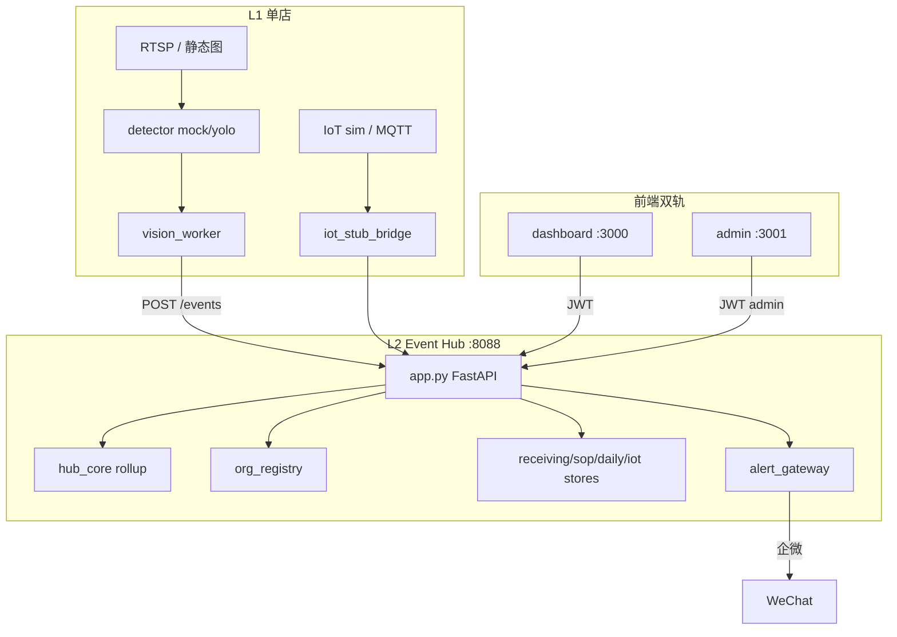

# Phase 1 架构设计规格

**冯校长火锅 · 智能运营 · 玉环 / 椒江试点**

| 项目 | 内容 |
|------|------|
| 版本 | V1.1 |
| 范围 | L1 边缘 + L2 Hub + 观测面/管控面分离（L3 Admin 生产级 Phase 2） |
| 关联 | [development_delivery_plan.md](development_delivery_plan.md) · [product_design.md §12](product_design.md#12-phase-1-mvp-范围) |
| 索引 | [architecture_design_index.md](architecture_design_index.md) |
| 评审 | [ar401_review_outcome_20260616.md](ar401_review_outcome_20260616.md) |
| 更新 | 2026-06-16 |

---

## 1. 架构目标（Phase 1）

在 **2 家直营试点店** 验证可复制技术栈，支撑 [product_goal_card.md](product_goal_card.md) 五项目标：

| 目标 | 架构抓手 |
|------|----------|
| 翻台效率 | L1 CV 桌态 + L2 POS 集成 + Hub 翻台建议 |
| 降损耗 | L1 IoT 秤 + L2 ERP/成本分析 |
| SOP 执行 | L2 SOP Engine + 调度器 + `/v1/sop/assign` |
| 缩短决策 | L2 AlertGateway + LLM 日报 + 层级/驾驶仓 rollup |
| 可复制 | 店级 config + systemd/docker + org_registry 打桩 |

**非目标（Phase 1）**：K8s 多区域、总部 ModelHub/ConfigHub 生产级、TimescaleDB 全量、strict RBAC 入库、F-TASK 生产默认开启。

**设计原则**：[ADR-013](architecture_decisions.md#adr-013设计先行实现与真数据接入分期) — 架构文档写全终局，实现与真数据分期。

---

## 2. 逻辑架构

### 2.1 三层 + 四类产品面

| 层 | Phase 1 | 组件 |
|----|---------|------|
| **L1 边缘** | ✅ | CV、IoT Agent/stub、离线队列、vision_worker |
| **L2 Hub** | ✅ | FastAPI `:8088`、stores、rollup、Admin stub API |
| **L3 管控** | ⚠️ stub | Admin UI `:3001` 内存/registry；DB CRUD → P2 |

| 产品面 | 端口 | 架构组件 | 只读/读写 |
|--------|------|----------|-----------|
| 执行看板 + PDA | :3000 | `dashboard/*` → Hub REST | 本店读写 |
| 层级 + 驾驶仓 | :3000 | regional/cockpit → `/v1/region|national/overview` | 只读 |
| 运营后台 | :3001 | admin/* → `/v1/admin/*` | P1 stub · P2 写 |

nginx 配置：[deploy/nginx/README.md](../deploy/nginx/README.md)（ADR-009 观测/管控分离）。

### 2.2 组件图（试点 · 2026-06-16）

### 2.3 代码映射

| 设计模块 | 仓库路径 | Phase 1 状态 |
|----------|----------|--------------|
| VideoIngest | `edge/stream/sources.py` | ⚠️ RTSP 可选，默认图片 |
| TableDetector | `edge/detector/hotpot_detector.py` | ⚠️ mock 默认，yolo/rknn 可选 |
| IoTAgent | `iot_stub_bridge` / `mqtt_bridge.py` | ⚠️ stub + MQTT profile |
| Event Hub | `cloud/event_hub/` | ✅ FastAPI + stores |
| Region/National rollup | `hub_core.py` | ✅ `/v1/region|national/overview` |
| Org/Admin stub | `org_registry.py` + admin routes | ⚠️ JSON/内存 |
| SOP Engine | `cloud/sop/` + `sop_assign_store` | ✅ |
| Alert Gateway | `cloud/alert_gateway/gateway.py` | ⚠️ mock + webhook E2E |
| VLM / LLM | `cloud/vlm_review/` · `llm_report/` | ⚠️ stub/API |
| POS/ERP | `cloud/integrations/` | ⚠️ sim/mock |
| 看板鉴权 | `auth.py` · `core.js` | ✅ demo JWT + Cookie 双端口 |
| 任务引擎 | — | ⬜ P1.5 DEV-520~524 |

---

## 3. 六业务闭环（C-01~C06）

| ID | 场景 | 数据流 | 关键接口 | 真数据 |
|----|------|--------|----------|--------|
| C-01 | 翻台 | RTSP→CV→`/tables`←POS | POST `/events` GET `/summary` | ❌ mock |
| C-02 | 后厨合规 | CV+IoT→`/events`→AlertGateway | `/alerts/*` | ❌ mock |
| C-03 | 食材全链路 | IoT→`/v1/iot/readings` | POST batch | ⚠️ stub |
| C-04 | SOP | signals→engine→`/sop` assign | `/v1/sop/assign*` | ⚠️ seed |
| C-05 | 来料成本 | ERP+秤→receiving | `/v1/receiving/*` | ⚠️ bridge |
| C-06 | 日报 | scheduler→daily_reports | `/v1/reports/daily*` | ✅ API |

---

## 4. API 与数据（权威子文档）

| 文档 | 版本 | 内容 |
|------|------|------|
| [architecture_api_spec.md](architecture_api_spec.md) | V1.1 | 已实现 + P1.5 tasks + P2 Admin/sales/trace |
| [architecture_data_model_phase1.md](architecture_data_model_phase1.md) | V1.1 | OpsEvent · P1 表 · tasks · 组织 · 追溯 |

PRD 映射见 api_spec §6；与产品对齐检查见 [architecture_design_index §1.2](architecture_design_index.md#12-产品--架构-对齐检查评审用)。

---

## 5. 非功能需求（Phase 1）

| 指标 | 目标 | 现状 |
|------|------|------|
| 桌态推理延迟 | <1s（边缘）·**target** | mock 即时；真链路待 BL-01/DEV-408~410 benchmark，未实测 |
| Hub API P95 | <200ms（摘要）·**target** | 单机经验值；待脚本压测实证（可本期补） |
| critical 告警送达 | <30s 企微 | webhook 待店级 key |
| VLM 层推理延迟 | 待实测后固化 | 按需 feature flag；默认 off；AOI 外部基准仅作参考 |
| 断网边缘缓存 | 24h·**P1.5（非 Phase1 硬验收）** | DEV-105 未实现；见 ADR-008 收敛口径 |
| 多租户隔离 | store_id + data_scope | ⚠️ demo 宽松；P2 strict |
| 试点可用性 | 99%（单机） | PoC 级 |

---

## 6. 安全架构（Phase 1 最小集）

| 项 | 设计 | 实现 |
|----|------|------|
| 看板鉴权 | JWT Bearer + Cookie | `auth.py` · `core.js` |
| 观测/管控分离 | 老板只读驾驶仓 | `can_admin` · ADR-009 |
| 边缘上报 | API Key + store header | 部分 |
| 传输 | HTTPS staging | docker + DEV-103 |
| 审计 | ack + 签字 + admin_audit | ack/签字 ✅ · admin stub ⚠️ |

---

## 7. 环境划分

| 环境 | 用途 | 拓扑 |
|------|------|------|
| **dev** | 研发本地 | `run_poc.sh` · pytest |
| **staging** | 两店 UAT | docker-compose + postgres profile |
| **pilot** | 玉环/椒江现场 | RK3588 + Hub VM · nginx 双端口 |

---

## 8. 实现状态矩阵

| 架构域 | 文档 | 代码 | 真数据 | 评审 |
|--------|:----:|:----:|:------:|:----:|
| L1 CV | ✅ | ⚠️ | ❌ | BL-01 |
| L1 IoT | ✅ | ⚠️ | ❌ | BL-02 |
| L2 Hub 核心 | ✅ | ✅ | ⚠️ | ✅ |
| L2 观测 rollup | ✅ | ✅ | ⚠️ | ✅ |
| L2 Admin stub | ✅ | ⚠️ | — | P2 |
| L2 告警 | ✅ | ⚠️ | ❌ | BL-03 |
| L2 集成/PDA | ✅ | ⚠️ | ❌ | BL-04 |
| 持久化 | ✅ V1.1 | ✅ | ⚠️ | ADR-003 待拍板 |
| 双端口部署 | ✅ | ✅ | — | ✅ |
| 安全/RBAC | ✅ | ⚠️ | — | BL-07 |
| F-TASK P1.5 | ✅ | ⬜ | — | feature flag |

---

## 9. 架构评审结论（2026-06-16）

> 全文：[ar401_review_outcome_20260616.md](ar401_review_outcome_20260616.md)

| 项 | 结论 |
|----|------|
| 文档层 | **有条件通过** — 与 PRD V1.5、api/data V1.1 对齐 |
| 待办 | 6/18 正式 AR-401 · ADR-003/004/005/008 拍板 · BL 清零 |
| 开发计划 | [development_delivery_plan.md](development_delivery_plan.md) |

---

## 10. 子文档

| 文档 | 内容 |
|------|------|
| [architecture_api_spec.md](architecture_api_spec.md) | REST API V1.1 |
| [architecture_data_model_phase1.md](architecture_data_model_phase1.md) | 数据模型 V1.1 |
| [architecture_hierarchy_phase_plan.md](architecture_hierarchy_phase_plan.md) | 全国层级 · DEV |
| [architecture_deployment_phase1.md](architecture_deployment_phase1.md) | docker/systemd |
| [architecture_decisions.md](architecture_decisions.md) | ADR-001~013 |
| [development_delivery_plan.md](development_delivery_plan.md) | HLD/LLD/DB/测试 |
| [poc_to_production_gap.md](poc_to_production_gap.md) | 差距清单 |

---

## 11. 版本记录

| 版本 | 日期 | 说明 |
|------|------|------|
| V1.1 | 2026-06-16 | 四产品面、rollup/Admin stub、api/data V1.1 引用、AR-401 文档复核 |
| V1.0 | 2026-06-15 | Phase 1 架构规格初版 |
