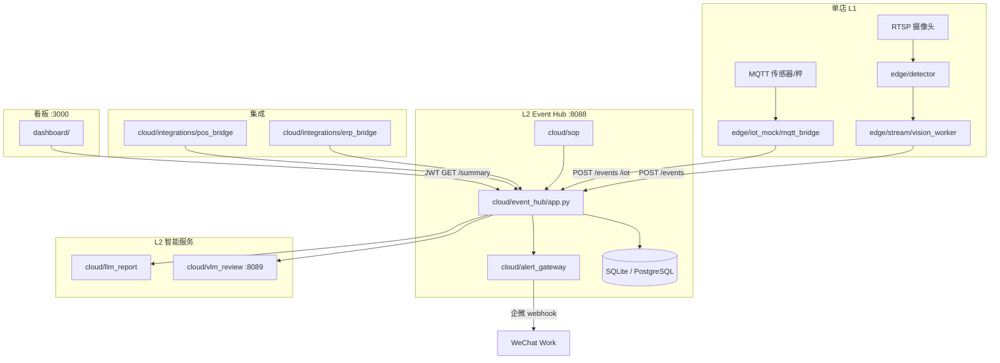

# Phase 1 架构设计规格

**冯校长火锅 · 智能运营 · 玉环 / 椒江试点**

| 项目 | 内容 |
|------|------|
| 版本 | V1.0 |
| 范围 | L1 单店边缘 + L2 试点 Hub（不含 L3 总部中台） |
| 关联 | [design_dev_implementation_plan.md §1](design_dev_implementation_plan.md) · [product_design.md §12](product_design.md#12-phase-1-mvp-范围) |
| 索引 | [architecture_design_index.md](architecture_design_index.md) |
| 更新 | 2026-06-15 |

---

## 1. 架构目标（Phase 1）

在 **2 家直营试点店** 验证可复制技术栈，支撑 [product_goal_card.md](product_goal_card.md) 五项目标：

| 目标 | 架构抓手 |
|------|----------|
| 翻台效率 | L1 CV 桌态 + L2 POS 集成 + Hub 翻台建议 |
| 降损耗 | L1 IoT 秤 + L2 ERP/成本分析 |
| SOP 执行 | L2 SOP Engine + 调度器 |
| 缩短决策 | L2 AlertGateway + LLM 日报 |
| 可复制 | 店级 config + systemd/docker 标准包 |

**非目标（Phase 1）**：K8s 多区域、总部 ModelHub/ConfigHub、TimescaleDB 全量、会员中台。

---

## 2. 逻辑架构

### 2.1 三层边界

| 层 | Phase 1 范围 | 组件 |
|----|--------------|------|
| **L1 边缘** | ✅ 每店 RK3588（或 PoC 单机模拟） | CV、IoT Agent、离线队列、vision_worker |
| **L2 区域/试点 Hub** | ✅ 单实例 FastAPI Hub | 事件、摘要、告警、集成桥、看板 |
| **L3 总部中台** | ❌ Phase 2+ | ModelHub、BI、SOP OTA |

### 2.2 组件图（试点）

### 2.3 代码映射

| 设计模块 | 仓库路径 | Phase 1 状态 |
|----------|----------|--------------|
| VideoIngest | `edge/stream/sources.py` | ⚠️ RTSP 可选，默认图片 |
| TableDetector | `edge/detector/hotpot_detector.py` | ⚠️ mock 默认，yolo/rknn 可选 |
| IoTAgent | `edge/iot_mock/mqtt_bridge.py` | ⚠️ mock，MQTT profile 可选 |
| IngredientBridge | `edge/iot_mock/ingredient_iot_bridge.py` | ⚠️ 演示 |
| EdgeHubClient | vision_worker / mqtt_bridge | ✅ HTTP POST |
| Event Hub | `cloud/event_hub/` | ✅ FastAPI |
| SOP Engine | `cloud/sop/sop_engine.py` | ✅ |
| Alert Gateway | `cloud/alert_gateway/gateway.py` | ⚠️ mock 文件 + 可选 webhook |
| VLM | `cloud/vlm_review/` | ⚠️ stub/API |
| LLM Report | `cloud/llm_report/` | ⚠️ rule + 可选 LLM |
| POS/ERP | `cloud/integrations/` | ⚠️ sim/mock |

---

## 3. 六业务闭环（C-01~C06）

| ID | 场景 | 数据流 | 关键接口 | 真数据状态 |
|----|------|--------|----------|------------|
| C-01 | 翻台 | RTSP→CV→`/tables`←POS→summary 翻台建议 | POST `/events` GET `/summary` | ❌ mock |
| C-02 | 后厨合规 | CV+IoT→`/events`→AlertGateway | POST `/events` GET `/alerts/*` | ❌ mock |
| C-03 | 食材全链路 | IoT Bridge→`/iot`→summary.iot_stats | POST `/iot` | ⚠️ sim |
| C-04 | SOP | signals→sop_engine→`/sop` | GET `/sop` POST `/sop` | ⚠️ seed |
| C-05 | 来料成本 | ERP+秤→`/cost` `/erp` | GET `/erp` GET `/cost` | ⚠️ bridge |
| C-06 | 日报 | summary→report_agent→看板 | 前端 buildReport / 待 DEV-423 | ⚠️ 手动 |

---

## 4. 非功能需求（Phase 1）

| 指标 | 目标 | 现状 |
|------|------|------|
| 桌态推理延迟 | <1s（边缘） | mock 即时 |
| Hub API P95 | <200ms（摘要） | 单机可满足 |
| critical 告警送达 | <30s 企微 | 需 webhook |
| 断网边缘缓存 | 24h | DEV-105 待完善 |
| 多租户隔离 | store_id 强隔离 | ⚠️ demo 宽松 |
| 试点可用性 | 99%（单机） | PoC 级 |

---

## 5. 安全架构（Phase 1 最小集）

| 项 | 设计 | 实现 |
|----|------|------|
| 看板鉴权 | JWT Bearer | `cloud/event_hub/auth.py` |
| 边缘上报 | API Key + store header | 部分 |
| 传输 | HTTPS staging | docker + DEV-103 |
| 密钥 | 环境变量，不入 Git | `.env` example |
| 审计 | ack + 签字表（待建） | ack ✅ 签字 ❌ |

---

## 6. 环境划分

| 环境 | 用途 | 拓扑 |
|------|------|------|
| **dev** | 研发本地 | `run_poc.sh` 单机 |
| **staging** | 两店 UAT | docker-compose + 可选 postgres profile |
| **pilot** | 玉环/椒江现场 | RK3588 + 区域 Hub VM |

---

## 7. 实现状态矩阵

| 架构域 | 文档 | 代码 | 真数据 | AR-401 |
|--------|:----:|:----:|:------:|:------:|
| L1 CV | ✅ | ⚠️ | ❌ | 待确认 |
| L1 IoT | ✅ | ⚠️ | ❌ | 待确认 |
| L2 Hub | ✅ | ✅ | ⚠️ | 待确认 |
| L2 告警 | ✅ | ⚠️ | ❌ | 待确认 |
| L2 集成 | ✅ | ⚠️ | ❌ | 待确认 |
| 持久化 | ✅ | ✅ | ⚠️ | 待确认 |
| 部署 | ✅ | ⚠️ | — | 待确认 |
| 安全 | ✅ | ⚠️ | — | 待确认 |

---

## 8. 子文档

| 文档 | 内容 |
|------|------|
| [architecture_api_spec.md](architecture_api_spec.md) | REST API 现状与 /v1 目标 |
| [architecture_data_model_phase1.md](architecture_data_model_phase1.md) | OpsEvent、表结构、规划表 |
| [architecture_deployment_phase1.md](architecture_deployment_phase1.md) | docker/systemd/两店拓扑 |
| [architecture_decisions.md](architecture_decisions.md) | ADR 架构决策记录 |
| [poc_to_production_gap.md](poc_to_production_gap.md) | 差距清单 |

---

## 9. 版本记录

| 版本 | 日期 | 说明 |
|------|------|------|
| V1.0 | 2026-06-15 | Phase 1 架构规格初版，对齐 PoC 代码 |
