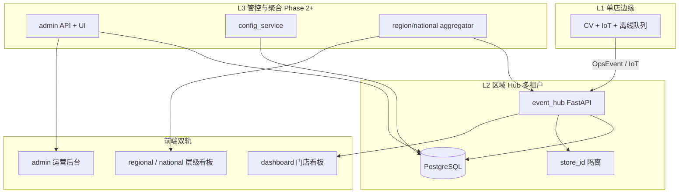
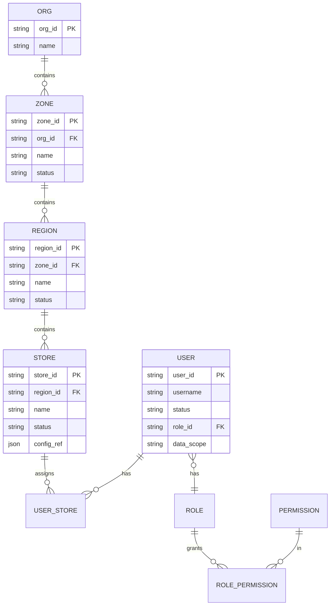

# 全国连锁层级架构 · 分阶段实施计划

**冯校长火锅 · 智能运营 · L0~L3 技术架构**

| 项目 | 内容 |
|------|------|
| 版本 | V1.0 |
| 更新 | 2026-06-16 |
| 关联 | [product_hierarchy_national_chain.md](product_hierarchy_national_chain.md) · [architecture_decisions.md](architecture_decisions.md) ADR-009 |

---

## 1. 三层云边架构（扩展版）



| 层 | Phase 1 | Phase 2 | Phase 3 |
|----|---------|---------|---------|
| L1 边缘 | 2 店 file/mock + IoT 打桩 | 20 店 RTSP + MQTT | 标准化镜像 OTA |
| L2 Hub | 单实例 · SQLite/PG · 内存+DB | 多区域租户强化 · 读写分离预备 | 区域 Hub 可选 HA |
| L3 管控 | **无**（JSON 配置） | Admin + Config 服务（可同 Hub 进程模块化） | 独立 ConfigHub · 数据湖导出 |

---

## 2. 组织数据模型（目标态）

### 2.1 实体关系



### 2.2 Phase 1 过渡（当前）

| 实体 | 存储 | 说明 |
|------|------|------|
| ZONE / REGION | `demo/data/stores.json` | 含 `parent_regions` + `regions` |
| STORE | `pilot_stores` + Hub `EventStore` | 每店 seed + 运行时 |
| USER | `auth.py` `DEMO_USERS` | 演示 |
| ROLE/PERM | `dashboard/assets/rbac.json` | 前端守卫 |

### 2.3 Phase 2 目标表（PostgreSQL）

| 表 | 用途 |
|----|------|
| `orgs` | 全国总部 |
| `zones` | 大区 |
| `regions` | 区域 |
| `stores` | 门店元数据 + `status` |
| `users` | 账号（密码 hash） |
| `roles` | 角色定义 |
| `role_permissions` | 菜单/操作/data_scope |
| `user_store_scopes` | 用户可访问门店（可选多店） |
| `admin_audit_log` | 配置变更审计 |
| `tasks` | P1.5 轻量任务内核 |
| `task_events` | 任务状态、转派、重开、取消审计 |

Hub 业务表（`events`、`alert_pushes`、`daily_reports`…）继续以 `store_id` 分区查询；**组织表独立**，通过 `stores.store_id` 关联。

---

## 3. API 分层

### 3.1 已实现（Phase 1）

| 域 | 端点 | 说明 |
|----|------|------|
| 门店运营 | `/events` `/summary` `/v1/receiving/*` … | 写需 `store_id` |
| 层级聚合 | `GET /v1/region/overview` | `region_id` = 区域或 `zone_*` |
| 对标 | `GET /benchmark` | 兼容别名 |
| 认证 | `POST /auth/token` | demo 用户 |
| 任务督办 | `/v1/tasks` `/v1/tasks/{id}/events` | P1.5 feature flag |

### 3.2 规划（Phase 2 · Admin）

| 域 | 方法 | 路径 | 权限 |
|----|------|------|------|
| 大区 | GET/POST/PUT | `/v1/admin/zones` | `admin:zone:write` |
| 区域 | GET/POST/PUT | `/v1/admin/regions` | `admin:region:write` |
| 门店 | GET/POST/PUT/DELETE | `/v1/admin/stores` | `admin:store:write` |
| 用户 | GET/POST/PUT | `/v1/admin/users` | `admin:user:write` |
| 角色 | GET/POST/PUT | `/v1/admin/roles` | `admin:role:write` |
| 权限 | GET/PUT | `/v1/admin/roles/{id}/permissions` | `admin:role:write` |
| 审计 | GET | `/v1/admin/audit-logs` | `admin:audit:read` |
| 全国总揽 | GET | `/v1/national/overview` | `scope:national:read` |
| F-SALES | GET/POST/PUT | `/v1/sales/rules` | `sales:rule:write` |
| F-TRACE | GET | `/v1/trace/{trace_id}` | `trace:read` |

**鉴权**：`HOTPOT_AUTH_MODE=strict`；JWT claims 含 `data_scope`（`store` | `region` | `zone` | `national`）及 `scope_ids[]`。

### 3.3 数据 scope  enforcement（Hub 中间件）

```
请求 store_id → 校验 user.scope 是否包含该店
请求 region_id → 校验区域是否在 user 可见范围
Admin 写操作 → 仅 national 或 delegate 角色
```

Phase 1 demo 模式保持宽松；P2 上线 strict + scope 强制。

### 3.4 任务督办 P1.5 API 边界

| 方法 | 路径 | 说明 |
|------|------|------|
| POST | `/v1/tasks` | 创建任务；必须含 `store_id/ref_type/ref_id` |
| GET | `/v1/tasks` | 按 `store_id/status/assignee/derived_flags` 查询 |
| POST | `/v1/tasks/{id}/submit` | assignee 提交 |
| POST | `/v1/tasks/{id}/verify` | 店长/督导复核关闭 |
| POST | `/v1/tasks/{id}/reopen` | 店长/督导/PMO 重开，必须 reason |
| POST | `/v1/tasks/{id}/cancel` | 未 closed 前取消；closed 后仅 admin override |
| POST | `/v1/tasks/{id}/reassign` | 转派；必须写 `sla_policy` |

`overdue/escalated` 通过查询计算，不落为互斥主状态。详见 [task_supervision_engine_design.md](task_supervision_engine_design.md)。

---

## 4. 前端架构

| 应用 | 目录 | 构建 | 部署 |
|------|------|------|------|
| 门店看板 | `dashboard/` | 静态 HTML + `core.js` | `:3000` 同域 |
| 层级看板 | `regional.html` `national.html` | 同上 | 同上 |
| 运营后台 | `admin/`（新建） | 可复用 `theme.css` | 同域 `/admin/` 或子域 |

**路由守卫**：

- `initShell()` 读 RBAC（P1 JSON → P2 API `/v1/auth/me`）
- 层级页要求 `data_scope >= region`
- Admin 要求 `admin:*` 权限

**下钻协议**（统一）：

```
national → ?zone_id=zone_east_china
regional → ?region_id=region_taizhou
store    → switchStore(store_id) → home.html
```

---

## 5. 分阶段实施计划（研发）

### Phase 1 · 试点（当前 — 已基本完成）

| 里程碑 | 交付 | 状态 |
|--------|------|------|
| M1.1 | 门店看板 7 模块 + PDA | ✅ |
| M1.2 | 多租户 Hub `store_id` | ✅ |
| M1.3 | 区域/大区 rollup API + `regional.html` | ✅ |
| M1.4 | 演示 RBAC + 企微 + 日报 | ✅ |
| M1.5 | UAT 2 店 | 进行中 |

**技术债（带入 P2）**：`DEMO_USERS`、`rbac.json`、`stores.json` 静态配置。

---

### Phase 1.5 · 任务督办内核（2~3 周 · feature flag）

| 周次 | 里程碑 | DEV | 验收 |
|------|--------|-----|------|
| W1 | tasks/task_events schema + 迁移脚本 | DEV-521 | `sop_assignments` 幂等迁移；旧 API 兼容 |
| W1~2 | 状态机和 SLA 派生标记 | DEV-521 | `overdue/escalated` 查询正确；reassign SLA 策略可审计 |
| W2 | 最小任务列表 UI + SOP 兼容 | DEV-521 | 可替代 DEV-421，不影响 BL-01~08 |
| W3 | feature flag UAT | DEV-521 | 未开启时现有 SOP 指派行为不变 |

**资源门禁**：

- 不占用 BL-01~08 的算法、边缘、IoT、PDA、RBAC 主负责人。
- 不作为 IMP-402 前置，除非仅替代 DEV-421 且不扩大范围。
- 依赖 BL-05 审计与 BL-07 RBAC 基础能力。

---

### Phase 2 · 区域推广（20 店 · 建议 10~12 周）

| 周次 | 里程碑 | DEV | 验收 |
|------|--------|-----|------|
| W1~2 | 组织模型入库 | DEV-501 | `stores`/`zones`/`regions` 表；迁移脚本从 JSON 导入 |
| W3~4 | Admin 门店 CRUD | DEV-502 | PMO  Web 增店后 Hub 自动建租户空壳 + seed 模板 |
| W5~6 | 用户/角色/权限 | DEV-503 | 淘汰 `DEMO_USERS`；strict 模式；收货员仅 PDA |
| W7 | 全国总揽页 | DEV-504 | `national.html` + `/v1/national/overview` |
| W8 | 审计日志 | DEV-505 | 增删改用户/店留痕 |
| W9~10 | 配置 OTA + F-SALES 规则版 | DEV-506/522 | SOP JSON、阈值 webhook、营销话术规则版本化 |
| W11~12 | 20 店 rollout | IMP-402 | 单店开户 <30min（后台操作） |

**架构门禁**：

- [ ] 所有 Admin API 集成测试 + RBAC 负例
- [ ] `HOTPOT_AUTH_MODE=strict` staging 默认开启
- [ ] PostgreSQL 单库多租户压测（20 store 并发写）

---

### Phase 3 · 全国（50+ 店）

| 里程碑 | 内容 |
|--------|------|
| M3.1 | 多大区 `national` 性能优化（物化视图 / 定时 rollup 表） |
| M3.2 | 加盟 SaaS：门店只读 + 业主手机简版 |
| M3.3 | 供应商 KPI 中台、LLM 区域 narrative |
| M3.4 | 可选：区域 Hub 分片（按大区） |

---

### Phase 4 · 中台深化

ConfigHub 独立服务、ModelHub、总部 BI/数据湖、会员中台联动（见 [solution.md](solution.md) Phase 3）。

---

## 6. 部署拓扑演进

| 环境 | Phase 1 | Phase 2 | Phase 3 |
|------|---------|---------|---------|
| 边缘 | 2× RK3588 或 dev mock | 20 店 systemd | 镜像 OTA |
| Hub | 1 VM · docker compose | 1 VM PG 16 · 备份 | 主从或按大区拆分 |
| 看板 |静态 nginx/python serve | 同左 + admin 静态 | CDN 可选 |

nginx 配置见 [deploy/nginx/README.md](../deploy/nginx/README.md)（同域 / 子域 / 双端口）。
| 配置 | git + JSON | Admin UI → DB | ConfigHub |

---

## 7. 安全与合规

| 项 | Phase 1 | Phase 2+ |
|----|---------|----------|
| 认证 | demo JWT | strict + 密码策略 + 可选 SSO |
| 授权 | 前端 RBAC | Hub 中间件 data_scope |
| 审计 | 业务 ack/签字 | + Admin 配置审计 |
| 加盟 | — | 写操作禁止；配置只读副本 |
| 隐私 | 无人脸 | 同左 |

---

## 8. 与现有代码映射

| 能力 | 当前路径 | P2 演进 | 真源替换（DEV） |
|------|----------|---------|---------------|
| 桌态 CV | mock / `hotpot_detector` mock | yolo/rknn + RTSP | DEV-408~410 |
| IoT | `iot_stub_bridge` / simulator | `mqtt_bridge` 真 MQTT | DEV-411~412 |
| POS/ERP | file bridge / sim | 店级 API | DEV-413~414 |
| 组织注册 | `demo/data/stores.json` | `cloud/event_hub/org_store.py` + 表 | DEV-501 |
| 区域聚合 | `hub_core.get_region_overview` | + `get_national_overview` | DEV-504 |
| 认证 | `cloud/event_hub/auth.py` | + DB 用户查询 | DEV-503 |
| RBAC | `dashboard/assets/rbac.json` | API `/v1/auth/me` | DEV-503 |
| 层级 UI | `dashboard/regional.html` | + `national.html` | DEV-504 |
| 运营后台 | `admin/` stub | `dashboard/admin/` + `/v1/admin/*` | DEV-501~505 |
| 任务督办 | `sop_assignments` | `tasks` + `task_events` | DEV-521 |
| 推销/增收 | — | `sales_rules` + F-TASK | DEV-522 |
| 追溯 | OpsEvent/签字/日报分散 | `trace_id/ref_id` 串联查询 | DEV-523 |

---

## 9. ADR 关联

- **ADR-001**：Phase 1 不做完整 L3 → **修订**：P1 不做 Admin **写**能力；P2 起 L3 模块化并入 Hub
- **ADR-009**（新增）：全国组织层级与 data_scope 模型
- **ADR-010**：F-TASK 轻量任务督办引擎
- **ADR-011**：F-SALES 规则版增收/推销
- **ADR-012**：F-TRACE 复用 OpsEvent/task_events 的追溯链
- **ADR-013**：设计先行、实现与真数据接入分期（§7 打桩须标明真源替换列）

---

## 10. 变更记录

| 版本 | 日期 | 说明 |
|------|------|------|
| V1.2 | 2026-06-16 | §7 打桩映射增真源替换列；关联 ADR-013 |
| V1.0 | 2026-06-16 | 组织 ER、Admin API、P1~P4 研发里程碑 |
| V1.1 | 2026-06-16 | 补充 P1.5 F-TASK API/排期门禁、P2 F-SALES/F-TRACE 依赖 |
