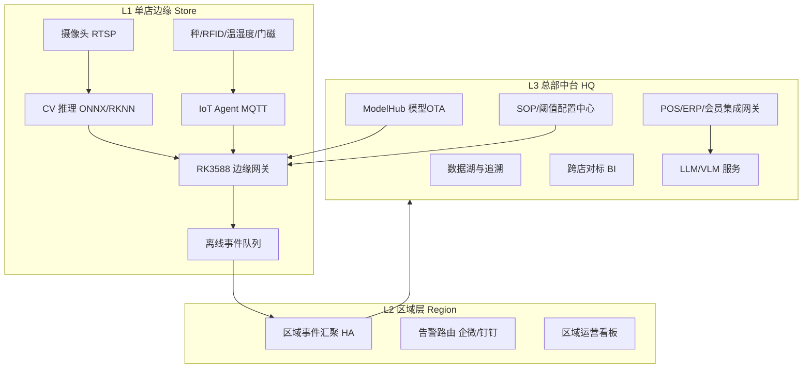
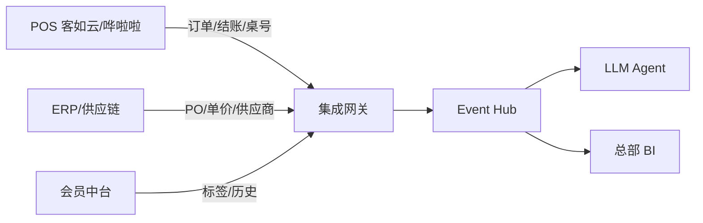
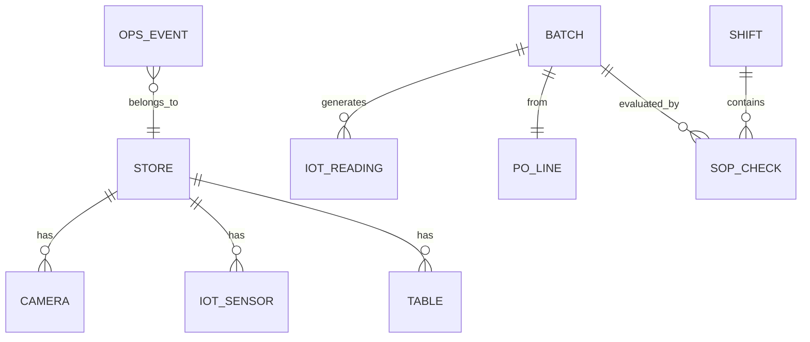
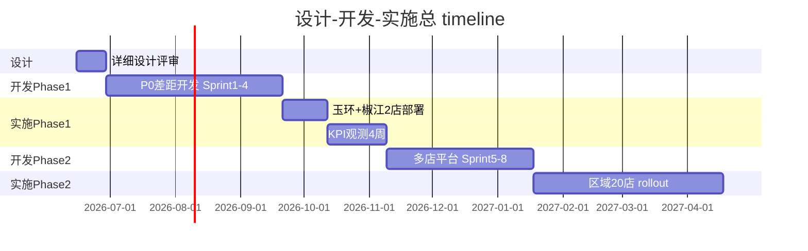
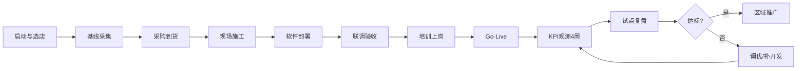
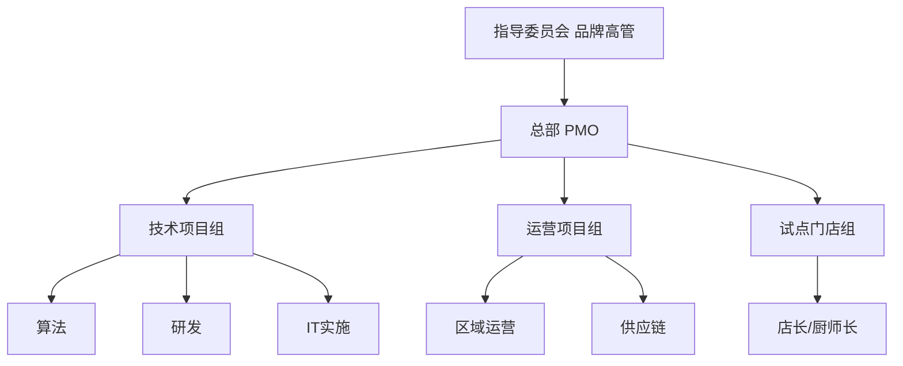
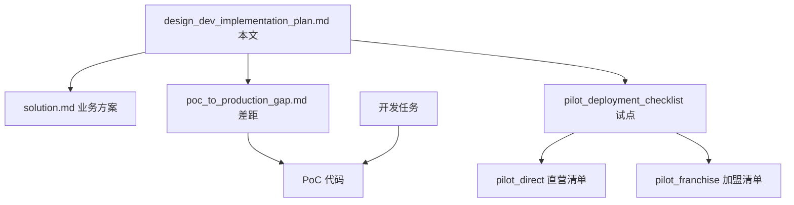

# 设计 · 开发 · 实施方案

**火锅餐饮智能运营 · 全国连锁版**

| 项目 | 内容 |
|------|------|
| 文档版本 | V1.0 |
| 文档定位 | 设计、开发、实施 **三合一主计划**（可执行） |
| 适用阶段 | Phase 0（PoC）→ Phase 3（全国推广） |
| 关联文档 | [solution.md](solution.md) · [poc_to_production_gap.md](poc_to_production_gap.md) · [试点清单](pilot_deployment_checklist.md) |
| PoC 代码 | `/home/liuwz/hotpot_smart_ops/` |

---

## 文档导航

| 篇章 | 回答的问题 | 主要读者 |
|------|------------|----------|
| **第一篇 设计** | 建什么、怎么架构、模块如何分工 | 架构师、产品、算法、IT |
| **第二篇 开发** | 谁开发、开发什么、怎么交付代码 | 研发、算法、测试、DevOps |
| **产品规格** | 用户要什么、页面与功能 | 产品、设计、运营 → [product_design.md](product_design.md) |
| **第三篇 实施** | 怎么装、怎么训、怎么验收、怎么运维 | PMO、区域运营、IT 实施、店长 |
| **开发交付** | 产品↔架构同步、HLD/LLD/DB、测试回归 | → [development_delivery_plan.md](development_delivery_plan.md) |

---

# 第一篇：设计方案

## 1.1 设计目标

在 **50+ 门店** 全国连锁场景下，构建可复制的「**边缘实时感知 + 云边智能决策 + 总部中台统管**」体系，以五类技术协同达成四类业务目标：

| 业务目标 | 设计抓手 | 量化 KPI |
|----------|----------|----------|
| 前厅增收 | CV 桌态 + LLM 翻台 + POS 联动 | 翻台率 +8~15% |
| 后厨降本 | IoT 全链路 + 成本分析 + 出成率 | 损耗 -10~18% |
| 食安合规 | VLM 质检 + IoT 冷链 + SOP 引擎 | 关键告警 <30s |
| 规模复制 | 边缘盒标准交付 + OTA + 加盟 SaaS | 单店部署 <3 天 |

**设计原则**（与 solution.md 一致）：

- **边缘优先**：<3s 本地告警，断网 24h+ 可用  
- **IoT 为据**：数量/温度/时长用硬数据，少人工填报  
- **VLM 为眼**：品质/场景/合规用视觉语言模型  
- **LLM 为脑**：日报、对账、问答、整改 narrative  
- **总部统管**：SOP、模型、供应商 KPI、加盟策略 OTA 下发  

---

## 1.2 总体架构设计

### 1.2.1 三层逻辑架构



### 1.2.2 五技术分工设计

| 技术 | 职责边界 | 部署位置 | 延迟要求 | PoC 模块 |
|------|----------|----------|----------|----------|
| **视频 CV** | 桌态四态、穿戴、烟雾、拥堵 | 边缘 NPU | <1s | `edge/detector/` |
| **IoT** | 秤重、温湿度、门磁、RFID、计时 | 边缘 + 传感器 | <3s | `edge/iot_mock/` → 真实 MQTT |
| **VLM** | 来料 A/B/C、清台就绪、生熟分区 | 云端 API | <10s | `cloud/vlm_review/` |
| **LLM** | 日报、SOP 问答、整改、对标 | 云端 API | 分钟级 | `cloud/llm_report/` |
| **边缘计算** | 推理、采集、缓存、上报 | 门店 RK3588 | — | `edge/rknn_deploy/` |

### 1.2.3 业务闭环设计

| 闭环 ID | 场景 | 数据流 | 决策输出 |
|---------|------|--------|----------|
| C-01 | 前厅翻台 | RTSP → CV → Hub ← POS → LLM | 翻台优先级、保洁任务 |
| C-02 | 后厨合规 | RTSP + IoT → Hub → 告警 | 穿戴/烟雾/冷链告警 |
| C-03 | 食材全链路 | IoT Bridge → Hub | 来料/保存/加工快照 |
| C-04 | SOP 数字化 | IoT + VLM + 人工 → SOP 引擎 | 合规率、违规清单 |
| C-05 | 来料成本 | IoT + ERP PO → 成本分析 | 短重/超价/拒收建议 |
| C-06 | 运营日报 | Hub 聚合 → LLM | 门店/区域日报 MD |

---

## 1.3 模块详细设计

### 1.3.1 边缘层模块

| 模块 | 输入 | 输出 | 生产设计要点 |
|------|------|------|--------------|
| **VideoIngest** | RTSP URL 列表 | 帧流 | 断线重连、降帧、多路调度 |
| **TableDetector** | 帧 + ROI 配置 | 桌态事件 | YOLO/RKNN，每店 ROI 标定 |
| **KitchenDetector** | 帧 | 合规事件 | 帽/口罩/烟雾类 |
| **IoTAgent** | MQTT Topic | 标准化读数 | 协议适配层，厂商驱动插件 |
| **IngredientBridge** | 传感器读数 | lifecycle JSON | 来料→保存→加工聚合 |
| **EdgeHubClient** | OpsEvent | HTTP/MQTT POST | 鉴权、重试、离线队列 |
| **LocalAlert** | 高危事件 | 本地声光/屏 | 烟雾/燃气/断链不依赖云 |

**边缘配置模型**（每店一份，总部 OTA 下发）：

```json
{
  "store_id": "store_yuhuan",
  "store_name": "冯校长火锅·玉环店",
  "store_type": "direct",
  "cameras": [
    { "id": "front_01", "rtsp": "rtsp://...", "zone": "front", "rois": [{"table_id": "T01", "bbox": [100,200,300,400]}] }
  ],
  "iot_gateway": { "mqtt_broker": "mqtt://127.0.0.1:1883", "topics": ["store/yuhuan/sensors/#"] },
  "hub_url": "https://region.example.com/hub",
  "model_version": "table_v1.2.0"
}
```

### 1.3.2 云端服务模块

| 服务 | 职责 | PoC → 生产演进 |
|------|------|----------------|
| **Event Hub** | 事件汇聚、摘要、多租户 | `http.server` → FastAPI + PostgreSQL |
| **SOP Engine** | 检查点规则评估 | 加配置中心 + APScheduler |
| **Cost Analyzer** | PO vs IoT 偏差 | 接 ERP API |
| **VLM Review** | 质检/清台/复核 | stub → Qwen-VL/GPT-4V |
| **LLM Report** | 日报/问答/整改 | rule → API + RAG |
| **Alert Gateway** | 告警分级推送 | 新增服务 |
| **Config Service** | SOP/阈值/ROI OTA | 新增服务 |

### 1.3.3 集成层设计



| 集成 | 最小字段集（Phase 1） | 同步方式 | 频率 |
|------|----------------------|----------|------|
| POS | 桌号、订单状态、结账时间、出餐时间 | Webhook + 日对账 | 实时 + 日 |
| ERP | PO 号、SKU、计划重量、单价、供应商 | API | 收货前 |
| 企微/钉钉 | 店长/督导 openid | OAuth + 机器人 | 实时告警 |

---

## 1.4 数据设计

### 1.4.1 统一事件模型

所有子系统产出 `OpsEvent`（PoC：`shared/schemas.py`）：

| 字段 | 类型 | 说明 |
|------|------|------|
| event_id | UUID | 全局唯一 |
| event_type | enum | 如 `table_empty`, `iot_weight_short`, `sop_violation` |
| source | enum | cv / iot / vlm / llm / pos / manual |
| level | enum | info / warn / critical |
| store_id | string | 门店租户 ID |
| zone | string | front / kitchen / storage / receiving |
| timestamp | ISO8601 | 事件时间 |
| confidence | float | 0~1 |
| metadata | object | 业务扩展 |

### 1.4.2 核心实体关系



### 1.4.3 存储设计（生产）

| 数据类型 | 存储 | 保留策略 |
|----------|------|----------|
| 事件流 | PostgreSQL + TimescaleDB | 热 90 天，归档 2 年 |
| IoT 时序 | TimescaleDB | 1 分钟粒度，1 年 |
| 视频截图 | 对象存储 OSS | 食安 90 天，普通 30 天 |
| SOP/配置 | PostgreSQL + 版本表 | 永久 |
| LLM 日报 | PostgreSQL + MD 文件 | 1 年 |
| 模型文件 | ModelHub OSS | 全版本 |

### 1.4.4 API 设计（生产目标）

在 PoC API（`/health`, `/summary`, `/events`, `/tables`, `/sop`, `/cost`, `/iot`）基础上扩展：

| 方法 | 路径 | 说明 | Phase |
|------|------|------|-------|
| POST | `/v1/events` | 批量事件（鉴权） | 1 |
| GET | `/v1/stores/{id}/summary` | 单店摘要 | 1 |
| GET | `/v1/stores/{id}/tables` | 桌态 | 1 |
| POST | `/v1/vlm/review` | VLM 复核 | 1 |
| POST | `/v1/reports/daily` | 触发日报 | 1 |
| GET | `/v1/config/sop` | SOP 配置拉取 | 2 |
| POST | `/v1/alerts/ack` | 告警确认 | 1 |
| GET | `/v1/region/benchmark` | 区域对标 | 2 |

---

## 1.5 部署形态设计

### 1.5.1 直营 vs 加盟

| 维度 | 直营店 | 加盟店 |
|------|--------|--------|
| 部署模式 | 全栈，Hub 可区域私有化 | SaaS Starter，预配置镜像 |
| POS/ERP | 深度 API，全供应商 PO | 经总部网关，限总部配送物料 |
| SOP | 可参与试点定制 | 总部 OTA，不可本地改 |
| 运维 | 区域 IT on-call | 总部远程 + **4G 必装** |
| 数据 | 直连总部中台 | 租户隔离，总部只读 |

### 1.5.2 单店物理拓扑

见 [solution.md §11](solution.md#11-部署架构与硬件清单)：RK3588 弱电间为中心，POE 摄像头 + MQTT IoT + 4G 备份。

### 1.5.3 环境划分

| 环境 | 用途 | 数据 |
|------|------|------|
| dev | 研发联调 | mock |
| staging | 预发布/UAT | 脱敏真实 |
| pilot | 3 家试点 | 真实 |
| prod-region | 区域 20 店 | 真实 |
| prod | 全国 | 真实 |

---

## 1.6 安全与合规设计

| 域 | 设计要求 |
|----|----------|
| 传输 | HTTPS + MQTT over TLS |
| 鉴权 | 门店 API Key + JWT（看板/PDA） |
| 租户隔离 | store_id 全链路校验 |
| 隐私 | 不做人脸识别；区域热力；店内公示 |
| 审计 | 告警确认、SOP 签字、拒收操作留痕 |
| 留存 | 食安视频/截图 ≥90 天 |

---

# 第二篇：开发方案

## 2.1 开发方法论

- **阶段式交付**：与 Phase 0~3 对齐，每阶段有 **可演示增量**  
- **PoC 优先复用**：逻辑模块保留，替换 mock 输入与基础设施  
- **双轨并行**：**产品轨**（业务闭环）+ **平台轨**（Hub/鉴权/监控）  
- **试点驱动**：Phase 1 以玉环 + 椒江 2 店真实数据定义验收，而非功能堆砌  

---

## 2.2 团队与 RACI

| 工作包 | R（负责） | A（批准） | C（咨询） | I（知会） |
|--------|-----------|-----------|-----------|-----------|
| 架构与方案 | 架构师 | CTO/PMO | 算法、IT | 区域 |
| CV 模型 | 算法 | 算法负责人 | 后厨、IT | PMO |
| IoT 集成 | 嵌入式 | IT 负责人 | 采购、设备商 | 店长 |
| Hub/后端 | 后端 | 技术负责人 | 前端、DevOps | PMO |
| POS/ERP 集成 | 后端+IT | PMO | 财务、采购 | 区域 |
| 看板/PDA | 前端 | 产品 | 店长 | 运营 |
| 试点实施 | 区域 IT | 区域总监 | 总部 PMO | 总部 |
| 运维监控 | DevOps | IT 负责人 | 后端 | 全员 |

**Phase 1 建议编制（8~12 周）**：

| 角色 | FTE | 说明 |
|------|-----|------|
| 产品经理 | 0.5 | 需求、验收、SOP 数字化 |
| 架构师 | 0.5 | 技术方案、集成设计 |
| 算法工程师 | 1~2 | CV/VLM/LLM |
| 后端工程师 | 1~2 | Hub、集成、告警 |
| 嵌入式/IoT | 1 | 设备协议、边缘镜像 |
| 前端工程师 | 0.5~1 | 看板、PDA |
| 测试工程师 | 0.5 | 自动化、试点支持 |
| DevOps | 0.5 | CI/CD、监控 |
| 项目经理 | 0.5 | 跨团队协调 |

---

## 2.3 开发阶段与里程碑

### 2.3.1 总览



| 里程碑 | 时间 | 交付物 | 退出标准 |
|--------|------|--------|----------|
| M0 PoC | 已完成 | 演示系统、6 闭环 | `run_poc.sh` 通过 |
| M1 详细设计 | +2 周 | 本方案评审通过、API/DB 设计 | 架构评审签字 |
| M2 Alpha | +6 周 | RTSP+真实 IoT+Hub DB | 实验室全链路 |
| M3 Beta | +10 周 | POS/ERP+VLM/LLM+告警 | 1 店灰度 |
| M4 试点上线 | +12 周 | 玉环 + 椒江 2 店生产 | P0 清单全绿 |
| M5 区域平台 | +6 月 | 多租户+OTA+监控 | 20 店稳定 |
| M6 全国 | +12 月 | 加盟 SaaS+中台 | 50+ 店 |

---

## 2.4 Sprint 级开发计划（Phase 1：12 周）

### Sprint 1（W1~W3）：平台基础

| 任务 ID | 模块 | 工作内容 | 产出 |
|---------|------|----------|------|
| DEV-101 | Hub | FastAPI 重构 + PostgreSQL 事件表 | 可持久化 Hub |
| DEV-102 | Hub | JWT/API Key 鉴权 + store 隔离 | 认证中间件 |
| DEV-103 | Hub | HTTPS 部署模板 | staging 环境 |
| DEV-104 | Edge | systemd 服务单元 + 健康检查 | 边缘守护 |
| DEV-105 | Edge | SQLite 离线队列 | 断网 24h 缓存 |
| DEV-106 | DevOps | GitLab CI：lint + pytest 冒烟 | CI 流水线 |
| DEV-107 | Test | `run_poc.sh` 纳入 CI | 回归门禁 |

### Sprint 2（W4~W6）：感知真实化

| 任务 ID | 模块 | 工作内容 | 产出 |
|---------|------|----------|------|
| DEV-201 | CV | 门店数据采集 + 标注规范 | 5000+ 框 |
| DEV-202 | CV | 桌态 YOLO v1 训练 + 评测 | mAP >85% |
| DEV-203 | CV | RTSP 拉流服务 + ROI 标定 CLI | VideoIngest |
| DEV-204 | CV | RKNN 转换 + RK3588 集成 | 边缘推理 v1 |
| DEV-205 | IoT | MQTT 适配层（温湿度/门磁） | IoTAgent v1 |
| DEV-206 | IoT | 智能秤协议对接（1 厂商） | 收货秤上线 |
| DEV-207 | Edge | ingredient_bridge 接 MQTT | 全链路真实输入 |

### Sprint 3（W7~W9）：智能与集成

| 任务 ID | 模块 | 工作内容 | 产出 |
|---------|------|----------|------|
| DEV-301 | VLM | Qwen-VL/GPT-4V 来料质检 API | 质检服务 v1 |
| DEV-302 | LLM | 日报 API + prompt + 结构化 JSON | 替代 rule |
| DEV-303 | LLM | SOP RAG 知识库（PDF→向量） | 问答 MVP |
| DEV-304 | Int | POS 最小集 Webhook（1 平台） | 订单/结账同步 |
| DEV-305 | Int | ERP PO 拉取 API | 成本真实 PO |
| DEV-306 | Alert | 企微/钉钉机器人 | 告警推送 |
| DEV-307 | SOP | APScheduler 班次自动跑 | 定时 SOP |

### Sprint 4（W10~W12）：试点就绪

| 任务 ID | 模块 | 工作内容 | 产出 |
|---------|------|----------|------|
| DEV-401 | Dash | 看板登录 + RBAC | 店长/督导账号 |
| DEV-402 | Dash | 桌态/SOP/成本/告警页 | 生产看板 v1 |
| DEV-403 | PDA | 收货签字 H5（可选 MVP） | 电子验收 |
| DEV-404 | Edge | 预配置镜像 v1.0 | 一键刷机 |
| DEV-405 | Ops | Prometheus + Grafana 基础监控 | 可观测性 |
| DEV-406 | Doc | 试点部署 Runbook | 实施手册 |
| DEV-407 | UAT | 2 店配置包（玉环/椒江 ROI/Topic/账号） | 店级 config |

详细差距对照见 [poc_to_production_gap.md](poc_to_production_gap.md)。

---

## 2.5 代码仓库与模块映射

```
hotpot_smart_ops/
├── shared/                 # 数据模型、IoT 注册表（复用）
├── edge/
│   ├── detector/           # Sprint2: RTSP + RKNN
│   ├── iot/                # Sprint2: 新建，替代 iot_mock 生产路径
│   ├── ingest/             # Sprint2: VideoIngest
│   └── rknn_deploy/        # Sprint2: 集成主流程
├── cloud/
│   ├── event_hub/          # Sprint1: FastAPI 重构
│   ├── sop/                # Sprint3: 调度 + OTA 拉取
│   ├── cost_control/       # Sprint3: ERP 对接
│   ├── llm_report/         # Sprint3: API 化
│   ├── vlm_review/         # Sprint3: 真实 VLM
│   ├── alert/              # Sprint3: 新建
│   └── config/             # Phase2: 配置中心
├── dashboard/              # Sprint4: 生产前端
├── integrations/           # Sprint3: POS/ERP 适配器
├── deploy/                 # Sprint4: docker/k8s/systemd
└── tests/                  # Sprint1 起：pytest
```

**PoC 保留策略**：`edge/iot_mock/`、`demo/` 保留用于 CI 冒烟与培训演示，生产路径走 `edge/iot/`。

---

## 2.6 开发规范

| 项 | 规范 |
|----|------|
| 语言 | Python 3.10+（后端/边缘）；TypeScript（看板 Phase 2 可选） |
| API | OpenAPI 3.0，`/v1` 版本前缀 |
| 事件 | 必须走 `OpsEvent`，禁止各模块私有 JSON |
| 配置 | 环境变量 + 店级 JSON，敏感项走密钥管理 |
| 日志 | 结构化 JSON，含 `store_id`, `trace_id` |
| 分支 | `main` 保护；`feature/*`；`release/pilot` |
| CR | 2 人 Review；核心模块需测试 |

---

## 2.7 测试策略

| 层级 | 范围 | 工具 | Phase 1 目标 |
|------|------|------|--------------|
| 单元测试 | SOP/成本/Bridge 逻辑 | pytest | 核心模块 >70% |
| 集成测试 | Hub API + mock 边缘 | pytest + httpx | 全 API 覆盖 |
| 冒烟测试 | `run_poc.sh` | CI | 每 commit |
| 模型评测 | 桌态 mAP、误报率 | 自建脚本 | mAP >85% |
| 性能测试 | 10 路 RTSP + 100 传感器 | locust | Phase 2 |
| UAT | 玉环 + 椒江真实场景 | 试点清单 | 店长签字 |

---

## 2.8 Phase 2~3 开发概要

| Phase | 开发重点 | 周期 |
|-------|----------|------|
| **Phase 2** | 多租户、SOP OTA 中心、ModelHub、RFID 全量、供应商 KPI 中台、PDA 工单闭环 | +10 周 |
| **Phase 3** | 加盟 SaaS 镜像、远程运维、数据湖 ETL、会员/等位集成、低照度模型 | +6 月 |

---

# 第三篇：实施方案

## 3.1 实施总流程



**单店实施周期**：直营 2~3 周（含 4 周观测）；加盟 1.5~2 周（远程为主）。

---

## 3.2 分阶段实施计划

### Phase 0：PoC 验证（已完成）

| 活动 | 产出 | 状态 |
|------|------|------|
| 方案文档 | solution.md | ✅ |
| 可运行 PoC | run_poc.sh 6 闭环 | ✅ |
| 差距分析 | poc_to_production_gap.md | ✅ |
| 决策评审 | 立项/预算/试点选店 | 待客户 |

### Phase 1：玉环 + 椒江 2 店试点（2~3 月）

**选店组合**（见 [试点清单索引](pilot_deployment_checklist.md)）：

| store_id | 店名 | 验证目标 |
|----------|------|----------|
| `store_yuhuan` | 冯校长火锅·玉环店 | Phase 1 试点 A · 区域复制基线 |
| `store_jiaojiang` | 冯校长火锅·椒江店 | Phase 1 试点 B · 跨店对标与运维 |

门店配置见 `demo/data/stores.json`。

**实施时间线（单店）**：

| 阶段 | 时间 | 关键活动 | 文档 |
|------|------|----------|------|
| T-14~T-7 | 启动 | 选店、组织、基线、采购 | 清单 §一 |
| T-7~T-3 | 施工 | 网络、摄像头、IoT 安装 | 清单 §二 |
| T-3~T-1 | 部署 | 边缘镜像、Hub、POS/ERP 联调 | 清单 §三 |
| T0 | 上线 | Go-Live、告警演练 | 清单 §四 |
| T+1~T+28 | 观测 | 日报、KPI、整改 | 清单 §五 |

### Phase 2：区域 20 店（3~4 月）

| 活动 | 说明 |
|------|------|
| 复制包 | 边缘镜像 + 标准 BOM + Runbook |
| 批量采购 | 总部集采降本 |
| 区域 Hub | HA 部署，跨店看板 |
| 模型 OTA | 统一推送桌态 v1.x |
| 供应商 KPI | 来料偏差排名与对账 |

### Phase 3：全国 50+ 店（4~6 月）

| 活动 | 说明 |
|------|------|
| 加盟 SaaS | 预配置盒 + 4G + 远程运维 |
| 总部中台 | 数据湖、BI、会员联动 |
| 运维体系 | 7×24 on-call、SLA |
| 持续优化 | 模型迭代、LLM prompt 优化 |

---

## 3.3 组织实施

### 3.3.1 项目治理



| 会议 | 频率 | 参与 | 议题 |
|------|------|------|------|
| 指导委员会 | 月 | 高管+PMO | 预算、范围、推广决策 |
| 项目组周会 | 周 | PMO+技术+运营 | 进度、风险、阻塞 |
| 试点日站会 | 上线期每日 | 驻场 IT+店长 | 联调、告警 |
| 复盘会 | 试点第 4 周末 | 全员 | KPI、二期需求 |

### 3.3.2 角色职责（实施期）

| 角色 | 实施职责 |
|------|----------|
| 总部 PMO | 标准、SOP 版本、验收签字、推广节奏 |
| 区域 IT | 施工、布线、边缘刷机、联调 |
| 算法 | 现场 ROI 标定、模型微调、误报处理 |
| 店长 | 基线数据、培训组织、告警响应 |
| 厨师长 | IoT 秤操作、SOP 签字、来料验收 |
| 加盟督导 | 加盟合规、配合远程运维 |

---

## 3.4 培训与变更管理

| 对象 | 内容 | 形式 | 时长 |
|------|------|------|------|
| 店长 | 看板、日报、告警确认 | 现场+手册 | 2h |
| 前厅 | 桌态含义、翻台配合 | 班前会 | 30min |
| 厨师长/收货 | IoT 秤、RFID、VLM 质检 | 实操 | 3h |
| 区域督导 | 跨店对标、整改闭环 | 线上 | 1h |
| IT | 边缘运维、远程诊断 | 工作坊 | 4h |

**变更管理要点**：

- 上线前 7 天公示与员工培训  
- 首周「算法辅助 + 人工并行」，不强制全自动拒收  
- 误报快速反馈通道（企微群 → 算法 48h 内响应）  

---

## 3.5 上线与验收

### 3.5.1 Go-Live 检查（P0 必过）

| # | 检查项 | 标准 |
|---|--------|------|
| 1 | 桌态识别 | 抽样 20 桌，准确率 >90% |
| 2 | IoT 连续采集 | 温湿度/秤 24h 无断点 |
| 3 | 冷链告警 | 模拟超温 <30s 推送店长 |
| 4 | POS 同步 | 结账后 1min 内桌态更新 |
| 5 | SOP 班次跑通 | 午/晚市自动出报告 |
| 6 | 来料成本 | 真实 PO + 秤重偏差报告 |
| 7 | LLM 日报 | 每日 22:00 前生成 |
| 8 | 断网演练 | 主链路断 30min，本地告警有效 |
| 9 | 账号权限 | 店长/督导/总部分级正确 |
| 10 | 隐私公示 | 店内公示 + 员工签字存档 |

完整清单：[直营](pilot_deployment_checklist_direct.md) · [加盟](pilot_deployment_checklist_franchise.md)

### 3.5.2 Phase 1 KPI 验收（4 周观测后）

| 类别 | 指标 | 目标 |
|------|------|------|
| 前厅 | 翻台率 vs 基线 | +5% 以上 |
| 前厅 | 桌态准确率 | >90% |
| 后厨 | SOP 合规率 | >85% |
| 后厨 | 来料偏差率 | <3% |
| 安全 | 关键告警响应 | <30s |
| 系统 | Hub 可用性 | >99% |
| 追溯 | 批次 RFID 覆盖 | 总部配送 100% |

---

## 3.6 运维与支持

### 3.6.1 运维模型

| 层级 | 直营 | 加盟 |
|------|------|------|
| L1 | 店长/IT（重启、换传感器） | 店长（按手册） |
| L2 | 区域 IT（4h 响应） | 总部远程（4h） |
| L3 | 总部研发（24h） | 总部研发（24h） |
| 备份 | 4G 自动切换 | **4G 必装** |

### 3.6.2 日常运维

| 任务 | 频率 | 负责 |
|------|------|------|
| 边缘盒健康巡检 | 日 | 自动 + L1 |
| 模型误报复盘 | 周 | 算法 + 店长 |
| SOP 版本核对 | 月 | PMO |
| 传感器校准 | 季 | IT |
| 安全补丁/OTA | 按需 | DevOps |

### 3.6.3 SLA（试点期）

| 级别 | 定义 | 响应 | 恢复 |
|------|------|------|------|
| P0 | 食安/燃气/断链 | 15min | 4h |
| P1 | 桌态/秤/看板不可用 | 1h | 8h |
| P2 | 日报延迟/非关键误报 | 4h | 24h |

---

## 3.7 风险与应对（实施视角）

| 风险 | 阶段 | 应对 |
|------|------|------|
| 施工延期 | 试点 | 提前 2 周勘查；弱电外包 |
| POS 接口延期 | 开发 | CSV 日导兜底；最小字段先行 |
| 员工抵触 | 上线 | 并行期；KPI 不与告警挂钩首月 |
| 模型误报 | 运营 | VLM 复核；阈值按店调 |
| 加盟 IT 弱 | 加盟 | 预配置镜像；禁止本地改配置 |
| 成本超支 | 全程 | 分阶段采购；SaaS 订阅平滑 |

---

## 3.8 交付物清单

| 阶段 | 设计交付 | 开发交付 | 实施交付 |
|------|----------|----------|----------|
| Phase 0 | solution.md | PoC 代码 | demo 演示 |
| Phase 1 | 本方案+API 设计 | 生产 v1.0 | 玉环/椒江 2 店上线报告 |
| Phase 2 | 中台设计 | 多租户+OTA | 20 店 rollout 报告 |
| Phase 3 | SaaS 运营手册 | 加盟镜像 | 50+ 店 KPI 年报 |

---

# 附录

## A. 文档关系图



## B. 快速决策：当前该做什么？

| 若您处于… | 优先动作 | 参考文档 |
|-----------|----------|----------|
| 方案评审 | 读第一篇 + solution 执行摘要 | §1 |
| **决策层立项** | **一页纸 Executive Summary** | [executive_summary_onepager.md](executive_summary_onepager.md) |
| 立项排期 | Sprint 计划 + 差距 P0 | [sprint_task_backlog.md](sprint_task_backlog.md) · §2.3~2.4 |
| 选试点店 | 第三篇 Phase 1 + 试点清单 | §3.2 |
| 研发开工 | 导入 Jira/Linear + Sprint 1 | [sprint_task_backlog.md](sprint_task_backlog.md) · [tools/sprint_backlog_jira.csv](tools/sprint_backlog_jira.csv) |
| 现场安装 | 直营/加盟清单 + Go-Live | §3.5 |

## C. 版本记录

| 版本 | 日期 | 说明 |
|------|------|------|
| V1.0 | 2026-06-12 | 初版：设计+开发+实施三合一 |

---

**维护说明**：每完成一个 Sprint 或试点里程碑，更新 §2.3 里程碑状态与 §3.5 验收实测数据。
