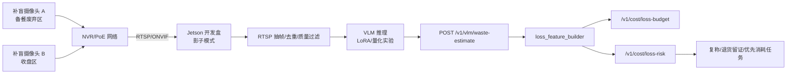

# 后厨 VLM 视觉损耗经营分析落地方案

**定位**：本文是 [kitchen_loss_real_device_solution.md](kitchen_loss_real_device_solution.md) 的视觉感知补充，不替代真实称重、温度、POS/ERP 与损耗预算主线。VLM 的角色是“超级传感器”：把废弃区、收盘区、备餐台的画面转成结构化浪费证据，反哺 `/v1/cost/loss-risk`、`/v1/cost/loss-budget` 和日报复盘。

| 项目 | 内容 |
|------|------|
| 状态 | V0.2 · PK 收敛版 |
| 关联 | ADR-020 · ADR-017 · ADR-019 · `POST /v1/vlm/waste-estimate` |
| 阶段 | P1C 影子模式；P2 模型微调与双店复制 |
| 关键边界 | **VLA 不进近期主线**；VLM 先做识别/估算/归因，不做机械抓取、自动报废、自动扣款 |

---

## 0. PK 收敛结论

| 点 | 结论 |
|----|------|
| 产品切入 | 维持“损耗预算/预测主线不变，VLM 只补视觉浪费证据”。P1A/P1B 仍以称重、温度、PDA、POS/ERP 和人工品质打分为主证据 |
| VLA/VLM 分期 | VLA 延后到 P3+；VLM 在 P1C 先做影子模式，不进入自动处罚、自动扣款或自动采购改单 |
| 数据采集 | 14 天 500~1000 张标注图可作为首批样本目标，但要先用手机和现有摄像头跑 SOP，现场可执行后再采购补盲硬件 |
| 硬件 | Jetson Orin Nano Super 8GB 仅为开发/影子验证；量产仍按 ADR-017/019 走 RK3588 16GB + YOLO-first + 云 API fallback |
| 接口 | `/v1/vlm/waste-estimate` 延续 `kitchen_loss_budget_solution.md` §2.3 冻结契约，VLM 方案只补 RTSP 抽帧、标注、模型与验收口径 |
| 测试 | 产品需求补 F-C09，测试用例补 TC-COST-09；P1C mock-first 必须验证 store-scope、source 降级和无模型不 500 |

---

## 1. 技术判断：VLA 延后，VLM 先落地

| 技术 | 当前判断 | 原因 |
|------|----------|------|
| VLA 机器人 | P3+ 观察，不进入 P1/P2 开发计划 | 机械臂/执行端成本高，后厨油烟、高温、湿滑、非标食材导致稳定性和安全边界难控；30万~80万元级投入不适合先证明 ROI |
| VLM 视觉理解 | P1C/P2 进入影子模式 | 可利旧摄像头，补盲成本低；适合识别废弃食材、餐后剩余比例、异常状态，为数据大脑补执行层反馈 |
| 数据大脑 | 仍是主线 | POS/ERP/称重/温度决定“该备多少”；VLM 负责“实际浪费在哪、执行是否走样” |

核心差异化：不做泛食安“电子监工”，而做**后厨经营分析**，回答老板和店长关心的三个问题：

1. 今天哪些 SKU 真实浪费最多？
2. 浪费来自备餐过量、品质差、餐后剩余，还是执行不规范？
3. 明天采购/备货/推荐菜应该怎么调整？

---

## 2. 场景与点位

### 2.1 先补两个经营点位

| 点位 | 目标 | 说明 |
|------|------|------|
| 备餐台废弃区 | 识别切坏、变色、临期、过期、边角料 | 优先俯拍，食材占画面 80% 以上；用于“内部损耗” |
| 餐余回收车 / 收盘区 | 识别顾客剩余菜品与剩余比例 | 优先俯拍餐盘/收盘框；用于“餐后浪费”与菜品结构优化 |

已有“明厨亮灶”摄像头继续用于合规和留证；本方案只补盲经营损耗点位，不追求全后厨无死角 VLM。

### 2.2 后续可扩展点位

| 点位 | 阶段 | 用途 |
|------|------|------|
| 冷藏库/保鲜柜 | P2 | 新鲜/临界/变质样本对比 |
| 改刀台 | P2 | 出成率、边角料比例 |
| 收货台 | P2 | 到货外观留证，与 `quality-tap` 互证 |

---

## 3. 14 天数据采集 SOP（店长落地版）

### 3.1 每日必做

| 时段 | 任务 | 数量 | 操作要点 |
|------|------|------|----------|
| 09:30 | 新鲜食材拍照 | 3~5 张/品类 | 冷藏库/保鲜柜，拍刚出库的新鲜毛肚、鸭肠、牛肉、豆皮、蔬菜等 |
| 10:30 | 废弃食材拍照 | 5~8 张 | 备餐结束后拍切坏、变色、过期、边角料 |
| 13:30 / 21:30 | 餐余剩菜拍照 | 各 5~10 张 | 午市/晚市收餐时拍不同剩余比例餐盘 |

### 3.2 拍照规范

| 项 | 要求 |
|----|------|
| 角度 | 手机或俯拍相机垂直于食材/餐盘上方，距离 30~40cm |
| 构图 | 食材/剩菜占画面 80% 以上 |
| 光线 | 开启补光；后厨点位建议固定 LED 补光 |
| 背景 | 可用白色 A4 纸垫底，减少不锈钢台面反光 |
| 滤镜 | 关闭美颜和滤镜，保留原图 |
| 命名 | `日期_点位_食材_状态_序号.jpg`，如 `20260621_废弃区_毛肚_变色_01.jpg` |

当天无废弃食材时，也要拍一张空废弃区，标注为“无废弃”，避免样本只记录坏情况。

### 3.3 标注规范

| 字段 | 选项 |
|------|------|
| 食材类别 | 毛肚 / 鸭肠 / 黄喉 / 牛肉 / 羊肉 / 豆皮 / 蔬菜 / 菌菇 / 丸滑 / 其他 |
| 新鲜度等级 | 新鲜 / 临界（当天需消耗）/ 变质（建议报废） |
| 剩余比例 | 0% / 10-30% / 30-60% / 60-90% / 90%以上 |
| 废弃原因 | 切坏 / 变色 / 过期 / 异味 / 其他 |

首批目标：14 天采集 500~1000 张高质量标注图，标注覆盖率 100%，抽检合格率 >=90%。

---

## 4. 采购预算（方案 A：Jetson 生态）

### 4.0 采购前置条件

采购不是第一步。现场先完成三件事：

1. 用手机执行 3~5 天采集 SOP，确认废弃区/收盘区是否能稳定拍到可识别画面。
2. 勘测现有 NVR/摄像头是否已支持 RTSP/ONVIF、固定 IP、7 天留存和账号密钥托管。
3. 确认补光、防油污膜、相机固定角度不会影响后厨动线。

只有当“样本可采、点位可装、员工不反感”三项通过后，才进入补盲摄像头和 Jetson 开发机采购。

| 设备 | 推荐型号 | 数量 | 参考价 | 说明 |
|------|----------|------|--------|------|
| 边缘 AI 开发盒 | NVIDIA Jetson Orin Nano Super Developer Kit 8GB | 1 | 约 ¥2,299（采购时复核） | 官方 Super profile 67 INT8 TOPS；仅开发/影子模式，不作为量产默认 |
| 补盲摄像头 | 4MP PoE 俯拍摄像头（RTSP/ONVIF、WDR、H.265、可加防油污膜） | 2 | 约 ¥300~500/台（采购时复核） | 备餐废弃区 + 餐余回收区；优先验证现场画面质量，不绑定单一型号 |
| PoE 交换机 | 腾达 SG106PC 6口千兆 PoE | 1 | 约 ¥200 | 现有交换机支持 PoE 时可省 |
| 网线/配件 | 超五类/六类网线、水晶头、防油污膜、补光灯 | 1 批 | 约 ¥100~300 | 现场按距离调整 |
| 单店合计 | - | - | 约 ¥3,100~3,300 | 不含施工人工 |

采购口径必须与 ADR-017/019 一致：

- Jetson 是开发/验证设备，不是首批量产默认。
- 量产默认仍是 RK3588 16GB 工业边缘盒 + 工业 IoT 网关。
- VLM 本地常驻必须先过准确率、延迟、稳定性和运维成本评估。

---

## 5. 模型路线

### 5.1 基座与微调

| 项 | 推荐 |
|----|------|
| 基座优先 | Qwen2-VL / Qwen2.5-VL 系列 |
| 备选 | InternVL2/InternVL 系列 |
| 微调方式 | LoRA / PEFT |
| 训练资源 | 云 GPU 或 RTX 3090/4090；不在 Jetson 上训练 |
| 首批数据 | 500~1000 张标注图，只做小样本火锅食材适配 |

建议从小模型/云端验证开始，不直接承诺 7B VLM 在 8GB Jetson 上实时跑全帧。可行路径：

1. 先用云 API 或开发机离线推理验证标签体系。
2. LoRA 微调生成火锅食材适配器。
3. 合并 LoRA 与基座模型。
4. 做 AWQ/INT4/INT8 量化试验。
5. Jetson 只跑抽帧影子模式；实时全量视频先用 YOLO/规则预筛。

### 5.2 输出 JSON 契约

VLM 输出进入 `POST /v1/vlm/waste-estimate`，结构化为：

```json
{
  "store_id": "store_yuhuan",
  "source": "vlm-shadow",
  "image_ref": "s3://.../20260621_废弃区_毛肚_变色_01.jpg",
  "items": [
    {
      "sku": "毛肚",
      "state": "临界",
      "waste_type": "备餐废弃",
      "estimated_weight_g": 300,
      "remaining_ratio": null,
      "confidence": 0.82,
      "reason": "颜色发暗且边角卷曲",
      "suggested_action": "优先复称并记录供应商品质"
    }
  ]
}
```

---

## 6. 边缘部署架构



### 6.1 RTSP 接入策略

| 层 | 决策 |
|----|------|
| 输入 | 摄像头/NVR 通过 RTSP/ONVIF 暴露视频流 |
| 采样 | 不逐帧跑 VLM；按事件/时间窗抽帧，例如每 10~30 秒或检测到收盘动作后采样 |
| 预处理 | OpenCV/GStreamer/DeepStream 负责解码、抽帧、亮度检查、去重 |
| 推理 | VLM sidecar 读取抽帧图片，输出 JSON |
| 回传 | 统一走 `/v1/vlm/waste-estimate`，进入 store-scoped 事件和特征 |

DeepStream 更适合视频解码、管线、YOLO/TensorRT 推理；VLM 推理建议先作为 sidecar 接抽帧图片，避免把 VLM 直接塞进实时全帧管线导致复杂度失控。

### 6.2 运行模式

| 模式 | 阶段 | 行为 |
|------|------|------|
| Shadow | P1C | 只出报告，不影响采购/备货指令 |
| Assisted | P2 | VLM 结果进入日报与备货建议，但需厨师长确认 |
| Auto-tuned | P3 | 连续准确率达标后，允许参与采购建议权重 |

影子模式退出条件：

- 食材识别 Top1 准确率 >=85%。
- 新鲜/临界/变质三分类准确率 >=80%。
- 餐余剩余比例分档准确率 >=75%。
- 连续 14 天无重大误报导致运营反感。

---

## 7. 与当前系统的落地任务

| ID | 阶段 | 任务 | DoD |
|----|------|------|-----|
| VLM-601 | P1C | 数据采集 SOP 执行 | 14 天、500~1000 张图、100% 标注、抽检合格率 >=90% |
| VLM-602 | P1C | 补盲摄像头点位与 RTSP 清单 | 备餐废弃区/收盘区 RTSP 可连，7 天留存，固定 IP 与账号入密钥管理 |
| VLM-603 | P1C | `/v1/vlm/waste-estimate` mock-first | store-scope 403、source 标注、无模型不 500、写事件 |
| VLM-604 | P2 | VLM shadow sidecar | RTSP 抽帧、去重、质量过滤、JSON 输出、失败降级 |
| VLM-605 | P2 | LoRA 微调实验 | Qwen/InternVL 对比，输出准确率报告和是否进入 Assisted 模式的结论 |
| VLM-606 | P2 | 视觉结果反哺预算 | VLM waste estimate 进入 `loss_feature_builder`，日报展示“今日浪费 Top5” |

---

## 8. 风险与防线

| 风险 | 防线 |
|------|------|
| 员工认为是监控 | 培训话术统一为“减少备货浪费、节省的钱可进入绩效”，不做个人扣罚 |
| 油烟/反光/光线差 | 俯拍 + 防油污膜 + LED 补光 + 图片质量过滤 |
| VLM 误判 | 影子模式只出报告，人工确认后才进入采购建议 |
| 7B 模型边缘实时性不足 | 抽帧 + YOLO 预筛 + 云 API fallback；不承诺全帧实时 VLM |
| 视频隐私与凭证泄漏 | RTSP 凭证纳入 ADR-019 密钥管理；只上传结构化结果，不上传全量视频 |

---

## 9. 下一步

1. 下发 14 天数据采集 SOP，先用手机/现有摄像头采集 3~5 天试运行。
2. 完成点位勘测：RTSP/ONVIF、固定 IP、留存、补光、防油污、员工动线与密钥托管。
3. 建 `VLM-603`：实现 `/v1/vlm/waste-estimate` mock-first，先把契约跑通。
4. 试运行确认后再采购 1 台 Jetson Orin Nano Super 开发套件 + 2 个 PoE 补盲摄像头。
5. 采集到首批 500 张后做 Qwen vs InternVL 离线评测。
6. 准确率达标后再进入 Jetson RTSP 抽帧 shadow sidecar。
