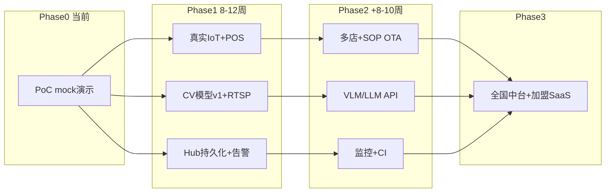

# 从 PoC 到生产的差距清单

**冯校长火锅智能运营 · Gap Analysis**

| 项目 | 内容 |
|------|------|
| 文档版本 | V1.0 |
| 当前状态 | Phase 0 PoC（可演示、可联调，**不可直接上生产**） |
| 目标状态 | Phase 1~3 试点/区域/全国生产环境 |
| 关联 | [solution.md](solution.md) · [设计·开发·实施](design_dev_implementation_plan.md) · [试点清单索引](pilot_deployment_checklist.md) |
| PoC 代码 | `/home/liuwz/hotpot_smart_ops/` |

---

## 1. 成熟度总览

| 层级 | 能力域 | PoC 现状 | 生产要求 | 差距等级 |
|------|--------|----------|----------|----------|
| L1 演示 | 业务闭环逻辑 | 6 条闭环可跑通 | 同 | 低 |
| L2 试点 | 单店真实数据 | 大量 mock/JSON | 真实 RTSP/IoT/POS | **高** |
| L3 区域 | 多店/高可用 | 单进程内存存储 | 集群+DB+监控 | **高** |
| L4 全国 | 中台/OTA/加盟 SaaS | 无 | 完整中台 | **很高** |

**结论**：PoC 验证了「架构可行 + 闭环逻辑」，生产需补齐 **数据真实化、模型工程化、平台化、运维安全、规模化** 五大类工作。

---

## 2. 分模块差距清单

图例：**P0** 生产阻塞 · **P1** 试点可暂缓、全国必做 · **P2** 优化项  
状态：✅ PoC 已有 · ⚠️ 部分/mock · ❌ 缺失

---

### 2.1 视频 CV（前厅桌态 + 后厨合规）

| 状态 | 优先级 | 维度 | PoC 现状 | 生产目标 | 差距工作 |
|:----:|:------:|------|----------|----------|----------|
| ⚠️ | P0 | 检测模型 | `MockHotpotDetector` 启发式；ONNX 可选未默认 | 火锅场景训练 YOLO/RKNN，准确率 >90% | 数据采集→标注→训练→评测 |
| ❌ | P0 | 视频输入 | 静态图片 `demo/data/*.jpg` | RTSP 实时流 / NVR 接入 | 拉流服务、断线重连、帧率控制 |
| ❌ | P0 | 桌位映射 | 默认 4×2 网格 | 每店 ROI 配置（每桌 bbox） | 可视化标定工具 + 配置下发 |
| ⚠️ | P0 | 边缘推理 | RKNN 脚本存在，未与主流程集成 | RK3588 7×24 稳定推理 | 集成 `DETECT_rknn3566`、性能调优 |
| ❌ | P1 | 多摄像头 | 单图单 zone | 6~10 路并发 | 多路调度、GPU/NPU 负载均衡 |
| ❌ | P1 | 模型 OTA | 无 | 总部推送模型版本 | ModelHub + 边缘回滚 |
| ❌ | P2 | 夜间/低照度 | 未测 | 补光/低照度模型 | 场景适配 |

**PoC 文件**：`edge/detector/hotpot_detector.py` · `edge/rknn_deploy/`

---

### 2.2 VLM（视觉语言模型）

| 状态 | 优先级 | 维度 | PoC 现状 | 生产目标 | 差距工作 |
|:----:|:------:|------|----------|----------|----------|
| ⚠️ | P0 | 来料质检 | 人工填 `quality_grade` A/B/C | VLM 自动分级 + 截图存档 | 接 Qwen-VL/GPT-4V API；质检 prompt 调优 |
| ❌ | P0 | 清台就绪 | 无 | 桌面残留/锅具状态评分 | VLM 场景 QA 接口 |
| ⚠️ | P1 | 合规复核 | `vlm_review/server.py` 规则 stub | 云端二次确认 | 真实 VLM 服务 + 置信度阈值 |
| ❌ | P1 | 生熟分区 | 人工 signal | 改刀间 VLM 检测 | 模型/ prompt |
| ❌ | P2 | 临期盘点 | 无 | 冷库 VLM 辅助 | 二期 |

**PoC 文件**：`cloud/vlm_review/server.py`

---

### 2.3 LLM（运营助手 / 日报）

| 状态 | 优先级 | 维度 | PoC 现状 | 生产目标 | 差距工作 |
|:----:|:------:|------|----------|----------|----------|
| ⚠️ | P0 | 日报生成 | 默认 `RuleBasedReportAgent` 规则模板 | 大模型生成 + 结构化输出 | 接 API；prompt 工程；幻觉校验 |
| ❌ | P0 | SOP 问答 | 无 | 店长/厨师长知识库 RAG | 向量库 + SOP 文档入库 |
| ❌ | P1 | 整改清单 | 规则 3~5 条 | 个性化、可执行、带责任人 | Agent 工具调用 |
| ❌ | P1 | 跨店对标 | 无 | 区域/全国 narrative | 多店数据聚合 API |
| ❌ | P2 | 营销话术 | 无 | 前厅加购推荐 | 接会员/POS 历史 |

**PoC 文件**：`cloud/llm_report/report_agent.py`（`OPENAI_API_KEY` 可选）

---

### 2.4 IoT（环境 + 食材全链路）

| 状态 | 优先级 | 维度 | PoC 现状 | 生产目标 | 差距工作 |
|:----:|:------:|------|----------|----------|----------|
| ⚠️ | P0 | 数据来源 | `sensor_simulator.py` + JSON mock | 真实 MQTT 设备 | 设备选型、协议适配、标定 |
| ⚠️ | P0 | 智能秤 | JSON 字段模拟 | 收货/改刀秤 API 或串口/MQTT | 厂商 SDK 集成 |
| ⚠️ | P0 | 温湿度/门磁 | 随机数生成 | 7×24 连续采集 | 工业传感器 + 网关 |
| ❌ | P0 | RFID | JSON 0/1 | 读写器 + 批次-货位绑定 | 硬件 + 中间件 |
| ✅ | P1 | 传感器模型 | `shared/iot_sensors.py` 注册表 | 同 | 按店扩展即可 |
| ✅ | P1 | 全链路 Bridge | `ingredient_iot_bridge.py` 逻辑完整 | 接真实读数 | 替换输入源 |
| ❌ | P1 | 设备管理 | 无 | 在线/离线、电量、固件 | IoT 设备管理平台 |
| ❌ | P2 | 探针/计时器 | mock | 蓝牙探针、解冻计时硬件 | 选型集成 |

**PoC 文件**：`edge/iot_mock/` · `shared/iot_sensors.py`

---

### 2.5 边缘计算

| 状态 | 优先级 | 维度 | PoC 现状 | 生产目标 | 差距工作 |
|:----:|:------:|------|----------|----------|----------|
| ❌ | P0 | 部署形态 | 开发机 `python3` 手动启动 | RK3588 镜像 + systemd | 预配置 OS 镜像 |
| ❌ | P0 | 断网缓存 | 逻辑设计有，未实现队列 | 24h 本地队列 + 恢复同步 | SQLite/Redis 离线队列 |
| ❌ | P0 | 进程守护 | 无 | 崩溃自启、看门狗 | supervisor/k8s edge |
| ⚠️ | P1 | RKNN 集成 | 脚本分离 | 视觉推理默认走 NPU | 端到端集成测试 |
| ❌ | P1 | 远程运维 | 无 | SSH 隧道/远程升级 | 边缘管理平台 |
| ❌ | P2 | 多店边缘 | 单实例 | 每店 1 盒标准化 | 供应链 |

**PoC 文件**：`edge/rknn_deploy/prepare_rknn.py`

---

### 2.6 事件汇聚与中台

| 状态 | 优先级 | 维度 | PoC 现状 | 生产目标 | 差距工作 |
|:----:|:------:|------|----------|----------|----------|
| ⚠️ | P0 | 服务框架 | `http.server` 单进程 | FastAPI/gRPC + 多 worker | 框架重构 |
| ❌ | P0 | 持久化 | 内存 `deque`，重启丢失 | PostgreSQL/TimescaleDB | 表结构设计 + ORM |
| ❌ | P0 | 鉴权 | 无，CORS `*` | JWT/API Key/门店隔离 | 认证中间件 |
| ❌ | P0 | 高可用 | 单点 | 多实例 + 负载均衡 | K8s/云部署 |
| ❌ | P1 | 消息队列 | 同步 HTTP POST | Kafka/MQTT→Hub 异步 | 削峰、重试 |
| ❌ | P1 | 多店 | 单 `store_id` mock | 租户隔离、区域汇聚 | 多租户模型 |
| ❌ | P2 | 数据湖 | 无 | 总部 BI 导出 | ETL 管道 |

**PoC 文件**：`cloud/event_hub/server.py`

---

### 2.7 SOP 引擎

| 状态 | 优先级 | 维度 | PoC 现状 | 生产目标 | 差距工作 |
|:----:|:------:|------|----------|----------|----------|
| ✅ | P0 | 规则逻辑 | `sop_engine.py` 检查点评估 | 同 | 生产可用 |
| ⚠️ | P0 | 配置管理 | 本地 JSON 文件 | 总部 OTA + 版本控制 | 配置中心 |
| ❌ | P0 | 定时调度 | 手动 CLI 触发 | 每班次 cron/调度器 | APScheduler/云定时 |
| ❌ | P1 | 人工签字 | JSON `true/false` | PDA 拍照 + 电子签 | 移动端 |
| ❌ | P1 | 整改闭环 | 仅告警 | 指派→处理→复核→归档 | 工单系统 |
| ❌ | P2 | 加盟不可改 | 未强制 | 权限控制 | RBAC |

**PoC 文件**：`cloud/sop/sop_engine.py` · `demo/data/sop_checklist.json`

---

### 2.8 来料成本控制

| 状态 | 优先级 | 维度 | PoC 现状 | 生产目标 | 差距工作 |
|:----:|:------:|------|----------|----------|----------|
| ✅ | P1 | 分析逻辑 | `analyzer.py` 规则完整 | 同 | 阈值可配置 |
| ⚠️ | P0 | 数据来源 | `incoming_materials.json` mock | ERP 实时 PO | API 对接 |
| ⚠️ | P0 | IoT 重量 | bridge enrichment 已支持 | 全自动，无人工录入 | 秤→Hub 直连 |
| ❌ | P1 | 供应商 KPI | 单店报告 | 跨店排名、自动对账 | 采购中台 |
| ❌ | P2 | 自动退货流程 | 建议拒收 | 对接供应链退货单 | 工作流 |

**PoC 文件**：`cloud/cost_control/analyzer.py`

---

### 2.9 看板与告警

| 状态 | 优先级 | 维度 | PoC 现状 | 生产目标 | 差距工作 |
|:----:|:------:|------|----------|----------|----------|
| ⚠️ | P0 | 看板 | 静态 HTML + 5s 轮询 | 生产级前端或嵌入现有系统 | React/Vue 或 SaaS |
| ❌ | P0 | 告警推送 | 无 | 企微/钉钉/短信/APP | 通知网关 |
| ❌ | P0 | 账号权限 | 无登录 | 店长/督导/总部 RBAC | 认证系统 |
| ❌ | P1 | 移动端 | 浏览器 | 店长手机适配/小程序 | 响应式或小程序 |
| ❌ | P2 | 大屏 | 无 | 门店电视看板 | 可选 |

**PoC 文件**：`dashboard/index.html` · `dashboard/serve.py`

---

### 2.10 外部系统集成

| 状态 | 优先级 | 维度 | PoC 现状 | 生产目标 | 差距工作 |
|:----:|:------:|------|----------|----------|----------|
| ⚠️ | P0 | POS | `pos_stats.json` mock | 订单/结账/桌号/出餐时间 API | 客如云/哗啦啦等对接 |
| ❌ | P0 | ERP/供应链 | JSON 手工维护 PO | 采购单、单价、供应商同步 | 采购系统 API |
| ❌ | P1 | 会员 | 无 | 客群标签、加购 | 会员中台 |
| ❌ | P1 | 等位 | 无 | 等位屏预计时间 | 等位系统 API |
| ❌ | P2 | 财务 | 无 | 日结/对账导出 | 财务系统 |

---

### 2.11 安全、合规与运维

| 状态 | 优先级 | 维度 | PoC 现状 | 生产目标 | 差距工作 |
|:----:|:------:|------|----------|----------|----------|
| ❌ | P0 | 传输加密 | HTTP 明文 | HTTPS/TLS 全链路 | 证书、MQTT over TLS |
| ❌ | P0 | 鉴权 | 无 | API Key + 门店隔离 | 见 2.6 |
| ❌ | P0 | 隐私 | 方案文档有，代码未 enforce | 不做人脸；告知；脱敏 | 视频策略配置 |
| ❌ | P0 | 审计日志 | 无 | 操作/告警/签字可追溯 | 审计表 |
| ❌ | P1 | 监控 | 无 | Prometheus/Grafana/告警 | 可观测性 |
| ❌ | P1 | 日志 | print | 结构化日志 + 集中收集 | ELK/Loki |
| ❌ | P1 | 备份 | 无 | DB 备份、视频留存策略 | 运维规范 |
| ❌ | P2 | 等保/渗透 | 未做 | 按监管要求 | 安全评估 |

---

### 2.12 测试与质量

| 状态 | 优先级 | 维度 | PoC 现状 | 生产目标 | 差距工作 |
|:----:|:------:|------|----------|----------|----------|
| ❌ | P0 | 自动化测试 | 无 | 核心 API 单元测试 | pytest |
| ❌ | P0 | 集成测试 | 手动 `run_poc.sh` | CI 流水线 | GitLab CI/GitHub Actions |
| ❌ | P1 | 性能测试 | 未做 | 10 路视频 + 100 传感器压测 | locust/k6 |
| ❌ | P1 | 模型评测 | 未做 | 桌态/质检 mAP、误报率 | 评测集 |
| ❌ | P2 | 混沌测试 | 未做 | 断网/宕机演练自动化 | 运维脚本 |

---

## 3. 差距优先级汇总

### P0 — 试点店上线前必须完成（估计 8~12 周）

| # | 工作项 | 负责域 | 依赖 |
|---|--------|--------|------|
| 1 | 火锅桌态/后厨 CV 模型训练 + RKNN 部署 | 算法 | 门店标注数据 |
| 2 | RTSP 实时拉流 + 桌位 ROI 配置工具 | 算法+IT | 摄像头安装 |
| 3 | 真实 IoT 设备接入（秤/温湿度/门磁） | IT | 硬件到货 |
| 4 | POS 最小集 API 对接 | IT+产品 | POS 厂商 |
| 5 | ERP PO 对接（来料成本） | 采购+IT | ERP 接口 |
| 6 | Event Hub 持久化 + 鉴权 | 后端 | 云资源 |
| 7 | 告警推送（企微/钉钉） | 后端 | 企业 IM |
| 8 | 边缘盒镜像 + systemd + 断网队列 | IT | RK3588 |
| 9 | VLM 来料质检 API | 算法 | 云 API |
| 10 | LLM 日报 API（替代 rule） | 算法 | 大模型 API |
| 11 | 看板登录 + 店长账号 | 前端+后端 | 认证 |
| 12 | HTTPS + 隐私告知落地 | 安全+法务 | 证书 |

### P1 — 区域推广前完成（估计 +8~10 周）

| # | 工作项 |
|---|--------|
| 1 | 多店租户 + 区域汇聚看板 |
| 2 | SOP OTA 配置中心 + 定时调度 |
| 3 | RFID 全追溯 |
| 4 | 模型 OTA + 版本回滚 |
| 5 | PDA 电子签字 + 整改工单 |
| 6 | 监控/日志/备份体系 |
| 7 | CI/CD + 自动化测试 |
| 8 | 加盟 SaaS 预配置镜像 |
| 9 | 供应商 KPI 中台 |

### P2 — 全国规模化优化

| # | 工作项 |
|---|--------|
| 1 | 总部数据湖 + BI |
| 2 | 会员/等位/营销 LLM |
| 3 | 多路视频 NPU 集群 |
| 4 | 边缘远程运维平台 |
| 5 | 等保与渗透测试 |

---

## 4. PoC 已具备、可直接复用的资产

以下模块 **逻辑正确、结构清晰**，生产以「增强」为主而非重写：

| 模块 | 路径 | 复用方式 |
|------|------|----------|
| 事件模型 | `shared/schemas.py` | 扩展字段，保持兼容 |
| IoT 传感器注册表 | `shared/iot_sensors.py` | 按店扩展 |
| 食材 IoT Bridge | `edge/iot_mock/ingredient_iot_bridge.py` | 换输入源为 MQTT |
| SOP 引擎 | `cloud/sop/sop_engine.py` | 加 OTA + 调度 |
| 成本分析 | `cloud/cost_control/analyzer.py` | 接 ERP API |
| LLM 报告结构 | `cloud/llm_report/report_agent.py` | 换 rule→API |
| 演示/回归 | `demo/run_poc.sh` | 保留为 CI 冒烟 |
| 方案与清单 | `docs/*.md` | 持续维护 |

---

## 5. 推荐演进路线

| 阶段 | 周期 | 退出标准 |
|------|------|----------|
| **PoC → 试点** | 8~12 周 | 1 家直营店 4 周真实数据；P0 清单 12 项全绿 |
| **试点 → 区域** | +8~10 周 | 20 店；SOP>85%；Hub 可用性 >99.5% |
| **区域 → 全国** | +4~6 月 | 50+ 店；加盟 SaaS；中台 OTA |

---

## 6. 人力与资源粗估（试点阶段）

| 角色 | 人数 | 主要产出 |
|------|------|----------|
| 算法工程师 | 1~2 | CV 模型、VLM/LLM 集成、RKNN |
| 后端工程师 | 1~2 | Hub 重构、POS/ERP、告警 |
| 嵌入式/IoT | 1 | 设备对接、边缘镜像 |
| 前端 | 0.5~1 | 看板、PDA |
| 产品经理 | 0.5 | 流程、验收 |
| 项目经理 | 0.5 | 试点统筹 |
| IT 实施 | 1~2 | 硬件安装、网络 |

**云资源（试点单店）**：云主机 2C4G×1、对象存储（视频截图）、大模型 API 按量。

---

## 7. 风险与缓解

| 风险 | 影响 | 缓解 |
|------|------|------|
| CV 准确率不达标 | 翻台建议不可信 | 先 ROI 标定；人工复核模式 |
| POS 接口延期 | 翻台与 POS 不同步 | 先 CSV 日导；最小字段 |
| IoT 厂商协议不统一 | 集成周期长 | 选型时要求 MQTT/HTTP 标准 API |
| 大模型成本 | 日报费用高 | rule 兜底 + 仅日报走 API |
| 加盟 IT 能力弱 | 部署失败 | 预配置镜像 + 4G 备份（见加盟清单） |

---

## 8. 自检：能否上生产？

在启动试点前，逐项确认：

- [ ] 是否仍依赖 `mock` 后端跑视觉？→ **否** 才能试点
- [ ] 事件 Hub 重启后数据是否保留？→ **是** 才能试点
- [ ] 告警是否推到店长手机？→ **是** 才能试点
- [ ] POS 是否真实对接？→ **最小集是** 才能验证翻台
- [ ] 来料是否真实 IoT 秤重？→ **是** 才能验证成本
- [ ] 是否有 HTTPS？→ **是** 才能生产
- [ ] `run_poc.sh` 是否仍作为唯一启动方式？→ **否**；需 systemd/镜像

**当前 PoC：上述 7 项多为「否」→ 适合演示与方案验证，需完成 P0 差距后试点。**

---

## 9. 相关文档

| 文档 | 用途 |
|------|------|
| [solution.md](solution.md) | 完整业务与技术方案 |
| [pilot_deployment_checklist_direct.md](pilot_deployment_checklist_direct.md) | 直营试点部署 |
| [pilot_deployment_checklist_franchise.md](pilot_deployment_checklist_franchise.md) | 加盟试点部署 |
| [README.md](../README.md) | PoC 运行说明 |

---

**文档维护**：每完成一项 P0 差距，在本清单更新状态（⚠️→✅）并记录完成日期与负责人。
