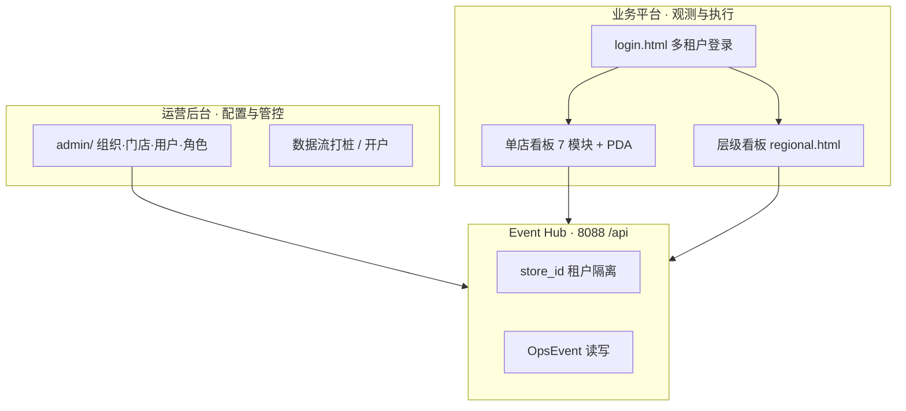
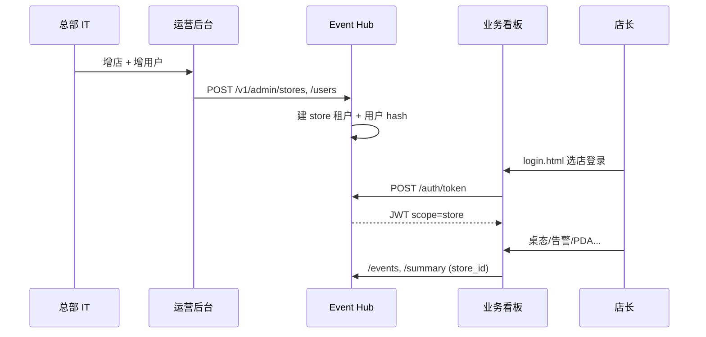

# 产品设计完整性复盘

**冯校长火锅 · 智能运营 · 业务平台 + 运营后台**

| 项目 | 内容 |
|------|------|
| 版本 | V1.0 |
| 更新 | 2026-06-16 |
| 读者 | 产品 · PMO · 架构 · 研发 |
| 关联 | [product_design.md](product_design.md) · [product_hierarchy_national_chain.md](product_hierarchy_national_chain.md) |

---

## 1. 执行摘要

### 1.1 产品双轨

| 维度 | 目标态（全国连锁） | 当前完成度 | 判定 |
|------|-------------------|------------|------|
| **业务平台 · 多租户登录** | 按店/区域/全国 scope 登录，strict 鉴权 | **~55%** | 演示可用，未达生产 |
| **业务平台 · 单店运营** | 7 模块 + PDA + 真/桩数据 | **~75%** | Phase 1 主体完成 |
| **层级看板** | 大区→区域→门店下钻 | **~70%** | 华东 2 店 PoC |
| **运营后台 · 门店 CRUD** | 增删改查 + 组织树 | **~35%** | 增/改/查 stub，无删 |
| **运营后台 · 用户 CRUD** | 增删改查 + scope | **~10%** | 只读 demo 列表 |
| **运营后台 · 角色权限 CRUD** | 角色/权限矩阵 | **~5%** | 静态 rbac.json |
| **审计与合规** | 配置变更留痕 | **~20%** | 门店变更有内存审计 |
| **整体可交付** | 20 店自助开户 | **~40%** | 需 Phase 2 闭环 |

**结论**：**观测与执行面（看板）** 已达 Phase 1 试点标准；**管控面（运营后台 + 生产级登录）** 仍为 **Admin v0.1 打桩**，与 PRD F-HQ08~11 目标态差距明确，需按 Phase 2 专项补齐。

---

## 2. 业务平台 · 多租户登录（F-AUTH / BL-07）

### 2.1 产品定义

| 项 | 规格 |
|----|------|
| **租户单元** | `store_id`（最小隔离）；区域督导 `region_id`；总部 `national` |
| **登录入口** | 业务 `:3000/login.html`；运营 `:3001/login.html?admin=1`（双端口 nginx） |
| **身份来源** | Phase 2 起：Hub `users` 表；当前：`DEMO_USERS` 硬编码 |
| **凭证** | 用户名 + 密码 → JWT（含 `role`、`store_id`、`data_scope`） |
| **会话** | 生产：Cookie + HTTPS；当前：sessionStorage + 跨端口 Cookie |
| **模式** | `HOTPOT_AUTH_MODE=demo`（宽松）/ `strict`（生产） |

### 2.2 角色 × 登录 × 落地页

| 角色 | 账号（demo） | 选店 | 落地页 | data_scope | 现状 |
|------|-------------|------|--------|------------|------|
| 店长 | zhangdian | **必选** | home.html | store | ✅ |
| 前厅领班 | lingban | 必选 | tables.html | store | ✅ |
| 厨师长 | chushi | 必选 | kitchen.html | store | ✅ |
| 收货员 | shouhuo | 必选 | pda/receiving.html | store | ✅ |
| 区域督导 | quyududao | 隐藏 | regional.html | region | ✅ |
| 总部 PMO | zongbu | **隐藏** | admin/index.html | national | ✅ |
| 总部 IT | — | — | admin/ | national | ⬜ 未单独账号 |

**PMO 登录 UX（已实现）**：选「总部 PMO」时隐藏门店；双端口下 Cookie 共享登录态，避免 :3000↔:3001 死循环。

### 2.3 多租户数据隔离

| 层 | 机制 | 现状 |
|----|------|------|
| Hub 读 | `enforce_store_read(auth, store_id)` | ✅ 逻辑有；demo 模式匿名可读 |
| Hub 写 | `enforce_store_write` + 边缘 `X-Api-Key` | ✅ |
| 看板 | `storeId()` + 顶栏 switchStore | ✅ 2 店切换 |
| JWT scope | `data_scope` in token | ⚠️ 已写入 JWT，Hub 中间件未全量强制 |
| 督导/总部 | `store_id: *` | ✅ demo |

### 2.4 前端 RBAC

| 能力 | 实现 | 现状 |
|------|------|------|
| 菜单可见 | `rbac.json` → `canAccessMenu` | ✅ 6 角色 |
| 操作守卫 | `canAction`（ack、report_generate…） | ✅ 部分页面 |
| 服务端校验 | Hub 按 role 限制（如日报生成） | ⚠️ 部分 API |
| 动态权限 | `/v1/auth/me` 返回 permissions | ⬜ 未接 UI |

### 2.5 差距清单（登录 · 多租户）

| # | 差距 | 优先级 | Phase |
|---|------|--------|-------|
| G-L01 | 用户不在 DB，`DEMO_USERS` 7 账号 | P0 | 2 |
| G-L02 | `strict` 模式未在 staging 默认开启 | P0 | 2 |
| G-L03 | Hub 未按 JWT `data_scope` 强制 region/national | P0 | 2 |
| G-L04 | 登录页门店列表静态，未从 `/stores` 动态拉取 | P1 | 2 |
| G-L05 | 无找回密码 / 强制改密 / SSO | P2 | 3 |
| G-L06 | 无「同一用户多店授权」UI | P1 | 2 |
| G-L07 | 加盟只读账号未实现 | P2 | 3 |

### 2.6 验收标准（登录 · Phase 2 Done）

- [ ] 新店开户后 5 分钟内可登录该店，无需改代码
- [ ] `strict` 下跨店读/写返回 403
- [ ] 7 类角色落地页与菜单与 PRD 一致
- [ ] 督导只见本区域门店；PMO/IT 见全国

---

## 3. 运营后台 · 组织 / 门店 / 用户 / 角色（F-HQ08~11）

### 3.1 信息架构（目标 vs 现状）

| 模块 | 目标 IA | 现状页面 | API |
|------|---------|----------|-----|
| 总览 | admin/index.html | ✅ KPI + 数据流 + 审计摘要 | pipeline/status, national/overview |
| 组织·门店 | admin/stores.html | ✅ 组织树 + 列表 + 新增 | org-tree, stores GET/POST/PUT |
| 用户 | admin/users.html | ⬜ **未建页** | users **GET only** |
| 角色权限 | admin/roles.html | ⬜ **未建页** | ⬜ **无 API** |
| 数据流打桩 | admin/pipeline.html | ✅ inprocess/subprocess | pipeline/tick |
| 审计 | admin/audit.html | ⚠️ 嵌在总览 | audit-logs GET |

### 3.2 CRUD 完整性矩阵

图例：**✅ 完成** · **⚠️ 部分/stub** · **⬜ 未做**

#### 3.2.1 组织层级（大区 / 区域）

| 操作 | F-HQ08 要求 | API | UI | 持久化 | 状态 |
|------|-------------|-----|-----|--------|------|
| **查** | 组织树 | `GET /v1/admin/org-tree` | stores 页树形 | stores.json | ⚠️ |
| **增** | 新建大区/区域 | ⬜ | ⬜ | ⬜ | ⬜ |
| **改** | 调整归属/状态 | ⬜ | ⬜ | ⬜ | ⬜ |
| **删** | 停用/归档 | ⬜ | ⬜ | ⬜ | ⬜ |

#### 3.2.2 门店（store）

| 操作 | F-HQ08 要求 | API | UI | 持久化 | 状态 |
|------|-------------|-----|-----|--------|------|
| **查** | 列表+状态+数据层 | `GET /v1/admin/stores` | ✅ 表格 | stores.json | ✅ |
| **增** | 开户+自动打桩 | `POST /v1/admin/stores` | ✅ 表单 | stores.json + Hub 租户 | ⚠️ stub |
| **改** | 状态/区域/店名 | `PUT /v1/admin/stores/{id}` | ✅ 状态下拉 | stores.json | ⚠️ |
| **删** | 停业/逻辑删除 | ⬜ | ⬜ | ⬜ | ⬜ |
| **查单** | 门店详情 | ⬜ | ⬜ | — | ⬜ |

**增店当前行为**：写 `stores.json` → 同步 Hub registry → inprocess 打桩注入 7 层数据（**非** DB、**无** edge 配置包下发）。

#### 3.2.3 用户（user）

| 操作 | F-HQ09 要求 | API | UI | 持久化 | 状态 |
|------|-------------|-----|-----|--------|------|
| **查** | 用户列表 | `GET /v1/admin/users` | ⬜ | DEMO_USERS | ⚠️ 只读 |
| **增** | 创建账号+scope | ⬜ | ⬜ | ⬜ | ⬜ |
| **改** | 启停/改角色/改 scope | ⬜ | ⬜ | ⬜ | ⬜ |
| **删** | 禁用/删除 | ⬜ | ⬜ | ⬜ | ⬜ |
| **重置密码** | 总部 IT | ⬜ | ⬜ | ⬜ | ⬜ |

#### 3.2.4 角色与权限（role / permission）

| 操作 | F-HQ10 要求 | API | UI | 持久化 | 状态 |
|------|-------------|-----|-----|--------|------|
| **查** | 角色列表+矩阵 | ⬜ | ⬜ | rbac.json | ⬜ |
| **增** | 自定义角色 | ⬜ | ⬜ | ⬜ | ⬜ |
| **改** | 菜单/操作/data_scope | ⬜ | ⬜ | rbac.json 静态 | ⬜ |
| **删** | 停用角色 | ⬜ | ⬜ | ⬜ | ⬜ |
| **鉴权生效** | Hub + 看板一致 | 部分 | 前端 only | — | ⚠️ |

#### 3.2.5 审计（audit）

| 操作 | F-HQ11 要求 | API | UI | 持久化 | 状态 |
|------|-------------|-----|-----|--------|------|
| **查** | 配置变更检索 | `GET /v1/admin/audit-logs` | 总览摘要 | 内存 500 条 | ⚠️ |
| **写** | 用户/角色变更留痕 | 仅 store create/update | — | 内存 | ⚠️ |
| **导出** | CSV/合规归档 | ⬜ | ⬜ | ⬜ | ⬜ |

### 3.3 运营后台差距汇总

| ID | 描述 | 依赖 DEV |
|----|------|----------|
| G-A01 | 用户管理页 + CRUD API | DEV-503 |
| G-A02 | 角色权限页 + CRUD API | DEV-503 |
| G-A03 | 大区/区域 CRUD | DEV-501 |
| G-A04 | 门店逻辑删除/归档 | DEV-502 |
| G-A05 | 组织/用户/角色入 PostgreSQL | DEV-501 |
| G-A06 | 审计持久化 + 检索页 | DEV-505 |
| G-A07 | 增店联动 edge 配置包 / webhook 模板 | DEV-502 + IMP |
| G-A08 | Admin strict 鉴权 + 操作负例测试 | DEV-503 |

### 3.4 验收标准（运营后台 · Phase 2 Done）

- [ ] PMO 可在 30 分钟内 Web 完成：增区域 → 增店 → 增店长账号 → 该店可登录看板
- [ ] 用户/角色/门店 CRUD 全走 Admin，**零**手改 JSON/py
- [ ] 所有写操作进 `admin_audit_log` 可检索
- [ ] 店长无法访问 `/v1/admin/*` 与 `admin/` 静态（403）

---

## 4. 两平台协同关系

| 环节 | 业务平台 | 运营后台 |
|------|----------|----------|
| **谁用** | 门店一线、督导 | 总部 IT/PMO |
| **端口（当前）** | :3000 | :3001（nginx 分离） |
| **写配置** | ❌ | ✅（目标） |
| **看实时运营** | ✅ | 只读跳转看板 |
| **租户生命周期** | 消费 | 生产 |

---

## 5. 与 PRD 功能 ID 对照

| PRD ID | 名称 | 产品完整度 | 研发状态 |
|--------|------|------------|----------|
| F-HQ06/07 | 区域/异常店 | 90% | ✅ |
| F-HQ12 | 全国总揽 | 30% | API 有，UI 无 |
| F-HQ08 | 门店管理 | 40% | 增改查 stub |
| F-HQ09 | 用户管理 | 10% | 只读 |
| F-HQ10 | 角色权限 | 5% | 静态 JSON |
| F-HQ11 | 审计 | 25% | 内存 stub |
| BL-07 | RBAC | 60% | 前端为主 |
| — | 多租户登录 | 55% | demo 账号 |

---

## 6. 分阶段补齐路线（产品视角）

### Phase 1（当前）— 试点观测 ✅

- 业务看板 + 演示登录 + 2 店 switchStore
- 层级看板 + Admin v0.1（门店增改查、打桩、组织树只读）
- **刻意不做**：生产级用户/角色 CRUD

### Phase 2（10~12 周）— 管控闭环 🎯

| 周 | 产品交付 | 关闭差距 |
|----|----------|----------|
| W1~2 | 用户/门店 DB 模型 | G-L01, G-A05 |
| W3~4 | admin/users.html + 门店删/归档 | G-A01, G-A04 |
| W5~6 | admin/roles.html + strict 鉴权 | G-A02, G-L02, G-L03 |
| W7~8 | 登录页动态门店 + `/v1/auth/me` | G-L04, G-L06 |
| W9~10 | 审计页 + national.html | G-A06, F-HQ12 |
| W11~12 | 20 店 rollout 验收 | 全文 DoD |

### Phase 3 — 全国与加盟

- 加盟只读、SSO、供应商 KPI、LLM narrative

---

## 7. 文档与代码索引

| 类型 | 路径 |
|------|------|
| PRD 总纲 | [product_design.md](product_design.md) §5.10 / §6.5 |
| 全国层级 | [product_hierarchy_national_chain.md](product_hierarchy_national_chain.md) |
| 架构分阶段 | [architecture_hierarchy_phase_plan.md](architecture_hierarchy_phase_plan.md) |
| Admin API | [architecture_api_spec.md](architecture_api_spec.md) §7 |
| 业务登录 | `dashboard/login.html` |
| 运营后台 | `dashboard/admin/` |
| 鉴权 | `cloud/event_hub/auth.py` |
| RBAC | `dashboard/assets/rbac.json` |
| 组织 stub | `cloud/event_hub/org_registry.py` |
| nginx 分离 | [deploy/nginx/README.md](../deploy/nginx/README.md) |

---

## 8. 变更记录

| 版本 | 日期 | 说明 |
|------|------|------|
| V1.0 | 2026-06-16 | 业务平台多租户登录 + 运营后台 CRUD 完整性复盘 |
