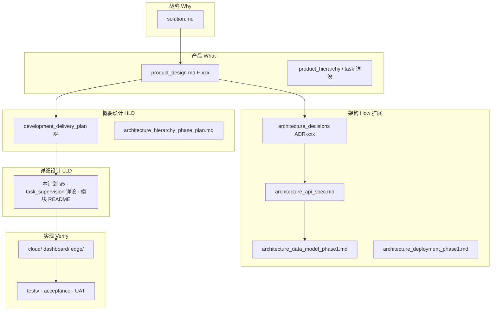
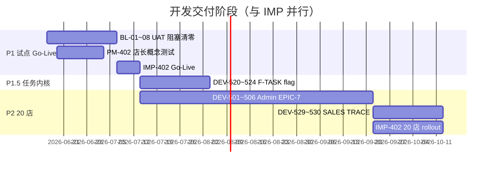
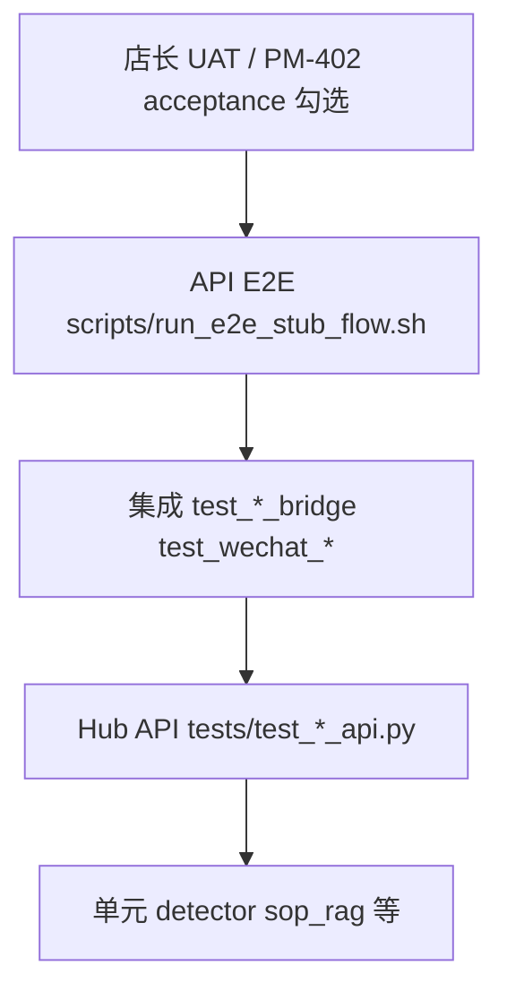

# 开发交付主计划

**冯校长火锅 · 智能运营 · 产品 × 架构 × 研发 × 测试**

| 项目 | 内容 |
|------|------|
| 版本 | V1.0 |
| 更新 | 2026-06-16 |
| 读者 | 产品 · 架构 · 研发 · 测试 · PMO |
| 原则 | [ADR-013](architecture_decisions.md#adr-013设计先行实现与真数据接入分期) — 设计写全，落地分期 |
| 关联 | [product_design_index.md](product_design_index.md) · [architecture_design_index.md](architecture_design_index.md) · [sprint_task_backlog.md](sprint_task_backlog.md) |

---

## 1. 文档分层与职责



| 层级 | 产物 | 权威文档 | 谁维护 |
|------|------|----------|--------|
| 产品规格 | F-xxx、角色、验收 | `product_design.md` §5、§12 | 产品 |
| 架构决策 | 边界、分期、契约 | `architecture_decisions.md` | 架构 |
| **概要设计 HLD** | 子系统边界、部署、接口清单 | 本文 §4 + `architecture_design_phase1.md` | 架构 |
| **详细设计 LLD** | 状态机、路由、类/模块、错误码 | 本文 §5 + 功能族详设 | 研发负责人 |
| **数据库设计** | 表、索引、迁移 | `architecture_data_model_phase1.md` | 后端 |
| API 契约 | 路径、请求/响应、PRD 映射 | `architecture_api_spec.md` §6 | 后端 + 产品会签 |
| 研发任务 | DEV-xxx、Epic、预估 | `sprint_task_backlog.md` | PMO/研发 |
| 测试验收 | 单元/API/UAT/回归 | 本文 §7 + `phase1_mvp_acceptance_checklist.md` | 测试 + 产品 |

---

## 2. 产品 ↔ 架构 同步机制（必须执行）

### 2.1 变更触发矩阵

| 变更类型 | 先改产品 | 必须同步架构 | 必须同步研发 |
|----------|:--------:|:------------:|:------------:|
| 新增 F-xxx 功能族 | ✅ | api_spec §6 · data_model · ADR 若新决策 | sprint DEV 行 |
| 调整 Phase / Won't Have | ✅ changelog | hierarchy_phase_plan · ADR | backlog Epic |
| 新增/调整 API | 会签 | ✅ api_spec | 实现 + `tests/test_*` |
| 新增/调整表 | 会签 | ✅ data_model | migration + store 模块 |
| 仅实现 bugfix | — | 无 | 代码 + 测试 |
| 打桩换真源 | gap 文档 | hierarchy §8 真源列 | BL 专项 DEV |

### 2.2 评审门禁

| 评审 | 时机 | 产品入口 | 架构入口 | 同步检查 |
|------|------|----------|----------|----------|
| **PM-401** | Phase 1 规格冻结 | `product_review_checklist.md` | — | PRD §12 vs acceptance |
| **AR-401** | 架构拍板 | PRD 约束 | `architecture_review_checklist.md` | [index §1.2](architecture_design_index.md#12-产品--架构-对齐检查评审用) 7 项 |
| **Sprint Planning** | 每 3 周 | US-xxx | DEV-xxx | api_spec §6 有映射 |
| **Go-Live IMP-402** | 试点上线 | acceptance §2 P0 全勾 | BL-01~08 清零 | 真数据列无 ❌ |

### 2.3 每次合并前 DoD（Definition of Done）

1. **产品**：F-xxx 在 PRD §5 有 ID + 验收标准；`product_design_changelog.md` 有记录（若行为变）。
2. **架构**：`architecture_api_spec.md` 与 `architecture_data_model_phase1.md` 已更新；重大决策追加 ADR。
3. **研发**：`sprint_task_backlog` DEV 状态更新；代码路径与 [ar401_code_directory_mapping.md](ar401_code_directory_mapping.md) 一致。
4. **测试**：新增/变更 API 有 `tests/test_*.py`；CI `pytest` 绿。
5. **对齐**：跑一遍 [architecture_design_index §1.2](architecture_design_index.md#12-产品--架构-对齐检查评审用) 自检表。

### 2.4 Changelog 双写规则

| 文档 | 何时写 |
|------|--------|
| `product_design_changelog.md` | PRD/角色/Phase 变更 |
| `architecture_changelog.md` | API/表/ADR/部署变更 |
| 本文 §9 里程碑 | Epic 完成、Phase 切换 |

---

## 3. 分阶段开发路线图

### 3.1 总览



### 3.2 Phase 1 · 试点 Go-Live（当前焦点）

**目标**：玉环 + 椒江 2 店，执行看板 + 层级 + 驾驶仓 v1 可 UAT；**不以 Admin DB、F-TASK 为前置**。

| 泳道 | Epic | 关键 DEV | 设计产物 | 测试 |
|------|------|----------|----------|------|
| 边缘真数据 | EPIC-2 | DEV-408~413 | HLD §4.1 L1 · gap | 现场 ROI/ MQTT |
| 集成 | EPIC-3 | DEV-414~419 | api_spec §2 · bridge LLD | test_*_bridge |
| 平台 | EPIC-1 | DEV-102~106 | data_model §4 · auth LLD | test_hub_smoke |
| 看板 | EPIC-4 | DEV-401~407 | figma + HTML | 手工 + pytest |
| UAT 阻塞 | §6.1 | DEV-420~426 | receiving/sop/audit API | test_receiving_* 等 |
| 实施 | EPIC-5 | IMP-401~402 | deployment_phase1 | acceptance §2 |

**Go-Live 门槛**：[phase1_mvp_acceptance_checklist.md](phase1_mvp_acceptance_checklist.md) P0 行「文档+UI+API」✅，「真数据+UAT」无 ❌。

### 3.3 Phase 1.5 · F-TASK（feature flag）

| 项 | 内容 |
|----|------|
| PRD | `product_design.md` §5.4.1 F-TASK01~04 |
| 详设 | [task_supervision_engine_design.md](task_supervision_engine_design.md) |
| HLD | 本文 §4.3 |
| DB | data_model §5.4~5.5 `tasks` / `task_events` |
| API | api_spec §3 |
| DEV | DEV-520~524（内核）；525~528（P2 增强） |
| 测试 | 新增 `test_tasks_api.py` · SOP 兼容回归 `test_sop_assign_api.py` |
| 门禁 | `HOTPOT_TASK_ENGINE=0` 时 UAT 主流程不变 |

### 3.4 Phase 2 · 20 店 + 运营后台

| Epic | 范围 | DEV | 设计 |
|------|------|-----|------|
| EPIC-7 组织管控 | Admin CRUD、strict RBAC | DEV-501~506 | hierarchy §2~3 · data_model §6 |
| EPIC-8 任务增强 | SLA 推送、区域 rollup | DEV-525~528 | task 详设 §11~12 |
| EPIC-9 增收追溯 | F-SALES / F-TRACE | DEV-529~530 | PRD §5.5.1 · §5.8.1 · api §4.2 |
| 看板 | `national.html` | DEV-504 | F-HQ12（API 已有） |

**验收**：30 分钟「增店 → 增店长 → 可登录」；`HOTPOT_AUTH_MODE=strict`。

---

## 4. 概要设计（HLD）— 四类产品面

### 4.1 L1 边缘 + L2 Event Hub（业务平台后端）

| 项 | 设计 |
|----|------|
| **边界** | 单店 RK3588（或 dev 单机）；Hub 单实例 FastAPI `:8088` |
| **输入** | RTSP→CV、MQTT→IoT、POS/ERP bridge、PDA POST |
| **输出** | OpsEvent 入 `events`；快照入 `store_snapshots`；告警→AlertGateway |
| **租户** | 全链路 `store_id`；JWT `data_scope`（P2 strict） |
| **部署** | [architecture_deployment_phase1.md](architecture_deployment_phase1.md) · docker/systemd |
| **打桩** | mock detector · `iot_stub_bridge` · file ERP/POS → hierarchy §8 替换列 |

详见 [architecture_design_phase1.md](architecture_design_phase1.md) §2~3。

### 4.2 执行看板 + PDA（`:3000` 业务平台前端）

| 模块 | 页面 | Hub 读 API | 写 API |
|------|------|------------|--------|
| 首页 | home.html | `/summary` | — |
| 桌态 | tables.html | `/tables` | POST `/tables` |
| 后厨 | kitchen.html | `/iot` `/events` | — |
| SOP | sop.html | `/sop` | `/v1/sop/assign*` |
| 成本 | cost.html | `/cost` `/erp` | — |
| 告警 | alerts.html | `/events` `/alerts/*` | POST ack |
| 日报 | report.html | `/v1/reports/daily*` | — |
| PDA | pda/receiving.html | batches | POST submit |

**HLD 要点**：静态 HTML + `core.js` 鉴权/轮询；无 BFF（ADR-007）。nginx [deploy/nginx/README.md](../deploy/nginx/README.md) 双端口。

### 4.3 层级 + 驾驶仓（观测面 · 只读）

| 页面 | 角色 | API | PRD |
|------|------|-----|-----|
| regional.html | 督导/大区 | `/v1/region/overview` | F-HQ06/07 |
| cockpit.html | 集团决策者 | `/v1/national/overview` | F-EXEC01 |
| national.html | PMO（P2） | 同上 | F-HQ12 |

**HLD 要点**：rollup 在 `hub_core`；不写配置；下钻 `switchStore(store_id)`。

### 4.4 运营后台 Admin（`:3001` 管控面）

| 阶段 | 能力 | 实现 |
|------|------|------|
| **P1 v0.1 stub** | 组织树查、门店增改查（内存）、用户 demo 列表、pipeline 打桩 | `admin/*` + `/v1/admin/*` stub |
| **P2 生产** | 门店/用户/角色 CRUD、审计、strict | DEV-501~505 + PostgreSQL |

**HLD 要点**：观测/管控分离（ADR-009）；PMO/IT 写，老板/督导只读。

---

## 5. 详细设计（LLD）索引

> 新模块先在对应详设或本文补 LLD 小节，再写代码。

| 子系统 | LLD 文档/路径 | 核心设计点 |
|--------|---------------|------------|
| OpsEvent 入站 | `shared/schemas.py` · data_model §1 | 枚举、metadata、禁止旁路 |
| Hub 路由 | `cloud/event_hub/app.py` · api_spec §2 | 鉴权依赖 `get_auth_context` |
| 聚合读模型 | `cloud/event_hub/hub_core.py` | summary、region/national rollup |
| 组织注册 | `cloud/event_hub/org_registry.py` | P1 JSON → P2 DB |
| 收货 | `receiving_store.py` · api §2.6 | batch + 双签 |
| SOP 指派 | `sop_assign_store.py` | P1.5 迁移至 tasks |
| 日报 | `daily_report_store.py` · `daily_scheduler.py` | 定时 + 持久化 |
| IoT 读数 | `iot_readings_store.py` | 打桩 → MQTT batch |
| 告警 | `cloud/alert_gateway/gateway.py` | N-01~05 · should_push |
| 鉴权 RBAC | `auth.py` · `dashboard/assets/rbac.json` | P2 → DB + `/v1/auth/me` |
| 任务引擎 | [task_supervision_engine_design.md](task_supervision_engine_design.md) | 状态机 §4 · API §8 |
| 看板鉴权 | `dashboard/assets/core.js` | Cookie · 双端口 origin |
| 边缘 CV | `edge/detector/` · `edge/stream/vision_worker.py` | mock/yolo/rknn |
| 边缘 IoT | `edge/iot_mock/mqtt_bridge.py` · `iot_stub_bridge.py` | stub 替换路径 |

**LLD 模板**（新 DEV 开工前复制到 Issue 描述）：

```markdown
## 模块
## 接口（对齐 api_spec 路径）
## 数据（对齐 data_model 表）
## 状态/错误码
## 测试用例 ID
## feature flag（如有）
```

---

## 6. 数据库设计分期

| Phase | 表/存储 | 文档 | 迁移 |
|-------|---------|------|------|
| **P1 已有** | events, store_snapshots, receiving_*, sop_assignments, daily_reports, iot_readings, alert_* | data_model §4~5 | db.py / pg_db.py |
| **P1.5** | tasks, task_events | data_model §5.4~5.5 | DEV-520 migration |
| **P2 组织** | orgs, zones, regions, stores, users, roles, role_permissions, user_store_scopes, admin_audit_log | data_model §6 | DEV-501 |
| **P2 业务** | sales_rules | data_model §6 | DEV-529 |
| **追溯** | 无新大表；ref_id/trace_id 字段 | data_model §7 · ADR-012 | DEV-530 查询层 |
| **P3** | Timescale iot、OSS 截图 | data_model §9 | 待规划 |

**规范**：SQLite dev / PostgreSQL staging+；`HOTPOT_DATABASE_URL` 切换（ADR-003）。每表变更必须更新 data_model + 迁移脚本 + 回滚说明。

---

## 7. 开发 → 测试 → 验证 → 回归

### 7.1 测试金字塔



| 层级 | 工具/路径 | 覆盖 | 触发 |
|------|-----------|------|------|
| 单元 | `pytest tests/test_*.py`（非 API） | bridge、rag、detector | 每 MR · CI |
| API | `tests/test_hub_smoke.py` 等 13 文件 | Hub 路由契约 | 每 MR · CI |
| 集成 E2E | `scripts/run_e2e_stub_flow.sh` | 打桩全链路 |  nightly / 发版前 |
| UAT | [uat_concept_test_record.md](uat_concept_test_record.md) | 店长场景 30min | PM-402 |
| 验收 | [phase1_mvp_acceptance_checklist.md](phase1_mvp_acceptance_checklist.md) | P0 五列 | Go-Live |
| 回归 | §7.3 回归包 | 发版前全量 | release/pilot tag |

### 7.2 当前测试资产

| 模块 | 测试文件 | PRD |
|------|----------|-----|
| Hub 冒烟 | test_hub_smoke.py | F-H* |
| Admin | test_admin_api.py | F-HQ08 stub |
| 驾驶仓 | test_cockpit_api.py | F-EXEC01 |
| 区域 | test_region_overview.py | F-HQ06/07 |
| 收货 | test_receiving_api.py | F-P* |
| SOP 指派 | test_sop_assign_api.py | F-S04 |
| 日报 | test_daily_report_api.py | F-R* |
| IoT 打桩 | test_iot_stub.py | F-K* |
| 企微 | test_wechat_webhook_e2e.py | F-A04 |
| POS/ERP | test_pos_bridge.py · test_erp_bridge.py | F-T03 · F-C* |
| VLM/RAG | test_vlm_api.py · test_sop_rag.py | F-C03 · F-S07 |

**P1.5 待增**：`test_tasks_api.py`（状态机 409、SOP 兼容双写）。

### 7.3 回归策略

| 场景 | 命令/动作 | 通过标准 |
|------|-----------|----------|
| **MR 门禁** | `pytest tests/ -q` | 全绿 |
| **发版前** | pytest + `bash scripts/run_e2e_stub_flow.sh` | 无失败 |
| **Go-Live 前** | acceptance §2 P0 人工勾 + BL 专项现场 | 真数据列 ✅ |
| **Phase 切换** | 跑 §1.2 对齐 7 项 + api_spec §6  diff | 无 orphan API |
| **Admin P2 后** | strict 模式 + 跨店 403 用例 | RBAC 矩阵 |

### 7.4 CI（已有）

`.gitlab-ci.yml`：ruff + pytest。DoD 要求 MR 不得降低覆盖率（新 API 必带 test）。

---

## 8. DEV × 设计产物 × 测试 追溯矩阵（摘要）

| DEV 段 | 产品 | HLD | LLD/DB | API spec | 测试 |
|--------|------|-----|--------|----------|------|
| DEV-408~413 | F-T/K | §4.1 | edge/* | §2.3 POST | 现场 + iot_stub |
| DEV-414~419 | F-A/P/C | §4.1 | gateway/receiving | §2.4~2.6 | test_receiving_* |
| DEV-420~426 | F-S/A/R | §4.2 | sop/report stores | §2.5~2.6 | test_sop_* daily_* |
| DEV-501~506 | F-HQ08~11 | §4.4 | org_registry→DB | §4.1 | test_admin_* 扩展 |
| DEV-520~524 | F-TASK | §4.2 tasks UI | task_supervision | §3 | test_tasks_api |
| DEV-529~530 | F-SALES/TRACE | §4.4 | sales_rules | §4.2 | 待增 |

完整 DEV 列表：[sprint_task_backlog.md §12](sprint_task_backlog.md#12-需求追溯矩阵dev--prd--us)。

---

## 9. 近期执行清单（Next 4 周）

| 周 | 产品 | 架构 | 研发 | 测试 |
|----|------|------|------|------|
| W1 | PM-401/402 结论回填 changelog | AR-401 拍板 ADR 提议项 | BL-01 CV ROI + BL-02 MQTT | acceptance 更新真数据列 |
| W2 | 冻结 Phase 1 P0 范围 | 导出 openapi_phase1.yaml | BL-03 企微真 key · BL-04 PDA 现场 | test_wechat 真环境 |
| W3 | 驾驶仓/层级 UAT 支持 | 无新 ADR 除非 scope 变 | BL-05~07 审计/RBAC/日报 | e2e + pytest 全绿 |
| W4 | IMP-402 签字 | deployment 两店 staging | Go-Live 分支 tag | 回归包 + 店长复测 |

**P1.5 启动条件**：BL-01~08 清零 **且** PM 书面批准；DEV-520 分支 + `HOTPOT_TASK_ENGINE=1` staging 验证。

---

## 10. 文档关系

| 文档 | 职责 |
|------|------|
| **development_delivery_plan.md（本文）** | 主计划：同步机制 · HLD/LLD/DB · 测试回归 |
| [design_dev_implementation_plan.md](design_dev_implementation_plan.md) | 长文设计+实施（17 章演进参考） |
| [sprint_task_backlog.md](sprint_task_backlog.md) | DEV 任务与 Epic |
| [architecture_api_spec.md](architecture_api_spec.md) | API 契约 |
| [architecture_data_model_phase1.md](architecture_data_model_phase1.md) | 数据库 |
| [phase1_mvp_acceptance_checklist.md](phase1_mvp_acceptance_checklist.md) | 产品验收 |

---

## 11. 变更记录

| 版本 | 日期 | 说明 |
|------|------|------|
| V1.0 | 2026-06-16 | 初版：同步机制、四产品面 HLD、LLD 索引、DB 分期、测试回归、4 周清单 |
