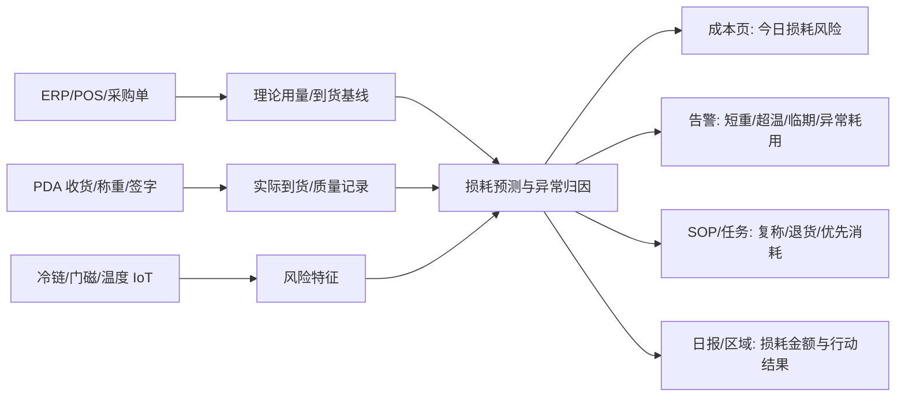

# 后厨损耗预测切入计划

**产品策略补充 · 在全局运营副驾驶不变的前提下，以后厨损耗预测作为创业切入口**

| 项目 | 内容 |
|------|------|
| 日期 | 2026-06-19 |
| 关联 | [product_design.md](product_design.md) · [architecture_design_phase1.md](architecture_design_phase1.md) · [development_delivery_plan.md](development_delivery_plan.md) |
| 输入 | 外部创业讨论聚焦：先打穿最痛、最可量化的后厨损耗，再分场景扩展 |
| 状态 | 产品/架构参考调整，代码实现分期 |

---

## 1. 调整结论

全局定位仍是“连锁火锅门店运营副驾驶”，但 Phase 1 的市场切入口从“五目标并列演示”收束为：

> **先帮店长/厨师长把后厨损耗看见、算清、预测并闭环，证明 ROI；再扩展到翻台、SOP、告警、日报、区域管理。**

这样做的理由：

| 维度 | 后厨损耗预测为何优先 |
|------|----------------------|
| 痛点强 | 食材短重、超温、过期、备货不准、改刀损耗直接影响毛利 |
| ROI 可量化 | 可以用损耗金额、损耗率、短重率、拒收率、预测命中率衡量 |
| 数据闭环短 | ERP/POS/收货/PDA/IoT 已在当前架构中有接口或 stub |
| 角色清晰 | 厨师长、店长、收货员、区域督导都有明确动作 |
| 可扩展 | 成本异常可自然生成 SOP、任务、告警、日报和跨店对标 |

---

## 2. 切入口闭环

---

## 3. 分阶段落地

| 阶段 | 名称 | 核心问题 | 产品交付 | 架构/数据交付 | 通过标准 |
|------|------|----------|----------|---------------|----------|
| P1A | 损耗可见 | 今天亏在哪 | 成本页显示短重、超温、异常批次、估算损耗金额 | 复用 `/v1/receiving/*`、`/v1/iot/readings*`、`/cost`、ERP/POS bridge | 每个异常批次有 SKU、供应商、金额、责任链 |
| P1B | 损耗预测 | 明天/本班可能亏在哪 | 后厨损耗风险 TopN：临期、超温、备货过量、耗用异常 | 新增 feature builder + rule baseline；规划 `/v1/cost/loss-risk` | TopN 风险可被厨师长理解并处理 |
| P1C | 行动闭环 | 预测后谁处理 | 一键生成复称、优先消耗、退货留证、SOP 整改 | 接 `/v1/sop/assign`，P1.5 接 F-TASK | 预测→动作→结果在日报可追踪 |
| P2 | 多店对标 | 哪家店/供应商损耗异常 | 区域损耗榜、供应商 KPI、异常门店清单 | PostgreSQL + store scope + rollup | 区域督导能定位 Top 异常店和供应商 |
| P3 | 智能优化 | 如何减少损耗 | 订货/备货/解冻建议，加盟复制模板 | POS/ERP 深集成，轻量模型迭代 | 能证明持续降低损耗率 |

---

## 4. 指标体系

| 指标 | 定义 | 阶段 |
|------|------|------|
| 可归因损耗金额 | 短重、质差、超温、过期、异常耗用折算金额 | P1A |
| 损耗率 | 可归因损耗金额 / 食材采购金额 | P1A |
| 预测命中率 | 系统预测风险中，被人工确认或后续事件验证的比例 | P1B |
| 行动闭环率 | 预测/异常生成的动作在 SLA 内完成比例 | P1C |
| 供应商异常率 | 供应商维度短重/质差/拒收批次数占比 | P2 |

Phase 1 北极星建议从“有效告警处理率”调整为：

> **可归因后厨损耗金额被系统发现并闭环的比例**。

告警 ack、日报阅读、SOP 合规仍保留，但作为损耗闭环的支撑指标。

---

## 5. 边界

| 做 | 不做 |
|----|------|
| 预测/建议/排序/归因 | 自动扣款、自动退货 |
| 人工确认和签字留证 | 用 AI 替代厨师长判断 |
| 规则 baseline 起步，逐步模型化 | 一上来训练复杂黑盒模型 |
| 单店 ROI 证明后再跨店复制 | 第一阶段追求全国中台大而全 |

---

## 6. 对现有全局设计的影响

| 设计域 | 保持不变 | 调整 |
|--------|----------|------|
| 产品定位 | 运营副驾驶 | Phase 1 叙事改为“后厨损耗预测先打穿” |
| 模块地图 | 桌态、后厨、SOP、成本、告警、日报、层级保留 | 成本/后厨/PDA 成为主路径；其他模块支撑闭环 |
| 架构 | L1 Edge + L2 Hub + L3 Admin 分期不变 | C-05 来料成本升级为首个 lead loop；新增 loss-risk 规划接口 |
| 数据 | OpsEvent、receiving、iot、cost、daily_reports 复用 | 后续补 loss_features/loss_predictions 或先用 snapshot 过渡 |
| 路线图 | P1/P1.5/P2/P3 分期不变 | P1A/P1B/P1C 更明确，避免五线并进 |
