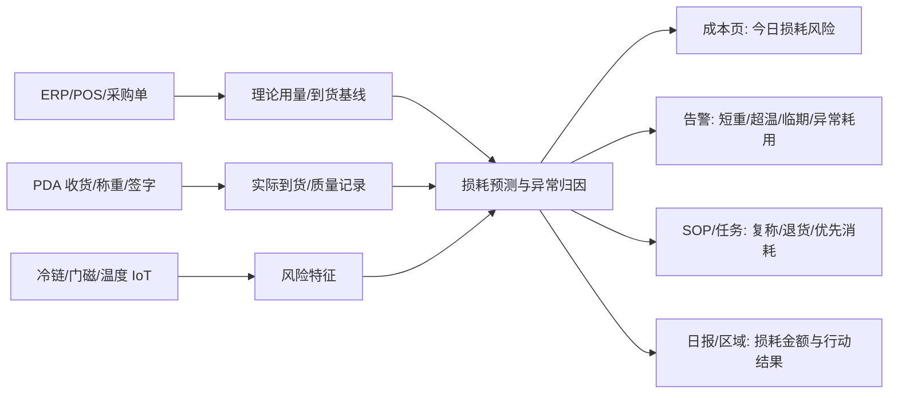

# 后厨损耗预测切入计划

**产品策略补充 · 在全局运营副驾驶不变的前提下，以后厨损耗预测作为创业切入口**

| 项目 | 内容 |
|------|------|
| 日期 | 2026-06-19 |
| 关联 | [product_design.md](product_design.md) · [architecture_design_phase1.md](architecture_design_phase1.md) · [development_delivery_plan.md](development_delivery_plan.md) |
| 输入 | 外部创业讨论聚焦：先打穿最痛、最可量化的后厨损耗，再分场景扩展 |
| 状态 | 产品/架构参考调整，代码实现分期 |

---

## 1. 调整结论

全局定位仍是“连锁火锅门店运营副驾驶”，但 Phase 1 的市场切入口从“五目标并列演示”收束为：

> **先帮店长/厨师长把后厨损耗看见、算清、预测并闭环，证明 ROI；再扩展到翻台、SOP、告警、日报、区域管理。**

这样做的理由：

| 维度 | 后厨损耗预测为何优先 |
|------|----------------------|
| 痛点强 | 食材短重、超温、过期、备货不准、改刀损耗直接影响毛利 |
| ROI 可量化 | 可以用损耗金额、损耗率、短重率、拒收率、预测命中率衡量 |
| 数据闭环短 | ERP/POS/收货/PDA/IoT 已在当前架构中有接口或 stub |
| 角色清晰 | 厨师长、店长、收货员、区域督导都有明确动作 |
| 可扩展 | 成本异常可自然生成 SOP、任务、告警、日报和跨店对标 |

---

## 2. 切入口闭环

---

## 3. 分阶段落地

| 阶段 | 名称 | 核心问题 | 产品交付 | 架构/数据交付 | 通过标准 |
|------|------|----------|----------|---------------|----------|
| P1A | 损耗可见 | 今天亏在哪 | 成本页显示短重、超温、异常批次、估算损耗金额 | 复用 `/v1/receiving/*`、`/v1/iot/readings*`、`/cost`、ERP/POS bridge | 每个异常批次有 SKU、供应商、金额、责任链 |
| P1B | 损耗预测 | 明天/本班可能亏在哪 | 后厨损耗风险 TopN：临期、超温、备货过量、耗用异常 | 新增 feature builder + rule baseline；规划 `/v1/cost/loss-risk` | TopN 风险可被厨师长理解并处理 |
| P1C | 行动闭环 | 预测后谁处理 | 一键生成复称、优先消耗、退货留证、SOP 整改 | 接 `/v1/sop/assign`，P1.5 接 F-TASK | 预测→动作→结果在日报可追踪 |
| P2 | 多店对标 | 哪家店/供应商损耗异常 | 区域损耗榜、供应商 KPI、异常门店清单 | PostgreSQL + store scope + rollup | 区域督导能定位 Top 异常店和供应商 |
| P3 | 智能优化 | 如何减少损耗 | 订货/备货/解冻建议，加盟复制模板 | POS/ERP 深集成，轻量模型迭代 | 能证明持续降低损耗率 |

---

## 4. 指标体系

| 指标 | 定义 | 阶段 |
|------|------|------|
| 可归因损耗金额 | 短重、质差、超温、过期、异常耗用折算金额 | P1A |
| 损耗率 | 可归因损耗金额 / 食材采购金额 | P1A |
| 预测命中率 | 系统预测风险中，被人工确认或后续事件验证的比例 | P1B |
| 行动闭环率 | 预测/异常生成的动作在 SLA 内完成比例 | P1C |
| 供应商异常率 | 供应商维度短重/质差/拒收批次数占比 | P2 |

Phase 1 北极星建议从“有效告警处理率”调整为：

> **可归因后厨损耗金额被系统发现并闭环的比例**。

告警 ack、日报阅读、SOP 合规仍保留，但作为损耗闭环的支撑指标。

---

## 5. 边界

| 做 | 不做 |
|----|------|
| 预测/建议/排序/归因 | 自动扣款、自动退货 |
| 人工确认和签字留证 | 用 AI 替代厨师长判断 |
| 规则 baseline 起步，逐步模型化 | 一上来训练复杂黑盒模型 |
| 单店 ROI 证明后再跨店复制 | 第一阶段追求全国中台大而全 |

---

## 6. 对现有全局设计的影响

| 设计域 | 保持不变 | 调整 |
|--------|----------|------|
| 产品定位 | 运营副驾驶 | Phase 1 叙事改为“后厨损耗预测先打穿” |
| 模块地图 | 桌态、后厨、SOP、成本、告警、日报、层级保留 | 成本/后厨/PDA 成为主路径；其他模块支撑闭环 |
| 架构 | L1 Edge + L2 Hub + L3 Admin 分期不变 | C-05 来料成本升级为首个 lead loop；新增 loss-risk 规划接口 |
| 数据 | OpsEvent、receiving、iot、cost、daily_reports 复用 | 后续补 loss_features/loss_predictions 或先用 snapshot 过渡 |
| 路线图 | P1/P1.5/P2/P3 分期不变 | P1A/P1B/P1C 更明确，避免五线并进 |

---

## 7. 四周 MVP 执行清单（外部讨论落地 → 映射本仓库切入点）

> 输入：外部创业讨论给出的 4 周从想法到 MVP 的行动清单。下表把每周任务**落到本仓库真实代码/数据切入点**，使「损耗预测先打穿」可立即执行。验证对象：单店（亲戚火锅店），出口指标见 §4。

| 周 | 目标 | 动作（外部清单） | 本仓库切入点 | 产出物 |
|----|------|------------------|--------------|--------|
| **W1** | 蹲点采数据（不写代码） | 拍废料桶 ≥100 张；切配师傅手工台账（切了/扔了/来料品质好-中-差，连记 7 天）；导出过去一月每日桌数+外卖量 | 对齐 `demo/data/`（`pos_stats.json`、`erp_po_orders.json`、`incoming_materials.json`、`ingredient_lifecycle_iot.json`）字段，作为 `loss_features` 真值种子 | Excel：日期/预订桌数/实际消耗/丢弃量/来料品质评分 |
| **W2** | 云端 API 验证预测逻辑（先不碰盒子） | 用 W1 数据写 Prompt，调用 DeepSeek/通义千问 API：输入「近 7 天消耗 + 今日预订 + 天气」→ 输出「今晚建议备货量」；与店长拍脑袋对比，误差稳定 <10% 即方向成立 | 复用 `cloud/llm_report/report_agent.py` 的 `OpenAIReportAgent` 模式新增 forecast prompt；`cloud/cost_control/analyzer.py` 出规则 baseline；对应规划接口 `/v1/cost/loss-risk`（见 §3 P1B） | 备货建议 vs 店长经验的命中率对比表（go/no-go 闸） |
| **W3** | 边缘盒子选型与部署 | 选型决策（见下方硬件表）；开发机优先生态 | `edge/detector/`（YOLO/RKNN）、`edge/rknn_deploy/`、ADR-005（生产 yolo）、ADR-014（YOLO→sVLM→VLM 三级过滤） | 跑通全链路的开发盒子 |
| **W4** | 搭「每日备货预测推送」Demo | 废料桶摄像头→VLM 识别废料种类/份量；LLM 读 VLM+收银数据出预测；微信群机器人**每天 15:00** 推送「今晚毛肚建议备 15 份，雨天 +10%」；亲戚免费试用一周，只问「下月收 1500 你还用吗」 | VLM：`cloud/vlm_review/`（`/quality-grade` 扩展为废料识别）；LLM：`cloud/llm_report/`；推送：`cloud/alert_gateway/`（企微 webhook）+ `cloud/event_hub/daily_scheduler.py`（**当前单时段单任务，仅 `HOTPOT_DAILY_REPORT_HOUR` 临时演示改 15:00**；三时段需 schedule profiles 扩展，见 ADR 收敛纪要） | 每日自动推送 Demo + 单店付费意向（pay-test） |

### 7.1 硬件选型决策（与 ADR-005 / ADR-014 一致）

| 阶段 | 选型 | 理由 |
|------|------|------|
| 开发/验证（第一台） | **NVIDIA Jetson Orin Nano 8GB**（≈¥2200-2600，40 TOPS） | 原生跑 Qwen2.5-VL-3B + Llama 3.2 3B，JetPack/CUDA/TensorRT 生态成熟，8GB 统一内存可同时常驻 3B VLM + 3B LLM，省模型适配成本；第一台是「开发机」跑通全链路 |
| 批量部署 | **瑞芯微 RK3588**（≈¥800-1000，6 TOPS NPU） | 成本效率（FPS/¥）显著更高，适合验证成功后规模铺店；经 RKNN 工具链转模型。本仓库 `edge/rknn_deploy/` 已就绪 |

> 这与 ADR-005「生产默认 yolo，dev 可 mock」、ADR-014「YOLO-only on Jetson，VLM feature flag」一致：**开发期 Jetson 跑全栈（YOLO+VLM+LLM）验证，批量期 RK3588 跑 YOLO-first 降成本**。

### 7.2 与现有分期的衔接

- W1~W2 = P1B「损耗预测」的**数据与规则 baseline**前置（§3）；不引入复杂模型（§5 边界：规则起步）。
- W4 的「每日推送」复用 P1A 已有的 `daily_scheduler` + `alert_gateway`，只是把日报口径聚焦为**备货/损耗风险**并改推送时段。
- pay-test（1500/月）= 北极星（§4「可归因损耗金额被发现并闭环的比例」）的**单店商业验证闸**：未通过则停在 P1B 调整，不进 P2 跨店。

---

## 8. 创业项目总结与双线商业化（外部完整讨论提炼）

### 8.1 一句话项目定义

> 利用在职积累的**边缘 AI 盒子 + 平台产品 + 运营商渠道**，以「**后厨损耗预测**」为针尖单点打穿火锅餐饮场景，沉淀可复制的**行业智能体模板**，最终形成「边缘 AI 盒子 + 行业智能体模板」标准套件。

### 8.2 双线并行（项目养产品）

| 线 | 角色 | 打法 | 与本仓库关系 |
|----|------|------|--------------|
| **运营商渠道线**（重庆电信等） | 现金流（脏活、来钱快） | 盒子对外定位「本地预处理，降带宽/云存储成本 ~60%」，以**技术供应商**身份入政企部，帮其完成「智慧园区/智慧餐饮」KPI；项目沉淀 3+ 落地案例与入库证明 | 复用同一 `edge/` + `cloud/` 套件；餐饮方案即「智慧餐饮」解决方案 |
| **火锅餐饮线**（亲戚连锁） | 产品化样板间（慢、可复制、边际成本低） | 针尖式单点爆破：只做后厨损耗预测；单店 ROI 证明后再跨店 | 本仓库主路径（§1~§7） |

> 三层境界落地：**借力**（亲戚店带薪调研 + 电信渠道）→ **造势**（"已在重庆电信渠道稳定运行 XX 小时"）→ **做局**（盒子+模板标准套件，让运营商替你铺店）。

### 8.3 MVP 纪律：针尖式单点，坚决"做少"（强化 §5 边界）

外部讨论明确**否决了"全链路大而全"**（来料验收 + 库存锁定 + 供应商问责 + 排班 + 营销），结论：

| MVP **只做** | MVP **坚决不做**（二期/客户逼才做） |
|--------------|-------------------------------------|
| 后厨损耗预测一个点：每天 15:00 推一张「三行字」图 | 自动验货、库存自动锁定、供应商问责报告 |
| 来料品质 = **师傅手动 3 按钮打分**（"今天货怎么样？好/一般/差"）作为**预测输入因子** | 不装称重台/验货摄像头自动品控（VLM 自动验货 → 二期） |
| 旧安卓手机 + 云 API 先验证逻辑，签下首个付费客户再买 Jetson | 不在硬件上 All in、不接定制化改功能 |

> **对 PRD 的影响**：F-C03（VLM 品质等级 A/B/C/D 自动分级）在创业 MVP 阶段**降级为「师傅手动打分」输入**，VLM 自动验货延后到 P1B 之后/二期。F-C06 损耗预测、F-C07 损耗闭环为本期主线。

### 8.4 四层落地架构（损耗预测闭环 → 映射代码）

| 层 | 职责（外部讨论） | 本仓库切入点 |
|----|------------------|--------------|
| L1 数据采集 | VLM 把切配台/废料桶画面翻译成结构化日志（`{时间,食材,动作,预估份量}`）；MVP 阶段可由手工台账/手动打分替代 | `cloud/vlm_review/`（废料/份量识别）；W1 手工台账过渡 |
| L2 特征工程 | 边缘时序对齐：VLM 输出 + 预订桌数 + 入座率 + 天气 + 节假日/活动。**先做 snapshot/JSON feature_builder + 测试，暂不建 `loss_features/loss_predictions` 表**（pay-test 通过或需跨天回放再落表） | `cloud/cost_control/analyzer.py`（仅够 P1A）+ `demo/data/*` |
| L3 预测决策 | LLM 少样本时序预测，输出**带理由**的备货建议（非黑盒数字）。**规则 baseline 已落桩 LOSS-402**：`GET /v1/cost/loss-risk` → TopN risk_score/reason/suggested_action | `routers/cost.py` + `domain/loss_risk.py`（已实现）；`cloud/llm_report/report_agent.py`（forecast prompt 待接） |
| L4 闭环反馈 | 次日 VLM/台账验证实际浪费，误差回喂 LLM 自动修正系数 | `daily_scheduler` 调度 + 成本页/日报归因（§2 闭环） |

### 8.5 交付形态（三时段推送 → daily_scheduler 多时段）

| 时段 | 内容 | 渠道 | 切入点 |
|------|------|------|--------|
| 每日 15:00 | 今晚建议备货（毛肚 15 / 鸭肠 10 / 黄喉 8）+ 理由摘要 + 品质提醒 | 后厨打印机 / 企微 | `daily_scheduler`（**需扩 schedule profiles**，现单时段）+ `alert_gateway` |
| 每日 22:00 | 今日损耗报告（浪费份数、损耗率、环比） | 老板微信/钉钉 | 现有日报（F-R01）聚焦损耗口径 |
| 每周一 09:00 | 损耗趋势周报（雨天上调 12%、周五提前切配等） | 邮箱 LLM 周报 | LLM 周报扩展（P1.5） |

### 8.6 模型与硬件选型补充（与 §7.1 一致）

- VLM：`Qwen2.5-VL-3B` / `MiniCPM-V-2.6`（量化版）；LLM：`Qwen2.5-3B-Instruct` / `Phi-3.5-mini`；推理 `llama.cpp` / INT4 量化；VLM+LLM 同时常驻需 ≥16GB（理想 32GB）统一内存。
- 阶段：原型（旧安卓 + 云 API）→ 开发机 Jetson Orin Nano 8GB（跑全栈验证）→ 批量 RK3588（YOLO-first 降成本）。
- 核心竞争力：**第一反应速度 ≤3s** 与**盒子稳定性（插上就忘）**优先于模型"智商"。

### 8.7 验证闸（北极星的商业版）

免费试用一月 → **"下月收 1500 元你还用吗？"** 单店付费意向通过，才进入跨店/运营商渠道复制；否则停在 P1B 调整。与 §4 北极星「可归因损耗金额被发现并闭环的比例」互为表里。
