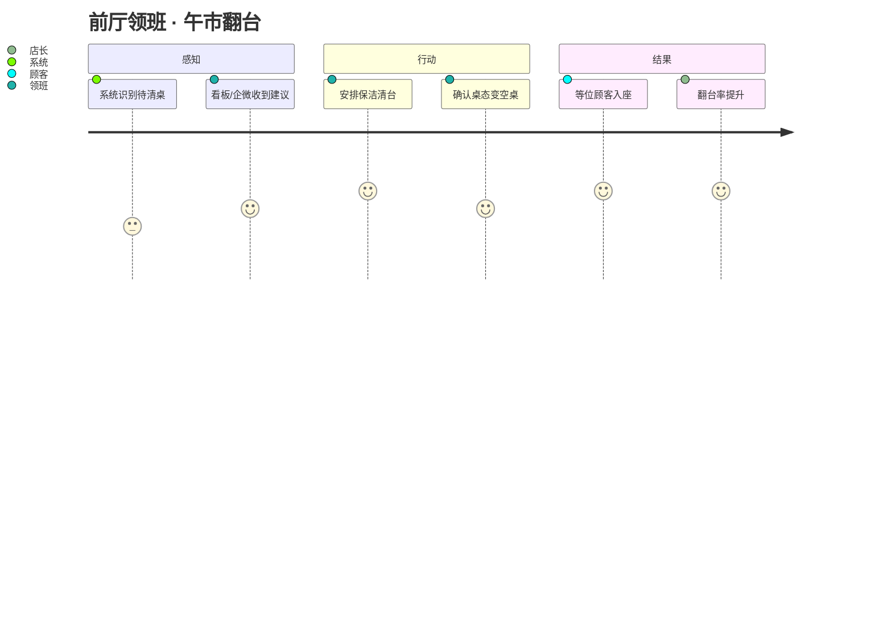
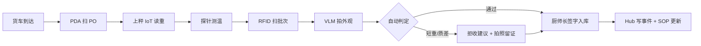
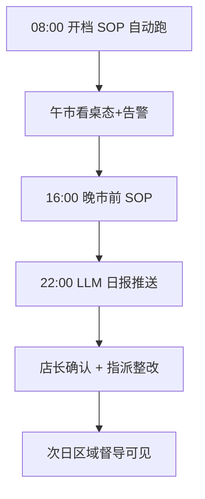
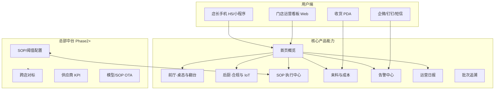
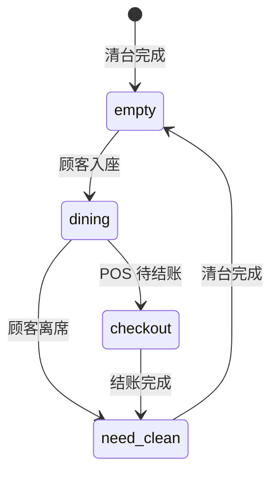
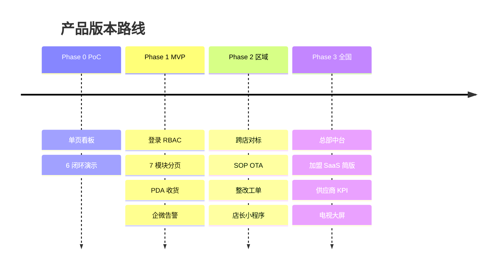

# 产品设计文档（PRD）

**火锅餐饮智能运营 · Product Design**

| 项目 | 内容 |
|------|------|
| 文档版本 | V1.0 |
| 文档类型 | 产品需求与设计规格 |
| 上游 | [solution.md](solution.md)（解决方案） |
| 下游 | [design_dev_implementation_plan.md](design_dev_implementation_plan.md) · [sprint_task_backlog.md](sprint_task_backlog.md) |
| PoC 参考 UI | `dashboard/index.html` |
| 更新日期 | 2026-06-12 |

---

## 目录

1. [产品定位与目标](#1-产品定位与目标)
2. [产品原则](#2-产品原则)
3. [用户与场景](#3-用户与场景)
4. [产品架构](#4-产品架构)
5. [功能规格（Feature PRD）](#5-功能规格feature-prd)
6. [信息架构与导航](#6-信息架构与导航)
7. [核心页面设计](#7-核心页面设计)
8. [告警与通知设计](#8-告警与通知设计)
9. [权限与角色](#9-权限与角色)
10. [数据指标与埋点](#10-数据指标与埋点)
11. [产品路线图](#11-产品路线图)
12. [Phase 1 MVP 范围](#12-phase-1-mvp-范围)
13. [与 PoC 看板的演进关系](#13-与-poc-看板的演进关系)

---

## 1. 产品定位与目标

### 1.1 一句话定位

> **面向连锁火锅门店的「运营副驾驶」——把桌态、后厨、来料、SOP 从「人盯人」变成「系统提醒 + 人确认」，让店长用一张屏管好一整家店。**

### 1.2 产品边界

| 我们做 | 我们不做（Phase 1） |
|--------|---------------------|
| 运营监测、告警、日报、SOP 数字化 | 替 POS 收银、替 ERP 下单 |
| 翻台/清台/来料 **建议** | 自动扣款、自动退货（仅建议+工单） |
| 食安与成本 **数据闭环** | 人脸识别、个体追踪 |
| 总部标准下发与跨店对标 | 完整 HR/排班系统 |

### 1.3 产品目标（Phase 1 试点）

| 目标 | 产品承载 | 成功信号 |
|------|----------|----------|
| 提升翻台效率 | 桌态看板 + 翻台建议 | 店长每日打开看板 ≥3 次 |
| 降低食材损耗 | IoT 全链路 + 成本页 | 来料偏差可见、可追责 |
| 提升 SOP 执行率 | SOP 页 + 班次报告 | 违规 30min 内有人 ack |
| 缩短决策时间 | LLM 日报 + 告警推送 | 日报阅读率 >80% |
| 可复制到加盟 | 预配置 + 只读总部配置 | 加盟店零配置部署 |

### 1.4 产品价值主张（按角色）

| 角色 | Before | After |
|------|--------|-------|
| 店长 | 巡场靠腿、信息滞后 | 一屏掌握桌态/告警/日报 |
| 前厅领班 | 清台靠喊、优先级靠猜 | 待清台排序 + 推送任务 |
| 厨师长 | 来料验收靠经验、损耗难量化 | 秤+VLM+PO 自动对账 |
| 区域督导 | 抽检靠到店、数据不可比 | 跨店对标 + 异常门店清单 |
| 总部 PMO | SOP 下发靠文档、执行难验证 | OTA SOP + 合规率看板 |

---

## 2. 产品原则

| # | 原则 | 产品体现 |
|---|------|----------|
| P1 | **告警要少而准** | 首月降低阈值灵敏度；critical 才推手机 |
| P2 | **建议可忽略，不可骚扰** | 同一桌 5min 内不重复推清台 |
| P3 | **IoT 优先于人工填报** | 能自动采的不让用户填 |
| P4 | **人工签字保留责任链** | 拒收/整改/SOP 关键项需确认 |
| P5 | **移动端优先于大屏** | 店长用手机；电视大屏 Phase 2 |
| P6 | **加盟不能改总部标准** | SOP/阈值只读；仅 ack/签字 |
| P7 | **隐私默认安全** | 不展示人脸；视频仅事件截图 |

---

## 3. 用户与场景

### 3.1 用户画像

|  persona | 典型人 | 核心诉求 | 使用端 | 频率 |
|----------|--------|----------|--------|------|
| **店长** | 门店负责人 | 增收降本、少背锅 | 手机/Web | 每日多次 |
| **前厅领班** | 大厅主管 | 清台翻台、等位 | 手机/企微 | 高峰实时 |
| **厨师长** | 后厨负责人 | 来料、出成、食安 | Web/PDA | 收货+班次 |
| **收货员** | 卸货/验收 | 快速验收、留证 | PDA | 每批次 |
| **区域督导** | 区域运营 | 多店对比、抓异常 | Web | 每日 1 次 |
| **总部 PMO** | 标准与推广 | SOP/供应商/推广 | Web 中台 | 每周 |
| **加盟业主** | 投资人 | 看 ROI、少折腾 | 手机简版 | 每周 |

### 3.2 核心用户旅程

#### 旅程 A：午市翻台（前厅）



**触点**：桌态看板 · 企微卡片 · （Phase 2）等位屏联动

#### 旅程 B：来料收货（后厨）



**触点**：收货 PDA · 成本页 · 告警（短重/超温）

#### 旅程 C：店长每日闭环



---

## 4. 产品架构

### 4.1 产品模块地图



### 4.2 端与场景匹配

| 端 | Phase | 主要功能 | 备注 |
|----|-------|----------|------|
| **门店 Web 看板** | 1 | 全模块 | 店长/厨师长桌面端 |
| **店长 H5** | 1 | 概览+告警+日报 | 响应式或独立轻页 |
| **收货 PDA** | 1 | 来料验收流 | 可 H5 起步 |
| **企微/钉钉** | 1 | critical/warn 推送 | 无独立 App |
| **区域 Web** | 2 | 多店对标 | 只读+下钻单店 |
| **总部中台** | 2~3 | 配置/OTA/供应商 | 加盟只读 |
| **门店电视大屏** | 2 | 桌态+告警 | 可选 |

---

## 5. 功能规格（Feature PRD）

优先级：**P0** 试点必做 · **P1** 试点强烈建议 · **P2** 二期

### 5.1 模块：首页概览（Home）

| ID | 功能 | 优先级 | 用户故事 | 验收标准 |
|----|------|--------|----------|----------|
| F-H01 | 连接与设备状态 | P0 | 作为店长，我想知道系统是否在线 | 显示 Hub/边缘/摄像头/IoT 在线数 |
| F-H02 | 今日 KPI 卡片 | P0 | 作为店长，我想一眼看到关键数 | 严重告警/待清台/SOP 率/成本偏差 |
| F-H03 | 快捷入口 | P1 | 作为店长，我想快速进各模块 | 6 宫格：桌态/SOP/成本/IoT/告警/日报 |
| F-H04 | 班次切换 | P1 | 作为店长，我想看午/晚市数据 | 切换 noon/evening 过滤 |

**数据依赖**：`/summary` 聚合 API

---

### 5.2 模块：前厅·桌态与翻台（Tables）

| ID | 功能 | 优先级 | 用户故事 | 验收标准 |
|----|------|--------|----------|----------|
| F-T01 | 桌位平面图 | P0 | 作为领班，我想看到每桌状态 | 四态颜色：空/用餐/待清/待结 |
| F-T02 | 桌态实时刷新 | P0 | 作为领班，我想接近实时更新 | ≤5s 轮询或 WebSocket |
| F-T03 | 翻台优先建议 | P0 | 作为领班，我想知道先清哪桌 | Top5 列表，含理由（待清+POS 已结） |
| F-T04 | 单桌详情 | P1 | 作为领班，我想看某桌历史 | 状态变更时间线 |
| F-T05 | VLM 清台就绪分 | P1 | 作为领班，我想知道可否清台 | 0~100 分 + 截图（Phase 1 可 mock） |
| F-T06 | 手动纠正桌态 | P1 | 作为领班，误识别时我要改 | 人工 override + 审计 |
| F-T07 | 等位预计时间 | P2 | 作为店长，我想联动等位 | 基于空桌预测 |

**状态机**：



| PoC 单页 | `dashboard/poc.html` | 6 闭环同屏演示 |
| **MVP 多页** | `dashboard/login.html` 等 | 7 模块 + PDA + 登录 |
| **手机 H5** | `dashboard/mobile/index.html` | 4 Tab · 390px 概念测试 |

**PoC 已有**：F-T01~T03 雏形（已拆至 `tables.html`；旧版见 `poc.html`）

---

### 5.3 模块：后厨·合规与 IoT（Kitchen）

| ID | 功能 | 优先级 | 用户故事 | 验收标准 |
|----|------|--------|----------|----------|
| F-K01 | 冷链温湿度实时 | P0 | 作为厨师长，我想看冷库是否正常 | 冷冻/冷藏曲线 + 当前值 |
| F-K02 | 门磁未关告警 | P0 | 作为厨师长，门开太久要提醒 | 超时阈值可配 |
| F-K03 | 食材全链路快照 | P0 | 作为厨师长，我想看来料→保存→加工 | 三阶段卡片 + 异常高亮 |
| F-K04 | 燃气/烟雾告警 | P0 | 作为店长，安全事件要立即知道 | critical 推送 |
| F-K05 | 穿戴合规告警 | P1 | 作为厨师长，未戴帽要提醒 | CV 事件列表 + 截图 |
| F-K06 | 解冻/锅底温度 | P1 | 作为厨师长，加工环境要达标 | IoT 传感器卡片 |
| F-K07 | 设备在线率 | P1 | 作为 IT，传感器离线要可见 | 离线列表 |

**PoC 已有**：F-K03 摘要（iot-summary + iot-alerts）

---

### 5.4 模块：SOP 执行中心（SOP）

| ID | 功能 | 优先级 | 用户故事 | 验收标准 |
|----|------|--------|----------|----------|
| F-S01 | 班次 SOP 列表 | P0 | 作为厨师长，我想看本班哪些 SOP 要跑 | 7 套 SOP 卡片 |
| F-S02 | 检查点明细 | P0 | 作为厨师长，我想看哪项没过 | 通过/失败/待确认 |
| F-S03 | 合规率 | P0 | 作为店长，我想看本班合规率 | 百分比 + 趋势 |
| F-S04 | 违规清单 | P0 | 作为店长，我要指派整改 | 违规项 + 责任人 + 截止 |
| F-S05 | 人工签字 | P0 | 作为收货员，关键项要签字 | PDA/Web 确认 + 时间戳 |
| F-S06 | 整改闭环 | P1 | 作为督导，整改要有结果 | 待办→处理→复核 |
| F-S07 | SOP 知识问答 | P1 | 作为新员工，我想问 SOP 怎么操作 | LLM RAG 问答 |
| F-S08 | 总部 SOP 版本 | P2 | 作为 PMO，我要 OTA 下发 | 版本号 + 生效时间 |

**PoC 已有**：F-S01~S04 列表（sop-list + sop-rate）

---

### 5.5 模块：来料与成本（Cost）

| ID | 功能 | 优先级 | 用户故事 | 验收标准 |
|----|------|--------|----------|----------|
| F-C01 | 当日来料批次列表 | P0 | 作为厨师长，我想看今天收了什么 | SKU/供应商/重量/偏差 |
| F-C02 | 短重/超价高亮 | P0 | 作为厨师长，异常批次要醒目 | >3% 标红 |
| F-C03 | VLM 品质等级 | P0 | 作为收货员，外观等级要记录 | A/B/C/D + 截图 |
| F-C04 | 拒收建议 | P0 | 作为厨师长，系统建议拒收我要看理由 | LLM 一句说明 |
| F-C05 | 出成率 | P1 | 作为厨师长，改刀损耗要量化 | 领料秤 vs 出成秤 |
| F-C06 | 供应商累计 KPI | P2 | 作为 PMO，我要排名 | 区域/全国榜单 |

**PoC 已有**：F-C01~C02 摘要（cost-summary + cost-list）

---

### 5.6 模块：告警中心（Alerts）

| ID | 功能 | 优先级 | 用户故事 | 验收标准 |
|----|------|--------|----------|----------|
| F-A01 | 实时事件流 | P0 | 作为店长，我想看所有告警 | 按时间倒序，分级色 |
| F-A02 | 分级过滤 | P0 | 作为店长，我想只看 critical | info/warn/critical 筛选 |
| F-A03 | 告警确认 ack | P0 | 作为店长，处理后我要确认 | ack 人+时间留痕 |
| F-A04 | 推送路由 | P0 | 作为店长，critical 推手机 | 企微/钉钉 30s 内 |
| F-A05 | 告警升级 | P1 | 作为督导，30min 未 ack 升级 | 升级至区域 |
| F-A06 | 静默规则 | P1 | 作为店长，误报多时要降频 | 同类型 5min 合并 |

**PoC 已有**：F-A01 事件流（events 列表）

---

### 5.7 模块：运营日报（Report）

| ID | 功能 | 优先级 | 用户故事 | 验收标准 |
|----|------|--------|----------|----------|
| F-R01 | 日报告生成 | P0 | 作为店长，我每天要一份总结 | 22:00 自动生成 |
| F-R02 | 结构化章节 | P0 | 作为店长，我想看翻台/SOP/成本/安全 | 固定 4 章 + 整改清单 |
| F-R03 | 一键重新生成 | P1 | 作为店长，数据更新后我要刷新 | 手动触发 API |
| F-R04 | 历史日报 | P1 | 作为督导，我想回看上周 | 按日期列表 |
| F-R05 | 区域对标叙述 | P2 | 作为 PMO，我想看 narrative 对比 | LLM 跨店段落 |

**PoC 已有**：F-R01~R02（生成日报按钮 + report-box）

---

### 5.8 模块：收货 PDA（Receiving）

| ID | 功能 | 优先级 | 用户故事 | 验收标准 |
|----|------|--------|----------|----------|
| F-P01 | 扫 PO/选批次 | P0 | 作为收货员，我要选 today's PO | 列表或扫码 |
| F-P02 | 称重自动带入 | P0 | 作为收货员，秤重自动填 | 无需手输 kg |
| F-P03 | 探针温度 | P0 | 作为收货员，冷链货要测温 | 蓝牙/手输 |
| F-P04 | RFID 扫描 | P1 | 作为收货员，批次要追溯 | 扫描成功提示 |
| F-P05 | 外观拍照 VLM | P0 | 作为收货员，拍一张自动分级 | 10s 内返回等级 |
| F-P06 | 双人签字 | P0 | 作为厨师长，验收要签字 | 电子签 + 不可抵赖 |
| F-P07 | 拒收流程 | P1 | 作为收货员，拒收要留证 | 拍照 + 原因选择 |

**Phase 1**：H5 竖屏，3~5 步向导式流程

---

### 5.9 模块：总部中台（HQ Console）— Phase 2+

| ID | 功能 | 优先级 | 说明 |
|----|------|--------|------|
| F-HQ01 | 跨店对标看板 | P1 | 翻台/SOP/成本/告警排名 |
| F-HQ02 | SOP 配置 OTA | P1 | 版本、生效范围、回滚 |
| F-HQ03 | 阈值配置 | P1 | 短重%、温度范围 |
| F-HQ04 | 供应商 KPI | P2 | 短重率、拒收率 |
| F-HQ05 | 模型 OTA 管理 | P2 | CV 模型版本 |

---

## 6. 信息架构与导航

### 6.1 门店 Web 看板 IA

```
登录
└── 首页概览
    ├── 前厅 · 桌态与翻台
    ├── 后厨 · IoT 与合规
    ├── SOP 执行中心
    │   └── 检查点详情 / 整改工单
    ├── 来料与成本
    │   └── 批次详情 / 追溯
    ├── 告警中心
    └── 运营日报
        └── 历史日报
设置（店长）
└── 门店信息 / 通知偏好 / 账号
```

### 6.2 导航模式

| 端 | 主导航 | 辅助 |
|----|--------|------|
| Web 看板 | 左侧固定 7 项 | 顶栏：门店名、班次、告警角标 |
| 手机 H5 | 底部 4 Tab：首页/桌态/告警/我的 | 日报从首页进 |
| PDA | 单任务流，无全局导航 | 完成后回 PO 列表 |

### 6.3 全局顶栏元素

| 元素 | 说明 |
|------|------|
| 门店名 + 编号 | store_id 映射中文名 |
| 班次 | 午市 / 晚市 / 全天 |
| 告警角标 | critical 未 ack 数量 |
| 连接状态 | 绿/红点（PoC 已有） |
| 用户菜单 | 角色、退出 |

---

## 7. 核心页面设计

> Phase 1 视觉：延续 PoC 深色运营风；生产增加登录与侧栏。以下为线框级规格，高保真 Phase 1 Sprint 4 交付。

### 7.1 首页概览

```
┌─────────────────────────────────────────────────────────────┐
│ [Logo] 冯校长火锅·玉环店  午市 ▼     🔔3   ● 已连接    张店长 ▼ │
├──────────┬──────────────────────────────────────────────────┤
│ 首页 ●   │  KPI 卡片行                                       │
│ 桌态     │  ┌──────┐ ┌──────┐ ┌──────┐ ┌──────┐ ┌──────┐   │
│ 后厨     │  │严重0 │ │待清3 │ │SOP92%│ │偏差2%│ │空桌12│   │
│ SOP      │  └──────┘ └──────┘ └──────┘ └──────┘ └──────┘   │
│ 成本     │  ┌─ 待处理 ─────────────────────────────────┐   │
│ 告警     │  │ • T05 待清台 12min  [派保洁]               │   │
│ 日报     │  │ • 冷藏库 5.2°C     [确认]                  │   │
│          │  └────────────────────────────────────────────┘   │
│          │  ┌─ 快捷入口 ─────────────────────────────────┐   │
│          │  │ [桌态] [SOP] [成本] [IoT] [告警] [日报]    │   │
│          │  └────────────────────────────────────────────┘   │
└──────────┴──────────────────────────────────────────────────┘
```

### 7.2 桌态页（继承 PoC + 增强）

| 区域 | 内容 | 交互 |
|------|------|------|
| 左 60% | 桌位网格（可切换平面图/列表） | 点击单桌 → 抽屉详情 |
| 右 40% | 翻台建议 Top5 | 点击「派任务」→ 企微通知保洁 |
| 底栏 | 四态图例 + 最后更新时间 | — |

**颜色规范**（与 PoC 一致）：

| 状态 | 色 | 文案 |
|------|-----|------|
| empty | 绿 | 空桌 |
| dining | 蓝 | 用餐中 |
| need_clean | 黄 | 待清台 |
| checkout | 红 | 待结账 |

### 7.3 收货 PDA 向导

```
Step 1/5  选择 PO
┌─────────────────┐
│ PO-20260612-001 │
│ 毛肚 20kg 蜀鲜  │ →
│ PO-20260612-002 │
└─────────────────┘

Step 3/5  称重（自动）
┌─────────────────┐
│  当前重量        │
│   19.2 kg       │
│ PO 20.0  偏差-4%│ ⚠
│  [确认重量]      │
└─────────────────┘

Step 5/5  签字
┌─────────────────┐
│ VLM 等级: A     │
│ [厨师长签字区]   │
│ [提交验收]       │
└─────────────────┘
```

### 7.4 告警卡片（企微推送模板）

```
【严重】冷藏库超温
门店：冯校长火锅·玉环店
当前：5.2°C（标准 0~4°C）
时间：14:32:08
👉 打开看板处理
[确认已处理]
```

---

## 8. 告警与通知设计

### 8.1 分级定义

| 级别 | 定义 | 示例 | 推送 |
|------|------|------|------|
| **critical** | 食安/人身/财产 | 燃气、烟雾、冷链断链 | 立即推店长+厨师长 |
| **warn** | 运营/成本异常 | 短重、SOP 违规、待清超时 | 看板+可选推 |
| **info** | 状态变更 | 桌态变化、批次入库 | 仅看板 |

### 8.2 推送规则

| 规则 ID | 规则 |
|---------|------|
| N-01 | critical 30s 内必达 |
| N-02 | 同 table_id 待清 5min 内合并 1 条 |
| N-03 | 22:00~08:00 非 critical 不推手机（可配） |
| N-04 | ack 后不再推；未 ack 30min 升级督导 |
| N-05 | 首月试点 warn 默认仅看板，不推手机 |

### 8.3 通知渠道优先级

1. 企微/钉钉机器人（Phase 1）
2. 看板角标 + 事件流
3. 短信（仅 critical 且企微失败，Phase 2）

---

## 9. 权限与角色

| 权限 | 店长 | 领班 | 厨师长 | 收货员 | 督导 | 总部 | 加盟业主 |
|------|:----:|:----:|:------:|:------:|:----:|:----:|:--------:|
| 看板只读 | ✓ | ✓ | ✓ | — | ✓ | ✓ | ✓ |
| 告警 ack | ✓ | ✓ | ✓ | — | ✓ | — | — |
| 桌态纠正 | ✓ | ✓ | — | — | — | — | — |
| 收货 PDA | ✓ | — | ✓ | ✓ | — | — | — |
| SOP 签字 | ✓ | — | ✓ | ✓ | — | — | — |
| 整改指派 | ✓ | — | ✓ | — | ✓ | — | — |
| SOP/阈值配置 | — | — | — | — | — | ✓ | — |
| 跨店数据 | — | — | — | — | ✓ | ✓ | 本店 |

**加盟约束**：F-HQ02~HQ05 对加盟账号不可见；本店 SOP 只读。

---

## 10. 数据指标与埋点

### 10.1 北极星指标

> **有效告警处理率** = 30min 内 ack 的 (warn+critical) / 总数

### 10.2 产品健康指标

| 指标 | 定义 | Phase 1 目标 |
|------|------|--------------|
| DAU（店长） | 日打开看板 | ≥1 次/店 |
| 日报阅读率 | 打开日报/推送 | >80% |
| 告警 ack 时效 | critical 平均 ack 时间 | <5min |
| 桌态纠正率 | 人工 override/总变更 | <5%（模型健康） |
| PDA 验收时长 | PO 到签字 | <3min/批次 |

### 10.3 关键埋点事件

| 事件名 | 触发 | 属性 |
|--------|------|------|
| `page_view` | 页面进入 | page, role, store_id |
| `alert_ack` | 确认告警 | alert_id, level, duration |
| `table_override` | 人工改桌态 | table_id, from, to |
| `report_view` | 打开日报 | date, source(push/manual) |
| `receiving_complete` | PDA 提交 | batch_id, variance_pct |
| `sop_sign` | SOP 签字 | sop_id, checkpoint_id |

---

## 11. 产品路线图



| 版本 | 时间 | 产品交付 | 用户价值 |
|------|------|----------|----------|
| **V0.1 PoC** | 已完成 | 单页看板 | 方案验证 |
| **V1.0 试点** | +12 周 | 分模块看板 + PDA + 推送 | 玉环 + 椒江 2 店可用 |
| **V1.5 区域** | +4 月 | 跨店 + OTA + 工单 | 20 店复制 |
| **V2.0 全国** | +6 月 | 中台 + 加盟简版 | 50+ 店 |

---

## 12. Phase 1 MVP 范围

### 12.1 Must Have（V1.0）

| 模块 | 功能 ID |
|------|---------|
| 首页 | F-H01, F-H02 |
| 桌态 | F-T01~T03 |
| 后厨 IoT | F-K01~K04 |
| SOP | F-S01~S05 |
| 成本 | F-C01~C04 |
| 告警 | F-A01~A04 |
| 日报 | F-R01~R02 |
| PDA | F-P01~P03, P05~P06 |
| 账号 | 登录 + 店长/厨师长/督导 |

### 12.2 Should Have

F-T04~T06, F-K05~K07, F-S06~S07, F-C05, F-R03~R04, F-P04, F-P07, F-H03~H04

### 12.3 Won't Have（Phase 1 不做）

- 等位屏联动（F-T07）
- 总部中台（F-HQ*）
- 会员营销话术
- 电视大屏
- 独立原生 App

---

## 13. 与 PoC 看板的演进关系

| PoC 组件 | 产品演进 |
|----------|----------|
| 单页 `index.html` | 拆为 7 路由页面 + 侧栏 |
| Hub URL 手输 | 登录后自动绑定 store |
| 5s 轮询 `/summary` | 保留；critical 改 WebSocket（Phase 2） |
| 桌态 8 桌 grid | 按店配置桌数 + 可选平面图 |
| 事件流 | 独立告警中心 + ack |
| 生成日报按钮 | 定时自动生成 + 历史列表 |
| 无登录 | RBAC + 加盟只读 |

**设计资产复用**：PoC 色板（`--ok/--warn/--accent`）、桌态四态 class、卡片布局 → 作为 V1.0 设计系统基础。

---

## 附录 A：需求追溯矩阵

| 产品功能 | 用户故事 | 研发任务 | Figma |
|----------|----------|----------|-------|
| F-T01~T03 | US-010~012 | DEV-202, DEV-402 | Web/Tables |
| F-K01~K04 | US-020~023 | DEV-205, DEV-402 | Web/Kitchen |
| F-S01~S05 | US-030~033 | DEV-307, DEV-402 | Web/SOP |
| F-C01~C04 | US-040~042 | DEV-305, DEV-402 | Web/Cost |
| F-P01~P06 | US-050~053 | DEV-403, DEV-206 | PDA/Recv-* |
| F-A01~A04 | US-060~062 | DEV-306, DEV-402 | Web/Alerts, Push/* |
| F-R01~R02 | US-063 | DEV-302, DEV-402 | Web/Report |

完整矩阵见 [sprint_task_backlog.md §12](sprint_task_backlog.md#12-需求追溯矩阵dev--prd--us)

---

## 附录 B：文档关系

| 文档 | 职责 |
|------|------|
| [solution.md](solution.md) | 业务方案 · Why |
| **product_design.md（本文）** | 产品规格 · What（F-xxx） |
| [user_story_map.md](user_story_map.md) | 用户故事 · Who/When（US-xxx） |
| [figma_component_spec.md](figma_component_spec.md) | 界面设计 · How it looks |
| [design_dev_implementation_plan.md](design_dev_implementation_plan.md) | 技术+实施 · How to build |
| [sprint_task_backlog.md](sprint_task_backlog.md) | 研发任务（DEV-xxx） |

---

**下一步建议**：
1. 产品评审本文 §5 MVP + §7 线框  
2. 设计师按 [figma_component_spec.md](figma_component_spec.md) 建 Figma 稿  
3. 与 3 家试点店长按 [user_story_map.md §6](user_story_map.md#6-概念测试脚本30min--试点店长) 做概念测试  
