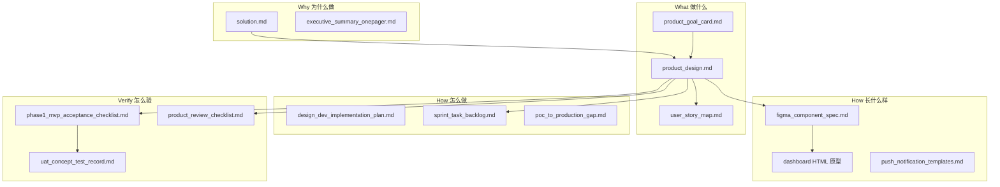

# 产品设计文档索引

**冯校长火锅 · 智能运营 · Phase 1**

| 项目 | 内容 |
|------|------|
| 版本 | V1.6 |
| 更新 | 2026-06-21 |
| 维护人 | 产品 |

---

## 1. 读什么、什么时候读

| 场景 | 首选文档 | 辅助 |
|------|----------|------|
| 立项 / 决策层汇报 | [executive_summary_onepager.md](executive_summary_onepager.md) | [solution.md §1](solution.md#1-执行摘要) |
| 对齐产品目标（5 分钟） | [product_goal_card.md](product_goal_card.md) | [product_design.md §1](product_design.md#1-产品定位与目标) |
| **创业切入口 / 后厨损耗预测** | [kitchen_loss_prediction_wedge_plan.md](kitchen_loss_prediction_wedge_plan.md) | PRD §1.3.1 · architecture phase1 C-05 |
| **真实设备接入 / 损耗预算落地** | [kitchen_loss_real_device_solution.md](kitchen_loss_real_device_solution.md) | ADR-019 · 采购/接线/开发/验收 |
| **设计 vs 分期交付（总原则）** | [product_design.md §2.1](product_design.md#21-设计完整性-vs-分期交付) | [ADR-013](architecture_decisions.md#adr-013设计先行实现与真数据接入分期) |
| **产品综观（决策层 / 新人 onboarding）** | [product_overview.md](product_overview.md) | 本文 |
| 功能范围与验收标准 | [product_design.md §5、§12](product_design.md#5-功能规格feature-prd) | [phase1_mvp_acceptance_checklist.md](phase1_mvp_acceptance_checklist.md) |
| **测试用例 / 自动化追溯** | [test_cases_phase1.md](test_cases_phase1.md) — 7 模块 F-xxx→用例→pytest（176 passed） | 与 acceptance/UAT 互补 |
| **全国连锁层级 / 运营后台** | [product_hierarchy_national_chain.md](product_hierarchy_national_chain.md) | [architecture_hierarchy_phase_plan.md](architecture_hierarchy_phase_plan.md) |
| **完整性复盘（登录+Admin CRUD）** | [product_completeness_review.md](product_completeness_review.md) | 本文 §2~§3 |
| 用户故事与优先级 | [user_story_map.md](user_story_map.md) | [sprint_task_backlog.md](sprint_task_backlog.md) |
| 界面与组件规格 | [figma_component_spec.md](figma_component_spec.md) | `dashboard/*.html` HTML 原型 |
| 企微/推送文案 | [push_notification_templates.md](push_notification_templates.md) | [product_design.md §8](product_design.md#8-告警与通知设计) |
| 产品评审会议 | [product_review_checklist.md](product_review_checklist.md) | PRD §5 + §7 |
| **PM-401 会后回填** | [pm401_review_outcome_template.md](pm401_review_outcome_template.md) | 通过/有条件通过 changelog+DoD |
| **PM-401 文档复核结论（6/16）** | [pm401_review_outcome_20260616.md](pm401_review_outcome_20260616.md) | 规格层有条件通过 · PRD V1.5 |
| 评审邀请模板 | [pm401_meeting_invite_template.md](pm401_meeting_invite_template.md) | 邮件/企微/会后跟进 |
| **PM-401 定稿邀请（6/17）** | [pm401_meeting_invite_20260617.md](pm401_meeting_invite_20260617.md) | 已填日期与演示链接 |
| **PM-401 议程（可打印 PDF）** | [pm401_meeting_agenda_20260617.html](pm401_meeting_agenda_20260617.html) | 浏览器 Ctrl+P 另存为 PDF |
| **PM-402 定稿邀请（6/19·6/20）** | [pm402_meeting_invite_20260619_20.md](pm402_meeting_invite_20260619_20.md) | 玉环+椒江概念测试 |
| **三场会议日历 ICS** | [product_meetings_phase1.ics](product_meetings_phase1.ics) | 含腾讯会议号+提前1天/30分钟提醒 |
| **腾讯会议配置** | [product_meetings_tencent.json](product_meetings_tencent.json) | 改号后运行 `scripts/gen_product_meetings_ics.py` |
| 店长概念测试 / UAT | [uat_concept_test_record.md](uat_concept_test_record.md) | [user_story_map.md §6](user_story_map.md#6-概念测试脚本30min--试点店长) |
| **开发交付主计划（HLD/LLD/测试）** | [development_delivery_plan.md](development_delivery_plan.md) | sprint · api_spec · acceptance |
| 研发排期与阻塞项 | [sprint_task_backlog.md §6.1](sprint_task_backlog.md#61-uat-go-live-阻塞专项dev-408) | [poc_to_production_gap.md](poc_to_production_gap.md) |
| **产品与架构对齐检查** | [architecture_design_index.md §1.2](architecture_design_index.md#12-产品--架构-对齐检查评审用) | api_spec §6 |
| **架构设计评审** | [architecture_design_index.md](architecture_design_index.md) | [architecture_review_checklist.md](architecture_review_checklist.md) AR-401 |
| **API 与 PRD 映射** | [architecture_api_spec.md §6](architecture_api_spec.md#6-与产品功能追溯主映射) | api V1.2 · data_model V1.2 |
| 现场部署 | [pilot_deployment_checklist_direct.md](pilot_deployment_checklist_direct.md) | [design_dev_implementation_plan.md](design_dev_implementation_plan.md) |

---

## 2. 文档体系（分层）

---

## 3. 产品设计阶段完成定义（DoD）

Phase 1 **产品设计阶段**视为「完善」需同时满足：

| # | 交付物 | 状态 | 文档/产物 |
|---|--------|------|-----------|
| 1 | 目标与边界明确 | ✅ | product_goal_card · PRD §1~2 |
| 2 | 功能 PRD + MVP 范围 | ✅ | PRD §5、§12 |
| 3 | 用户故事 + Release 切片 | ✅ | user_story_map |
| 4 | IA + 线框 + 组件 Token | ✅ | PRD §6~7 · figma_component_spec §2~3 |
| 5 | 告警/权限/埋点规格 | ✅ | PRD §8~10 |
| 6 | 需求追溯 DEV↔PRD↔US | ✅ | sprint §12 · PRD 附录 A |
| 7 | MVP 验收勾选表 | ✅ | phase1_mvp_acceptance_checklist |
| 8 | HTML 可交互原型（7 模块+PDA+H5） | ✅ | `dashboard/` |
| 9 | Figma 高保真 18 Frame | ⬜ | figma_component_spec §4（**HTML 先行，见变更日志**） |
| 10 | 产品评审签字 | ⚠️ | pm401_review_outcome_20260616（文档层有条件通过；正式 6/17） |
| 11 | 试点店长概念测试记录 | ⬜ | uat_concept_test_record |
| 12 | 推送模板定稿 | ✅ | push_notification_templates |

**当前阶段判定**：规格层 **完成**；验证层 **待执行**（#10、#11）；视觉层 **HTML 替代 Figma 进行中**（#9）。

---

## 4. 关键 ID 对照

| 前缀 | 含义 | 示例 |
|------|------|------|
| F- | 产品功能 | F-T03 翻台建议 |
| US- | 用户故事 | US-012 翻台 Top5 |
| DEV- | 研发任务 | DEV-416 PDA PO 列表 |
| PM- | 产品任务 | PM-402 概念测试 |
| BL- | UAT 阻塞项 | BL-04 PDA 打通 |
| N- | 推送规则 | N-02 5min 合并 |

---

## 5. 变更与版本

所有产品设计文档变更记入 [product_design_changelog.md](product_design_changelog.md)。

| 文档 | 当前版本 |
|------|----------|
| product_design.md | V1.6 |
| kitchen_loss_prediction_wedge_plan.md | V1.0 |
| product_hierarchy_national_chain.md | V1.2 |
| product_overview.md | V1.0 |
| product_completeness_review.md | V1.0 |
| figma_component_spec.md | V1.1 |
| user_story_map.md | V1.1（§8 US 状态） |
| product_goal_card.md | V1.1 |
| phase1_mvp_acceptance_checklist.md | V1.1 |

---

## 6. 下一步（产品侧）

1. **6/17 PM-401** — 按 [product_review_checklist.md](product_review_checklist.md) 评审 → 会后按 [pm401_review_outcome_template.md](pm401_review_outcome_template.md) 回填 changelog + DoD #10
2. **6/19~6/20 PM-402** — 玉环/椒江填写 [uat_concept_test_record.md](uat_concept_test_record.md)
3. HTML 原型对齐 Figma 或书面确认 D-001
4. 两店测试完成后更新 index §3 → 「产品设计阶段 OK」
