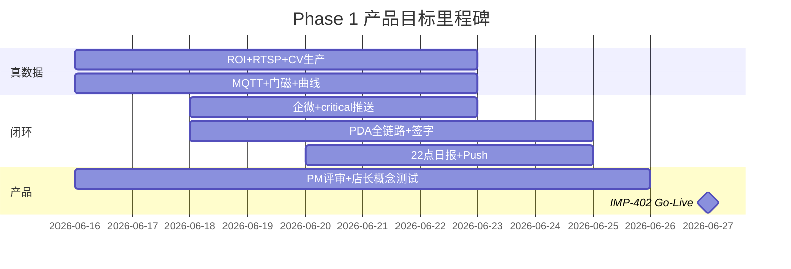

# 产品目标卡 · Phase 1 试点

**冯校长火锅 · 智能运营 · 玉环 / 椒江**

| 项目 | 内容 |
|------|------|
| 版本 | V1.0 |
| 读者 | PMO · 试点店长 · 区域督导 · 产品/研发 |
| 关联 | [product_design.md](product_design.md) · [product_design_index.md](product_design_index.md) · [phase1_mvp_acceptance_checklist.md](phase1_mvp_acceptance_checklist.md) |
| 日期 | 2026-06-15 |

---

## 一页纸 · 我们在做什么

### 一句话

> **运营副驾驶**：系统提醒 + 人确认，店长一张屏管好一整家店。

### 为谁做（Phase 1）

店长 · 前厅领班 · 厨师长 · 收货员 · 区域督导（单店视图）

### 解决什么

| 痛点 | 产品手段 |
|------|----------|
| 翻台慢、清台靠喊 | CV 桌态 + 翻台 Top5 + 企微提醒 |
| 来料短重、损耗难量化 | 秤 + VLM + ERP PO 对账 |
| SOP 走样、难追责 | 班次 SOP + 违规清单 + 签字/ack |
| 信息滞后、复盘靠记忆 | 告警中心 + 22:00 LLM 日报 |

### 不做什么（Phase 1）

不替 POS/ERP · 不自动扣款退货 · 无人脸 · 无排班/等位屏/总部中台

### 北极星指标

**有效告警处理率** = 30min 内 ack 的 (warn+critical) ÷ 总数

### 七条原则（评审时必问）

少而准 · 可忽略不骚扰 · IoT 优先 · 人工签字 · 移动优先 · 加盟只读 · 隐私安全

### Phase 1 交付物（Must Have）

登录 RBAC · 看板 7 模块 · 收货 PDA 5 步 · 企微 critical · 两店预配置 UAT

### 试点成功 = 五句话

1. 店长愿意每天打开看板 ≥3 次  
2. 来料偏差在系统里看得见、查得到责任人  
3. 违规告警 30 分钟内有人 ack  
4. 日报阅读率 >80%，店长用来派整改  
5. 玉环/椒江配置可复制到第三家店  

---

## 五项目标 · 差距 · 下一里程碑

> 状态截至 `release/pilot` · 评估基准见 [验收勾选表](phase1_mvp_acceptance_checklist.md)

### 目标 1：提升翻台效率

| 项 | 内容 |
|----|------|
| **产品承载** | 桌态看板 F-T01~T03 · 翻台 Top5 · POS 结账联动 |
| **成功信号** | 店长每日打开看板 ≥3 次；翻台建议被领班采纳 |
| **当前** | ⚠️ UI/API 可演示；桌态来自 mock 检测器；POS 为 bridge mock |
| **差距** | 无现场 RTSP+ROI；结账后 1min 桌态更新未验证；「派保洁」仅演示 |
| **下一里程碑** | **DEV-408~410** ROI 标定 + yolo/rknn 生产推理 + 准确率 ≥85% |
| **责任人** | 算法 + 区域 IT |
| **目标日期** | UAT 冲刺 W1 完成标定；W2 现场联调 |

---

### 目标 2：降低食材损耗

| 项 | 内容 |
|----|------|
| **产品承载** | IoT 全链路 F-K03 · 成本页 F-C01~C04 · PDA 验收 F-P01~P06 |
| **成功信号** | 来料偏差可见、可追责；短重批次标红 |
| **当前** | ⚠️ 成本列表 + 偏差高亮有；IoT/秤/VLM/PDA 多为静态或 mock |
| **差距** | 真 MQTT 传感器未上线；PDA 未接 ERP/秤/VLM/Hub 提交；签字未入库 |
| **下一里程碑** | **DEV-411~413** 真 IoT · **DEV-416~419** PDA 全链路 · **DEV-420** 签字 API |
| **责任人** | 嵌入式 + 前端 + 后端 |
| **目标日期** | W1 IoT 24h 连续；W2 PDA <3min/批次 UAT 通过 |

---

### 目标 3：提升 SOP 执行率

| 项 | 内容 |
|----|------|
| **产品承载** | SOP 中心 F-S01~S05 · 违规清单 F-S04 · 告警 ack F-A03 |
| **成功信号** | 违规 30min 内有人 ack；合规率可班次查看 |
| **当前** | ⚠️ SOP 列表/合规率/展开检查点有；指派整改为演示；签字无持久化 |
| **差距** | F-S04 无工单 API；F-S05 签字未写 Hub；检查点明细不完整 |
| **下一里程碑** | **DEV-421** 违规指派 · **DEV-420/422** 签字与督导审计 · **DEV-307** 午晚市自动跑稳 |
| **责任人** | 后端 + 前端 |
| **目标日期** | W1 指派+签字 API；W2 店长 UAT-SOP 段通过 |

---

### 目标 4：缩短决策时间

| 项 | 内容 |
|----|------|
| **产品承载** | 告警中心 F-A01~A04 · LLM 日报 F-R01~R02 · 首页 KPI F-H02 |
| **成功信号** | 日报阅读率 >80%；critical 不在店也能 30s 收到 |
| **当前** | ⚠️ 告警流+ack 持久化较好；日报四章节可手动生成；企微/22:00 自动未闭环 |
| **差距** | F-R01 无定时任务；F-A04 需配 webhook；日报未推送到手机 |
| **下一里程碑** | **DEV-414~415** 企微 E2E · **DEV-423~424** 22:00 自动生成+Push |
| **责任人** | 后端 + DevOps |
| **目标日期** | W1 webhook 联调；W2 连续 3 晚 22:00 自动日报验证 |

---

### 目标 5：可复制到加盟

| 项 | 内容 |
|----|------|
| **产品承载** | 店级 `config.json` · 边缘镜像 · RBAC 加盟只读 · 零配置部署 |
| **成功信号** | 加盟店导入配置即可运行；不能改总部 SOP/阈值 |
| **当前** | ⚠️ 两店 store 配置骨架有；RBAC 演示级；边缘镜像在 backlog |
| **差距** | ROI/MQTT/账号 UAT 包未交付；DEV-404 刷机镜像；DEV-425~426 角色矩阵未落地 |
| **下一里程碑** | **DEV-407~408** 两店 UAT 配置包 · **DEV-404** 边缘镜像 · **DEV-425~426** RBAC |
| **责任人** | DevOps + 后端 + 前端 |
| **目标日期** | Go-Live 前 staging 24h 全链路；第三店部署演练（可选） |

---

## 里程碑总览（2 周 UAT 冲刺）

| 周 | 产品目标侧重 | 关键 DEV/PM | Go/No-Go 检查 |
|----|--------------|-------------|---------------|
| **W1** | 真感知 + 审计底座 | DEV-408~413, 420~422, PM-401 | 现场 IoT 24h、ROI 归档、产品评审通过 |
| **W2** | 闭环体验 + 验证 | DEV-414~419, 423~426, PM-402 | PDA UAT、企微 30s、22:00 日报、店长签字 |

**Go-Live 门槛**：五项目标对应 Must Have 在 [验收表 §6](phase1_mvp_acceptance_checklist.md#6-现场-upt-脚本勾选用) **全部可勾选**，且 [§5 八条阻塞](phase1_mvp_acceptance_checklist.md#5-uat-阻塞项go-live-前必须清零) 清零。

---

## 评审用 · 五问五答（30 秒版）

| # | 问 | 答 |
|---|-----|-----|
| 1 | 这是什么？ | 门店运营副驾驶，不是收银/ERP 替代品 |
| 2 | 店长每天用啥？ | 手机/Web 看板：桌态、告警、日报；不在店收企微 |
| 3 | 厨师长/收货员用啥？ | 后厨 IoT 页 + 收货 PDA 5 步验收签字 |
| 4 | 怎样算试点成功？ | 五项目标成功信号 + 北极星 ack 率 |
| 5 | 现在卡在哪？ | 文档齐、能演示；真数据与 UAT 签字尚未完成 |

---

## 签字（评审会后）

| 角色 | 是否认同本目标卡 | 姓名 | 日期 |
|------|------------------|------|------|
| PMO | ☐ 是 ☐ 修订后认同 | | |
| 产品 | ☐ 是 ☐ 修订后认同 | | |
| 玉环店长 | ☐ 是 ☐ 有保留意见 | | |
| 椒江店长 | ☐ 是 ☐ 有保留意见 | | |
| 区域督导 | ☐ 是 ☐ 有保留意见 | | |

**保留意见记录**：

---

## 维护

- Sprint Review 或 UAT 后更新「当前 / 差距 / 里程碑」列  
- 与 [sprint_task_backlog.md §6.1](sprint_task_backlog.md#61-uat-go-live-阻塞专项dev-408) 子任务状态同步
