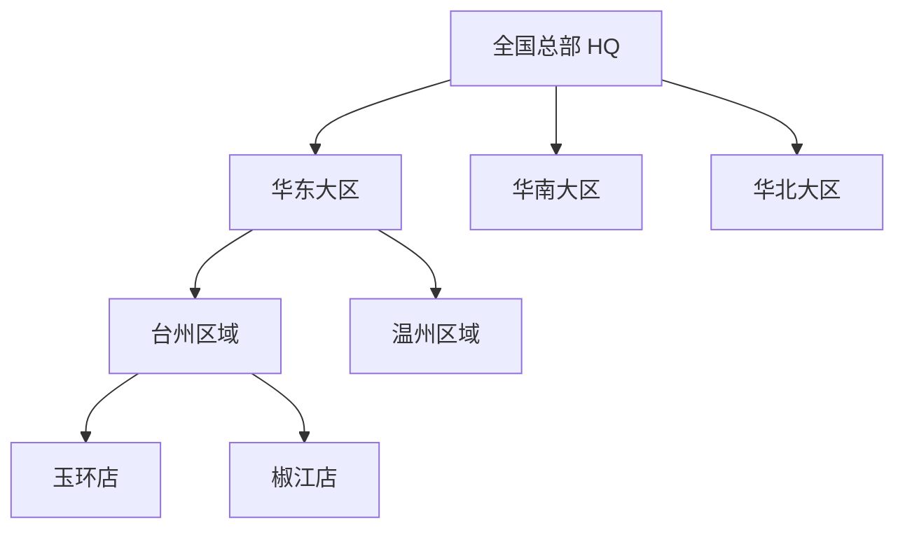

# 全国连锁层级体系 · 产品与管控规格

**冯校长火锅 · 智能运营 · 全国扩张基线**

| 项目 | 内容 |
|------|------|
| 版本 | V1.0 |
| 更新 | 2026-06-16 |
| 读者 | 产品 · 架构 · 研发 · PMO |
| 关联 | [product_design.md](product_design.md) · [architecture_hierarchy_phase_plan.md](architecture_hierarchy_phase_plan.md) |

---

## 1. 设计目标

构建**从上到下可观测、可管控、可分阶段交付**的全国连锁运营体系：

| 目标 | 说明 |
|------|------|
| **一层看清全国** | 总部/大区一眼掌握健康度、异常店、关键 KPI |
| **逐层下钻** | 全国 → 大区 → 区域 → 门店 → 单店模块（桌态/后厨/PDA） |
| **权责分明** | 每层角色只看、只管职责范围内数据与配置 |
| **配置与运营分离** | 「看数看板」与「运营后台」分产品面，避免店长误操作全局配置 |
| **分阶段可交付** | 每一 Phase 可独立上线、可验收，不阻塞下一层建设 |

---

## 2. 组织与数据层级



| 层级 | ID 示例 | 典型角色 | 核心诉求 |
|------|---------|----------|----------|
| **L0 全国** | `org_hq` | 总部 PMO、CEO 办 | 全国 KPI、异常店 Top N、扩张进度 |
| **L1 大区** | `zone_east_china` | 大区总、总部运营 | 大区 rollup、区域对标、资源倾斜 |
| **L2 区域** | `region_taizhou` | 区域督导 | 区域巡检、异常店、跨店对标 |
| **L3 门店** | `store_yuhuan` | 店长、领班、厨师长、收货员 | 单店执行、ack、签字、PDA |
| **L4 模块** | 桌态/后厨/SOP… | 职能岗位 | 职能看板与操作 |

**租户隔离原则**：`store_id` 为最小数据隔离单元；上层聚合仅做**只读 rollup**，写入必须带 `store_id` 或明确的管理员 scope。

---

## 3. 双产品面：看板 vs 运营后台

| 产品面 | 路径（规划） | 用户 | 能力 |
|--------|--------------|------|------|
| **门店运营看板** | `dashboard/` | 店长、领班、厨师长、收货员 | 单店实时运营：桌态、IoT、SOP、告警、日报、PDA |
| **层级看板** | `regional.html` → `national.html` | 督导、大区、总部 | **只读**下钻：健康矩阵、异常店、对标、审计聚合 |
| **运营后台 Admin** | `admin/`（Phase 2+） | 总部 IT、PMO | **读写**配置：组织、门店、用户、角色、业务参数 |

> Phase 1 已实现：门店看板 + 区域/大区层级看板（`regional.html` + `zone_east_china`）。  
> Phase 2 起建设：`admin/` 运营后台。

---

## 4. 功能规格（按层级）

### 4.1 层级看板（只读 · 观测面）

| ID | 功能 | 层级 | 优先级 | Phase | 现状 |
|----|------|------|--------|-------|------|
| F-HQ01 | 跨店 KPI 对比表 | L2+ | P1 | 1 | ✅ `regional.html` |
| F-HQ06 | 区域总揽 + 健康矩阵 | L1~L2 | P1 | 1 | ✅ 华东大区 rollup |
| F-HQ07 | 异常门店清单 | L1~L2 | P1 | 1 | ✅ |
| **F-HQ12** | **全国总揽首页** | L0 | P1 | 2 | ⬜ 多大区 Tab + 全国 KPI |
| **F-HQ13** | **大区下钻路径统一** | L0~L3 | P1 | 2 | ⚠️ 部分（URL `region_id`） |
| **F-EXEC01** | **集团驾驶仓** | L0 | P1 | **2** | ✅ `cockpit.html` |
| **F-EXEC02** | **加盟业主 ROI 简版** | L3 单店 | P2 | **3** | ⬜ 手机 H5 |
| F-R05 | 区域 narrative（LLM） | L1~L2 | P2 | 3 | ⬜ 规则引擎已有 |

### 4.2 运营后台（读写 · 管控面）

| ID | 功能 | 说明 | 优先级 | Phase |
|----|------|------|--------|-------|
| **F-HQ08** | 组织与门店管理 | 增删改门店、归属大区/区域、开业/停业/筹备 | P0 | 2 |
| **F-HQ09** | 用户管理 | 增删改用户、绑定组织 scope、启用/禁用、重置凭证 | P0 | 2 |
| **F-HQ10** | 角色与权限 | 角色 CRUD、菜单/操作矩阵、数据 scope（本店/区域/大区/全国） | P0 | 2 |
| **F-HQ11** | 操作审计 | 配置变更、权限变更、敏感操作留痕 | P1 | 2 |
| F-HQ02 | SOP 配置 OTA | 版本、生效范围、回滚 | P1 | 2 |
| F-HQ03 | 阈值配置 OTA | 短重%、温度、告警灵敏度 | P1 | 2 |
| F-HQ04 | 供应商 KPI | 全国/区域榜单 | P2 | 3 |
| F-HQ05 | 模型 OTA | CV 模型版本 | P2 | 3 |

### 4.3 门店运营（已有 · Phase 1）

见 [product_design.md §5](product_design.md#5-功能规格feature-prd)（F-H/T/K/S/C/A/R/P 系列）。

---

## 5. 角色 × 层级 × 产品入口

| 角色 | 默认落地页 | 数据 scope | 门店看板 | 层级看板 | 运营后台 |
|------|------------|------------|:--------:|:--------:|:--------:|
| 店长 | `home.html` | 本店 | ✓ 全功能 | — | — |
| 前厅领班 | `tables.html` | 本店 | 子集 | — | — |
| 厨师长 | `kitchen.html` | 本店 | 子集 | — | — |
| 收货员 | `pda/receiving.html` | 本店 | PDA only | — | — |
| 区域督导 | `regional.html` | 本区域门店 | 可下钻 | ✓ 区域 | 只读审计 |
| 大区运营 | `regional.html?zone_*` | 本大区 | 可下钻 | ✓ 大区 | 只读 |
| 总部 PMO | `regional.html` / `national.html` | 全国 | 可下钻 | ✓ 全国 | ✓ 读写（Phase 2） |
| 总部 IT | `admin/` | 全国 | — | 系统状态 | ✓ 组织/用户/角色 |
| **集团决策者（老板/CEO）** | **`cockpit.html` 驾驶仓** | 全国 | — | ✓ 摘要 | — |
| 加盟业主 | 手机简版 / `cockpit.html?store` | 本店 | 只读 | — | — |

**加盟约束（P6）**：加盟账号不可见 F-HQ02~05/08~11 写操作；SOP/阈值总部下发只读。

### 5.1 是否增加「老板」角色？— 建议 **要，但拆两种，不混为一谈**

|  persona | 建议角色名 | 与现有角色区别 | Phase |
|----------|------------|----------------|-------|
| **品牌/集团老板、CEO 办** | `集团决策者` | 只看结果与风险，**不**配 SOP、不增店；与 PMO（管标准与推广）分离 | **P2 驾驶仓 v1** |
| **加盟门店投资人** | `加盟业主`（已有） | 只看**本店** ROI、食安、日报；零配置、手机优先 | **P3 增强** |
| ~~直营单店老板~~ | 不单独设角 | 通常=店长或区域股东；避免与店长权限重叠 | — |

**不建议**只加一个笼统「老板」账号覆盖所有人——权限与页面差异大，应靠 **角色 + data_scope** 区分。

### 5.2 是否增加「驾驶仓」？— 建议 **要，且独立于 PMO 看板**

| 产品面 | 用户 | 核心问题 | 与 regional/PMO 的区别 |
|--------|------|----------|------------------------|
| **驾驶仓** `cockpit.html` | 老板、CEO、董事会 | 赚没赚、安不安全、哪家拖后腿、扩张进度 | **战略摘要**；只读；无操作按钮 |
| 层级看板 `regional.html` | 督导、大区运营 | 怎么巡、怎么纠偏 | 可下钻、偏**运营执行** |
| 运营后台 `admin/` | IT、PMO | 怎么配、怎么开户 | **写配置** |

**驾驶仓 v1 内容（F-EXEC01，建议 P2）**：

- 全国/大区 KPI 条：店数、营收汇总、SOP 均值、异常店数、食安红灯
- 异常店 Top N + 趋势（较上周）
- 筹备 vs 营业店进度
- 一键跳转层级看板下钻（**不在驾驶仓里做配置**）

**驾驶仓 v2（P3）**：单店 ROI、加盟 vs 直营对比、LLM 周报语音摘要、手机 H5 全屏。

---

## 6. 信息架构

### 6.1 层级看板 IA（观测面）

```
驾驶仓 cockpit.html（Phase 2 · 老板/CEO 默认首页）
└── 全国 KPI 摘要 · 异常 Top N · 趋势
    └── [下钻] → national.html / regional.html

全国总揽 national.html（Phase 2）
└── 大区 zone_east_china
    └── 区域 regional.html?region_id=region_*
        └── [进入单店] → home.html（switchStore）
            ├── 桌态 / 后厨 / SOP / 成本 / 告警 / 日报 / PDA
```

### 6.2 运营后台 IA（管控面 · Phase 2）

```
admin/
├── 首页（全国门店数、待审批、最近变更）
├── 组织管理
│   ├── 大区列表
│   ├── 区域列表
│   └── 门店列表（增删改、筹备/开业/停业）
├── 用户与访问
│   ├── 用户（增删改、绑定 scope）
│   ├── 角色（增删改）
│   └── 权限矩阵（菜单 + 操作 + 数据范围）
├── 业务配置
│   ├── SOP 版本（OTA）
│   ├── 告警阈值
│   └── 企微 Webhook / 通知策略
└── 审计日志
```

### 6.3 与 PRD 关系

- 门店 IA： [product_design.md §6.1](product_design.md#61-门店-web-看板-ia)
- 区域 IA： [product_design.md §6.4](product_design.md#64-区域--总部-ia-f-hq06--f-hq07)

---

## 7. 分阶段交付（产品视角）

| Phase | 时间盒 | 组织规模 | 产品交付 | 验收信号 |
|-------|--------|----------|----------|----------|
| **P1 试点** | 当前 | 2 店 · 1 区域 · 1 大区 | 门店看板 7 模块 + PDA；区域/大区 rollup；演示 RBAC | 玉环/椒江 UAT 通过 |
| **P2 区域** | +3~4 月 | 20 店 · 多区域 · 华东完整 | `national.html`；`admin/` 组织/用户/角色；SOP·阈值 OTA；PG 多租户 | 新店 0 代码开户；PMO 自助增店 |
| **P3 全国** | +6 月 | 50+ 店 · 多大区 | 全国总揽；供应商 KPI；LLM narrative；加盟 SaaS 只读 | 单店部署 <3 天；大区日活 |
| **P4 中台深化** | 持续 | 100+ 店 | ModelHub、数据湖导出、会员联动 | 总部 BI 对接 |

**原则**：每一 Phase **先观测（看板）后管控（后台）**；P1 允许 JSON/硬编码，P2 起必须后台可配置。

---

## 8. 与现状差距

| 项 | 现状 | P2 目标 |
|----|------|---------|
| 组织层级 | `stores.json` 静态 1 大区 3 区域 | DB + Admin CRUD |
| 用户 | `DEMO_USERS` 硬编码 7 账号 | `users` 表 + Admin |
| 角色权限 | `rbac.json` 静态 | `roles` + `permissions` 表 + 缓存 |
| 全国视图 | 仅华东大区 | `national.html` 多大区 |
| 审计 | 业务 ack/签字有；配置变更无 | `admin_audit_log` |

---

## 9. 研发追溯（预留 DEV ID）

| DEV | 内容 | Phase | 依赖 |
|-----|------|-------|------|
| DEV-501 | 组织模型 `orgs` + stores 关联 API | P2 | DEV-102 |
| DEV-502 | Admin 门店 CRUD UI + API | P2 | DEV-501 |
| DEV-503 | 用户/角色/权限 CRUD | P2 | DEV-501, DEV-425 |
| DEV-504 | `national.html` 全国总揽 | P2 | DEV-501, F-HQ06 |
| DEV-505 | Admin 审计日志 | P2 | DEV-503 |
| DEV-506 | SOP/阈值 OTA 配置中心 | P2 | DEV-501 |

详见 [architecture_hierarchy_phase_plan.md](architecture_hierarchy_phase_plan.md)。

---

## 10. 变更记录

| 版本 | 日期 | 说明 |
|------|------|------|
| V1.0 | 2026-06-16 | 全国层级、双产品面、F-HQ08~13、分阶段交付基线 |
