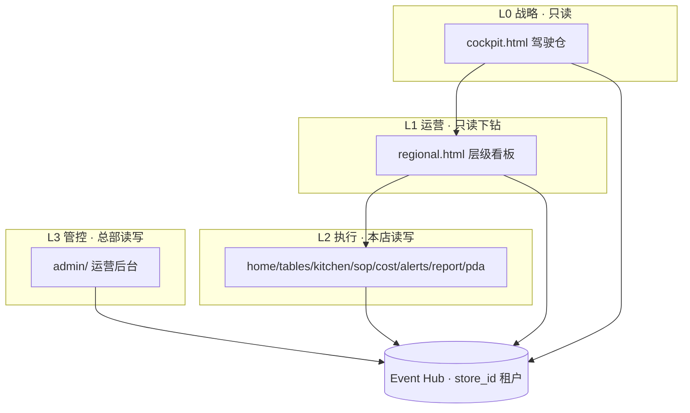

# 产品综观

**冯校长火锅 · 智能运营 · 全国连锁 · 2026-06-16**

| 项目 | 内容 |
|------|------|
| 版本 | V1.0 |
| 定位 | 门店运营副驾驶 · 系统提醒 + 人确认 |
| 详述 | [product_design.md](product_design.md) · [product_completeness_review.md](product_completeness_review.md) |

---

## 1. 一句话

> **边缘感知（CV/IoT）+ 云边 Hub 聚合 + 四类产品面（执行 / 运营 / 战略 / 管控），支撑全国连锁从上到下「看得见、管得住、配得动」。**

Phase 1：**玉环 + 椒江 2 店试点** — 看板与驾驶仓可演示；生产级开户与用户体系在 Phase 2。

---

## 2. 四类产品面



| 产品面 | 路径 | 端口（nginx 双端口） | 回答的问题 | 完成度 |
|--------|------|---------------------|------------|--------|
| **执行看板** | `home.html` 等 7 模块 + PDA | :3000 | 本店今天怎么干 | **~75%** |
| **层级看板** | `regional.html` | :3000 | 区域怎么巡、哪家异常 | **~70%** |
| **集团驾驶仓** | `cockpit.html` | :3000 | 全国好不好、谁拖后腿 | **~60%** v1 |
| **运营后台** | `admin/` | :3001 | 怎么开户、怎么配 | **~30%** v0.1 |

**原则**：驾驶仓 / 层级看板 **只读**；配置写入 **仅运营后台**；门店一线 **不碰全局配置**。

---

## 3. 组织与租户

```
全国 HQ → 大区（华东…）→ 区域（台州…）→ 门店（玉环/椒江…）→ 模块（桌态/IoT/SOP…）
```

- **最小隔离单元**：`store_id`
- **聚合只读**：大区 / 区域 / 全国 rollup（`/v1/region/overview`、`/v1/national/overview`）
- **当前规模**：1 大区 · 3 区域（2 筹备）· 2 营业店

---

## 4. 角色 × 入口 × 权限

| 角色 | 演示账号 | 密码 | 选店 | 默认首页 | Admin | 写操作 |
|------|----------|------|------|----------|:-----:|:------:|
| 店长 | zhangdian | demo | 是 | home.html | — | 本店 |
| 前厅领班 | lingban | demo | 是 | tables.html | — | 部分 |
| 厨师长 | chushi | demo | 是 | kitchen.html | — | 部分 |
| 收货员 | shouhuo | demo | 是 | PDA | — | 收货 |
| 区域督导 | quyududao | demo | 否 | regional.html | — | 督导级 |
| **集团决策者** | **laoban** | demo | 否 | **cockpit.html** | — | **无** |
| 总部 PMO | zongbu | demo | 否 | admin/ | ✓ | 配置 |
| 加盟业主 | — | — | — | 手机简版（P3） | — | 只读本店 |

**快捷登录**：

- 老板驾驶仓：`/login.html?cockpit=1`
- PMO 运营后台：`/login.html?admin=1` 或 `:3001/admin/`

---

## 5. 功能模块地图

### 5.1 门店执行（Phase 1 · 主体完成）

| 模块 | 页面 | 功能 ID | 状态 |
|------|------|---------|------|
| 首页 | home.html | F-H02 | ✅ |
| 桌态翻台 | tables.html | F-T* | ✅ 桩/演示 |
| 后厨 IoT | kitchen.html | F-K* | ✅ 桩 |
| SOP | sop.html | F-S* | ✅ |
| 来料成本 | cost.html | F-C* | ✅ |
| 告警 | alerts.html | F-A* | ✅ 企微 E2E 待真 key |
| 日报 | report.html | F-R* | ✅ API+定时 |
| 收货 PDA | pda/receiving.html | F-P* | ✅ 打桩 |

### 5.2 层级与战略（观测面）

| 功能 | ID | 状态 |
|------|-----|------|
| 区域总揽 + 健康矩阵 | F-HQ06 | ✅ |
| 异常店清单 | F-HQ07 | ✅ |
| 跨店 KPI 对比 | F-HQ01 | ✅ |
| **集团驾驶仓** | **F-EXEC01** | ✅ v1 |
| 全国总揽独立页 | F-HQ12 | ⚠️ 合并在 cockpit API |
| 统一面包屑下钻 | F-HQ13 | ⚠️ 部分 |

### 5.3 运营后台（管控面 · v0.1）

| 功能 | ID | 查 | 增 | 改 | 删 |
|------|-----|----|----|----|-----|
| 组织树 | F-HQ08 | ⚠️ | ⬜ | ⬜ | ⬜ |
| 门店 | F-HQ08 | ✅ | ⚠️ | ⚠️ | ⬜ |
| 用户 | F-HQ09 | ⚠️ | ⬜ | ⬜ | ⬜ |
| 角色 | F-HQ10 | ⬜ | ⬜ | ⬜ | ⬜ |
| 审计 | F-HQ11 | ⚠️ | — | — | — |
| 数据流打桩 | — | ✅ | ✅ tick | — | — |

### 5.4 数据与集成（打桩 → 真接入）

```
Vision stub → IoT stub → POS sim → SOP → ERP file → Cost → Hub → 看板/驾驶仓
```

| 数据源 | 当前 | 下一步 |
|--------|------|--------|
| 桌态 CV | mock | RTSP + YOLO |
| IoT | sensor_simulator | MQTT |
| ERP/POS | file/sim | API |
| 企微 | 测试 webhook | 店级 key |

---

## 6. 技术架构（产品视角）

| 层 | 组件 | 说明 |
|----|------|------|
| 边缘 | vision / IoT agent | 单店；断网队列 |
| Hub | `:8088` / nginx `/api` | 多租户；OpsEvent 统一模型 |
| 看板 | nginx `:3000` / `:3001` | 静态 HTML + core.js |
| 配置 | stores.json + DEMO_USERS | **Phase 2 → PostgreSQL + Admin** |

**部署模式**（见 [deploy/nginx/README.md](../deploy/nginx/README.md)）：

- 开发：单端口 `python3 dashboard/serve.py :3000`
- 试点/生产推荐：**:3000 业务 / :3001 运营后台** 或子域分离

---

## 7. 完成度总览

| 域 | 完成度 | 说明 |
|----|--------|------|
| 单店执行看板 | **75%** | UAT 进行中 |
| 多租户登录 | **60%** | 8 角色 demo；非 DB |
| 层级 + 驾驶仓 | **65%** | 华东 2 店；老板 v1 |
| 运营后台 CRUD | **30%** | 门店 stub；人无角色 |
| 全国 20 店可复制 | **40%** | Phase 2 目标 |

**整体**：**Phase 1 试点可演示 ✅ · Phase 2 管控闭环待建 🎯**

---

## 8. 分阶段路线

| Phase | 规模 | 产品重点 |
|-------|------|----------|
| **P1 现在** | 2 店 | 执行看板 + 层级 + 驾驶仓 v1 + Admin 打桩 |
| **P2** | 20 店 | 用户/角色/门店 DB CRUD；strict；`national` 页完善 |
| **P3** | 50+ 店 | 加盟业主 ROI；LLM 周报；供应商 KPI |
| **P4** | 100+ 店 | 中台 OTA；ModelHub；BI 导出 |

**Phase 2 第一优先级**：`admin/users.html` + `admin/roles.html` + 登录页动态门店 + 30 分钟「增店→增店长→可登录」验收。

---

## 9. 文档索引

| 文档 | 用途 |
|------|------|
| [product_design.md](product_design.md) | PRD 功能规格 |
| [product_hierarchy_national_chain.md](product_hierarchy_national_chain.md) | 全国层级 + 驾驶仓/老板角色 |
| [product_completeness_review.md](product_completeness_review.md) | 登录 + Admin CRUD 差距矩阵 |
| [architecture_hierarchy_phase_plan.md](architecture_hierarchy_phase_plan.md) | 研发里程碑 DEV-501~506 |
| [phase1_mvp_acceptance_checklist.md](phase1_mvp_acceptance_checklist.md) | MVP 验收勾选 |

---

## 10. 变更记录

| 版本 | 日期 | 说明 |
|------|------|------|
| V1.0 | 2026-06-16 | 四类产品面 · 8 角色 · 完成度 · 阶段路线 |
