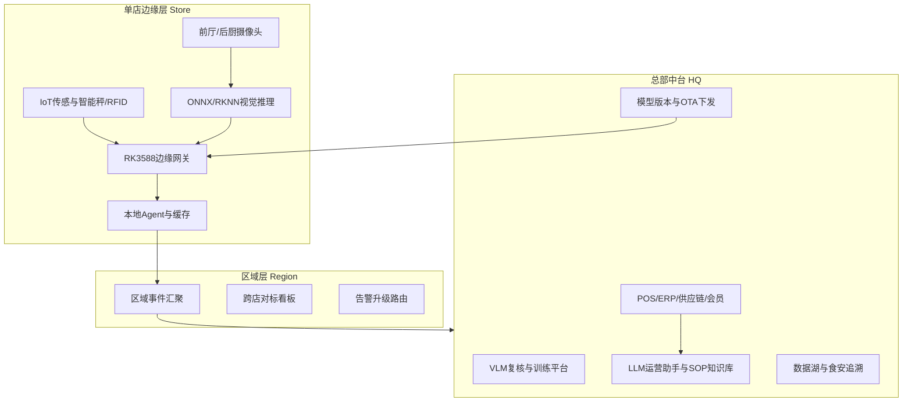
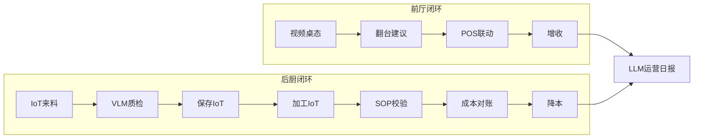
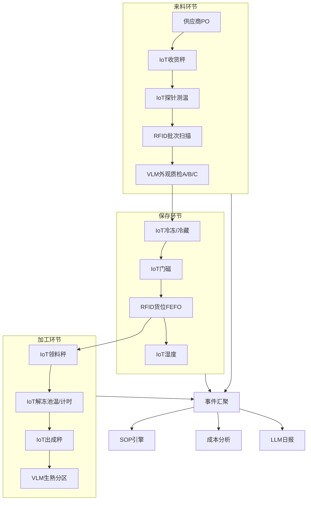
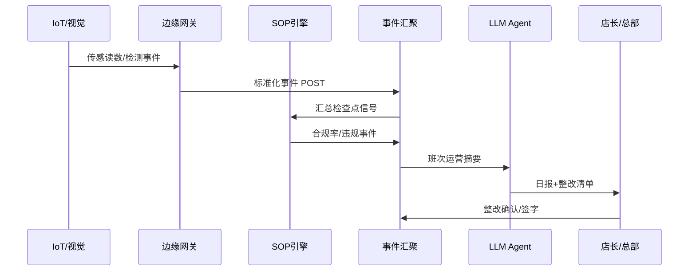
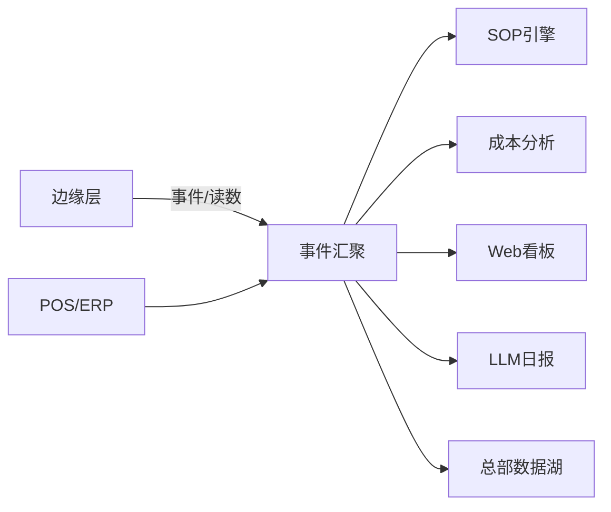
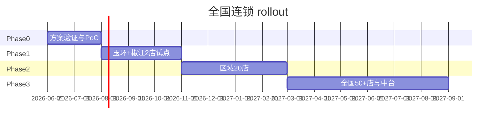

# 冯校长火锅智能运营解决方案

**全国连锁版 · 完整方案文档**

| 项目 | 内容 |
|------|------|
| 文档版本 | V2.0 |
| 适用对象 | **冯校长火锅**全国连锁（50+ 门店） |
| 技术栈 | LLM + VLM + 视频监测 + IoT + 边缘计算 |
| 覆盖范围 | 前厅增收 · 后厨降本 · 食安合规 · SOP 数字化 · 来料成本控制 |
| PoC 路径 | `/home/liuwz/hotpot_smart_ops/` |
| 更新日期 | 2026-06-12 |

---

## 目录

1. [执行摘要](#1-执行摘要)
2. [项目背景与目标](#2-项目背景与目标)
3. [方案总体设计](#3-方案总体设计)
4. [前厅智能运营场景](#4-前厅智能运营场景)
5. [后厨智能运营场景](#5-后厨智能运营场景)
6. [食材全链路：来料·保存·加工](#6-食材全链路来料保存加工)
7. [后厨 SOP 数字化体系](#7-后厨-sop-数字化体系)
8. [来料品质与成本控制](#8-来料品质与成本控制)
9. [五大技术能力详解](#9-五大技术能力详解)
10. [数据架构与系统集成](#10-数据架构与系统集成)
11. [部署架构与硬件清单](#11-部署架构与硬件清单)
12. [PoC 交付与软件地图](#12-poc-交付与软件地图)
13. [实施路径与组织保障](#13-实施路径与组织保障)
14. [ROI 测算与商业论证](#14-roi-测算与商业论证)
15. [合规、安全与风险管理](#15-合规安全与风险管理)
16. [验收标准与 KPI 体系](#16-验收标准与-kpi-体系)
17. [附录](#17-附录)

---

## 1. 执行摘要

### 1.1 方案定位

本方案面向**冯校长火锅**全国连锁，构建「**边缘实时感知 + 云边智能决策 + 总部中台统管**」三层架构，以 **LLM、VLM、视频 CV、IoT、边缘计算** 五类能力协同，解决前厅翻台效率、后厨食安成本、SOP 执行走样、来料品质数量失控等核心痛点，实现**降本增收**与**规模化复制**。

### 1.2 核心价值

| 价值维度 | 关键举措 | 预期效果 |
|----------|----------|----------|
| **前厅增收** | 桌态视觉识别 + LLM 翻台调度 + 等位 IoT 联动 | 翻台率 +8~15%，等位流失 -20% |
| **后厨降本** | IoT 秤重/出成率 + 来料成本分析 + 损耗归因 | 食材损耗 -10~18%，来料偏差 <3% |
| **食安合规** | VLM 质检 + IoT 冷链 + SOP 自动巡检 | 关键告警 <30s，追溯 100% |
| **运营标准化** | 总部 SOP OTA + 跨店对标 + LLM 日报 | SOP 合规率 >95% |
| **规模复制** | 边缘盒统一交付 + 模型 OTA + 加盟 SaaS | 单店部署 <3 天 |

### 1.3 技术协同一句话

> **IoT 提供数量与环境的硬数据，VLM 提供品质与场景的视觉判断，视频 CV 提供实时行为与状态检测，LLM 提供归因分析与运营决策，边缘计算保障低延迟与断网可用。**

---

## 2. 项目背景与目标

### 2.1 火锅业态特点

- **高翻台依赖**：空桌等待 5 分钟即可能损失一整轮翻台收入
- **SKU 多、损耗高**：毛肚、鲜切、蔬菜、底料等品类多，临期与改刀损耗显著
- **前厅服务密度高**：加汤、清台、等位、加购并发，人力调度难
- **后厨风险集中**：明火、冷链、油烟、穿戴合规、来料短重并存
- **连锁管理难**：加盟与直营并存，SOP 执行与成本口径难统一

### 2.2 痛点矩阵

| 区域 | 典型痛点 | 根因 | 业务影响 |
|------|----------|------|----------|
| 前厅 | 翻台慢、等位流失 | 桌态信息滞后、清台不及时 | 营收天花板 |
| 前厅 | 服务响应慢 | 缺客观 SLA 监测 | 差评、复购下降 |
| 后厨 | 出餐超时 | 档口拥堵、备料不足 | 退单、体验差 |
| 后厨 | 食材损耗高 | 临期未处理、出成率未量化 | 直接利润损失 |
| 后厨 | 来料短重/超价 | 验收靠人工、数据未对账 | 成本失控 |
| 后厨 | SOP 流于形式 | 巡检靠纸面、无实时校验 | 审计不合格 |
| 后厨 | 冷链断链 | 温度/门磁未连续监测 | 食安事故 |
| 全店 | 安全隐患 | 明火烟雾/滑倒 | 品牌与法律风险 |

### 2.3 项目目标 KPI

| 维度 | 核心指标 | 试点目标 | 全国推广目标 |
|------|----------|----------|--------------|
| 前厅增收 | 翻台率 | +8~15% | +10~12% 均值 |
| 前厅增收 | 等位流失率 | -20% | -15% 均值 |
| 后厨降本 | 食材损耗率 | -10~18% | -12% 均值 |
| 后厨降本 | 来料成本偏差率 | <3% | <2.5% 均值 |
| 后厨降本 | 出餐 P90 时长 | -15% | -12% 均值 |
| 运营标准 | SOP 合规率 | >90% | >95% |
| 安全合规 | 关键事件响应 | <30s | <20s |
| 安全合规 | 批次追溯完整率 | 100% | 100% |

---

## 3. 方案总体设计

### 3.1 三层架构



### 3.2 设计原则

| 原则 | 说明 |
|------|------|
| **边缘优先** | 翻台、冷链、烟雾、门磁等 <3s 本地告警；断网可运行 24h+ |
| **云边协同** | 边缘做检测/计数/规则；云端 VLM 做复杂复核与模型迭代 |
| **IoT 为据** | 数量、温度、湿度、时长等用 IoT 硬数据，减少人工填报 |
| **VLM 为眼** | 外观品质、穿戴合规、生熟分区等用视觉语言模型 |
| **LLM 为脑** | 日报、对账、SOP 问答、整改建议、跨店对标 narrative |
| **总部统管** | SOP 版本、模型 OTA、供应商 KPI、加盟策略统一下发 |

### 3.3 业务闭环总览



---

## 4. 前厅智能运营场景

### 4.1 智能翻台与等位管理

| 技术 | 能力 | 输出 | 部署 |
|------|------|------|------|
| 视频 CV | 空桌/用餐中/待清桌/待结账 四态 | 桌态事件流 | 边缘 RKNN |
| VLM | 桌面残留、锅具状态、可否清台 | 清台就绪评分 | 云端 API |
| LLM | POS 结账 + 视觉 → 翻台优先级 | 保洁/传菜任务单 | 云 API |
| IoT | 等位屏、叫号、预计入座时间 | 等位转化提升 | MQTT 网关 |

**增收机制**：待清台识别 → 优先清台 → 缩短空桌等待 → 提升翻台率；等位屏实时更新预计时间 → 降低流失。

### 4.2 服务质量监测

- 顾客举手/长时间无服务员靠近（**区域热力，不做人脸识别**）
- 加汤/加炭请求 proxy（锅面烟量、水位视觉估计）
- LLM 自动生成门店服务 SLA 日报，区域对标排名

### 4.3 智能营销与客单提升

- LLM Agent：基于桌态、人数、点餐历史推送加购话术（毛肚、饮料套餐）
- 会员中台联动：高价值客群识别，优化座位分配

### 4.4 前厅安全

- 地面水渍/滑倒风险（视觉）
- 儿童靠近热锅区（区域检测）
- 消防通道占用（视觉）

---

## 5. 后厨智能运营场景

### 5.1 出餐效率与档口协同

| 环节 | 手段 | 输出 |
|------|------|------|
| 档口队列 | 视频 CV 出餐口排队长度 | 拥堵告警 |
| 订单对齐 | IoT 时间戳 + POS 出餐时间 | 超时定位档口 |
| 备料排班 | LLM 基于历史峰值 | 备料/排班建议 |

### 5.2 食安合规

| 环节 | 手段 | 输出 |
|------|------|------|
| 穿戴合规 | 视频 CV + VLM 复核 | 未戴帽/口罩告警 |
| 生熟分区 | VLM 场景理解 | 混放告警 |
| 冷链 | IoT 温湿度连续监测 | 断链告警 |
| 消毒 | IoT 消毒柜温度曲线 | HACCP 记录 |
| 巡检 | LLM 自动生成 HACCP 报告 | 可审计归档 |

### 5.3 后厨安全

- 明火/烟雾/油温：视频 + 烟感 IoT 融合
- 燃气泄漏：IoT 气体传感器
- 设备异常：冰柜压缩机/排风电机电流 IoT

---

## 6. 食材全链路：来料·保存·加工

本章为后厨降本食安的核心，强调 **IoT 与 VLM、LLM 的分工协作**。

### 6.1 全链路模型



### 6.2 来料环节：品质与数量把控

| 控制项 | IoT 手段 | VLM 手段 | LLM 手段 | 阈值/动作 |
|--------|----------|----------|----------|-----------|
| **数量** | 收货智能秤 vs PO 重量 | — | 短重对账、供应商 KPI | 短重 >3% → 扣重/退货 |
| **品质·温度** | 探针测温 | — | 超温拒收建议 | 冷链货 >4°C 告警 |
| **品质·外观** | — | A/B/C/D 分级 | 拒收/降价决策 | C/D 级建议拒收 |
| **追溯** | RFID 批次扫描 | 标签 OCR（可选） | 批次追溯报告 | 未扫描 → 禁止入库 |
| **环境** | 卸货区湿度 | — | — | 40~75% RH |

### 6.3 保存环节：冷链与先进先出

| 控制项 | IoT 手段 | 告警 | SOP |
|--------|----------|------|-----|
| 冷冻库温 | 温感 (-22~-15°C) | 超温/低温 | 食材保存 SOP |
| 冷藏库温 | 温感 (0~4°C) | 超温 | 食材保存 SOP |
| 断链风险 | 门磁 + 超时 | 门未关 | 食材保存 SOP |
| 湿度 | 湿度传感器 | 异常 | 食材保存 SOP |
| FEFO | RFID 货位 | 未入架 | 食材保存 SOP |

### 6.4 加工环节：出成率与操作合规

| 控制项 | IoT 手段 | VLM 手段 | 输出 |
|--------|----------|----------|------|
| 领料 | 改刀前智能秤 | — | 领料重量自动登记 |
| 出成率 | 改刀后智能秤 | — | 出成率 = 可用/领料，自动算 |
| 解冻 | 解冻池水温 + 计时器 | — | 超温/超时告警 |
| 环境 | 改刀间温湿度 | — | 环境异常告警 |
| 生熟 | — | 分区视觉检测 | 混放告警 |
| 效期 | — | 临期盘点（可选） | 优先使用建议 |

### 6.5 IoT 传感器完整清单

| 传感器 ID | 环节 | 类型 | 正常范围 | 关联 SOP 检查点 |
|-----------|------|------|----------|-----------------|
| receiving_scale | 来料 | 重量 | PO 匹配 ±3% | receiving_weight_match |
| receiving_probe_temp | 来料 | 温度 | -25~4°C | receiving_temp_check |
| receiving_humidity | 来料 | 湿度 | 40~75% RH | receiving_env_ok |
| receiving_rfid_gate | 来料 | RFID | 已扫描 | receiving_rfid_logged |
| cold_storage_1 | 保存 | 温度 | -22~-15°C | cold_storage_freezer |
| cold_storage_2 | 保存 | 温度 | 0~4°C | cold_storage_worst |
| freezer_door_1 | 保存 | 门磁 | 关闭 | storage_door_closed |
| storage_humidity | 保存 | 湿度 | 35~65% RH | storage_humidity_ok |
| rfid_shelf_zone_a | 保存 | RFID | 已入架 | storage_fefo_ok |
| prep_scale_raw | 加工 | 重量 | >0 | prep_input_weight |
| prep_scale_usable | 加工 | 重量 | >0 | prep_yield_logged |
| thaw_pool_temp | 加工 | 温度 | 0~4°C | prep_thaw_temp_ok |
| prep_timer_thaw | 加工 | 时长 | 0~240 min | prep_thaw_time_ok |
| prep_area_temp | 加工 | 温度 | 15~25°C | prep_area_env_ok |
| broth_temp_hold | 加工 | 温度 | 85~98°C | broth_temp_hold |
| gas_main | 安全 | 燃气 | 0~50 ppm | closing_gas_off |

> 配置源文件：`shared/iot_sensors.py`

### 6.6 三技术协同示例：一批毛肚入库

1. **IoT**：收货秤 19.2kg（PO 20kg，短重 4%）→ 探针 -18.5°C → RFID 已扫描
2. **VLM**：外观质检 A 级
3. **SOP 引擎**：来料收货 SOP 7 项中 6 项通过，短重触发 `iot_weight_short`
4. **成本分析**：短重 + 出成率绑定 IoT 加工秤数据
5. **LLM 日报**：「毛肚批次短重 4%，建议扣重结算；冯校长供应链 KPI 纳入复核」

---

## 7. 后厨 SOP 数字化体系

### 7.1 SOP 体系总览

| SOP ID | 名称 | 类别 | 频次 | 严重级别 | 检查点类型 |
|--------|------|------|------|----------|------------|
| sop_opening | 开档准备 | opening | 每班次 | critical | 人工 + IoT + VLM |
| sop_receiving | 来料收货 | receiving | 每批次 | critical | 人工 + IoT + VLM |
| sop_storage | 食材保存 | storage | 7×24 连续 | critical | IoT |
| sop_prep_meat | 荤菜改刀加工 | processing | 每批次 | warn | IoT + VLM + 人工 |
| sop_broth | 锅底熬制 | cooking | 每日 | warn | 人工 + IoT |
| sop_closing | 打烊清洁 | closing | 每班次末 | warn | 人工 + IoT |
| sop_haccp | HACCP 巡检 | haccp | 每 2 小时 | critical | IoT + 人工 |

> 配置源文件：`demo/data/sop_checklist.json` · 引擎：`cloud/sop/sop_engine.py`

### 7.2 检查点数据来源分类

| 类型 | 说明 | 示例 | 优势 |
|------|------|------|------|
| **IoT** | 传感器/秤/RFID 自动采集 | 冷库温度、收货秤重 | 客观、连续、难篡改 |
| **VLM** | 视觉语言模型场景理解 | 外观质检、穿戴、生熟分区 | 品质维度、非结构化 |
| **Vision/CV** | 边缘目标检测/状态识别 | 烟雾、桌态、穿戴 proxy | 低延迟、本地闭环 |
| **Manual** | 人工确认/PDA 签字 | 双人验收、效期标签 | 责任可追溯 |
| **POS/ERP** | 业务系统数据 | 订单、PO、单价 | 对账闭环 |

### 7.3 SOP 执行流程



### 7.4 LLM 在 SOP 中的角色

- **知识库问答**：「毛肚改刀厚度标准」「冷库超温 2 小时处理流程」
- **违规归因**：「出成率低是因为解冻超时还是刀工损耗？」
- **整改清单**：按优先级输出未达标项与责任人
- **跨店对标**：「本店 SOP 合规 82%，区域均值 91%，差距在来料收货环节」
- **版本管理**：总部更新 SOP → OTA 下发 → 边缘缓存 → LLM 解释变更

---

## 8. 来料品质与成本控制

### 8.1 成本控制闭环

```
供应商 PO → IoT 秤重验收 → VLM 质检 → 入库 RFID
                ↓                ↓
           短重/超价告警      拒收/降价
                ↓
         IoT 加工出成率 → 损耗归因 → 供应商对账 → LLM 报告
```

### 8.2 控制点矩阵

| 控制点 | 数据来源 | 检测逻辑 | 告警类型 | 业务动作 |
|--------|----------|----------|----------|----------|
| 单价偏差 | ERP PO + 收货单 | 实收单价 vs PO >5% | cost_price_over | 议价/换供 |
| 短重 | IoT 收货秤 + PO | 实收 vs PO >3% | cost_weight_short / iot_weight_short | 扣重/退货 |
| 到货温度 | IoT 探针 | 超阈值 | iot_temp_abnormal | 拒收 |
| 出成率 | IoT 领料秤+出成秤 | 低于 SKU 标准 | cost_yield_low | SOP 复盘 |
| 外观品质 | VLM 分级 | C/D 级 | cost_quality_reject | 拒收/降价 |
| 临期 | ERP + VLM（可选） | 剩余 <2 天 | cost_near_expiry | 优先使用/退供 |
| RFID 缺失 | IoT | 未扫描 | iot_rfid_missing | 禁止入库 |

### 8.3 标准出成率参考（火锅核心 SKU）

| SKU | 标准出成率 | 主要损耗环节 |
|-----|------------|--------------|
| 毛肚 | 92% | 改刀损耗、解冻 |
| 鲜牛肉 | 88% | 筋膜剔除、改刀 |
| 鸭血 | 98% | 破损 |
| 虾滑 | 95% | 解冻出水 |
| 蔬菜拼盘 | 85% | 摘损、临期 |
| 底料 | 99% | 开封损耗 |

> 分析引擎：`cloud/cost_control/analyzer.py` · 支持 IoT enrichment 自动覆盖人工重量

### 8.4 ROI 贡献（月食材成本 115 万示例）

| 项 | 假设 | 月节省 |
|----|------|--------|
| 来料短重/超价挽回 | 2% | ¥2.3 万 |
| 出成率提升 | 3% | ¥3.5 万 |
| 劣质批次拒收 | — | ¥1.0 万 |
| **合计** | — | **¥6.8 万/月** |

---

## 9. 五大技术能力详解

### 9.1 能力分工总表

| 能力 | 前厅 | 后厨 | 部署位置 | 延迟要求 |
|------|------|------|----------|----------|
| **视频 CV** | 桌态/人流/排队 | 穿戴/烟雾/档口队列 | 边缘 RKNN | <1s |
| **VLM** | 清台就绪判断 | 来料质检/生熟分区/合规复核 | 云端 API | <5s |
| **LLM** | 翻台调度/服务报告/营销话术 | SOP问答/损耗报告/对账/整改 | 云 API + 边缘 Agent | <30s |
| **IoT** | 等位屏/能耗 | 秤/温湿度/RFID/门磁/燃气 | MQTT 边缘网关 | <3s |
| **边缘计算** | 本地告警/隐私脱敏 | 本地闭环/断网缓存 | RK3588/RK3566 | — |

### 9.2 视频 CV（边缘）

- 前厅：空桌/用餐/待清/待结账四态；餐段热力
- 后厨：厨师帽/口罩 proxy、烟雾/明火、档口排队
- 部署：ONNX → RKNN（`Detect_Inference_Project` 管线复用）
- PoC：`edge/detector/hotpot_detector.py`

### 9.3 VLM（云端）

- 来料外观 A/B/C/D 分级
- 清台就绪（桌面残留、锅具状态）
- 生熟分区、穿戴合规二次复核
- 复杂场景 QA：「这张入库照片是否混有异物？」
- PoC stub：`cloud/vlm_review/server.py`（生产接 GPT-4V / Qwen-VL 等）

### 9.4 LLM（云端 + 边缘 Agent）

- 门店运营日报（前厅 + 后厨 + SOP + 成本 + IoT 全链路）
- SOP 知识库问答与整改清单
- 供应商对账 narrative、跨店对标
- 备料/排班/营销话术建议
- PoC：`cloud/llm_report/report_agent.py`（rule 兜底 + OpenAI API 可选）

### 9.5 IoT（边缘网关 + MQTT）

- 协议：MQTT（`hotpot/{store_id}/sensors/{sensor_id}`）
- 来料→保存→加工全链路 Bridge：`edge/iot_mock/ingredient_iot_bridge.py`
- 环境传感器：`edge/iot_mock/sensor_simulator.py`
- 读数驱动 SOP 检查点 + 成本 enrichment

### 9.6 边缘计算

- 硬件：RK3588 16G（单店 1 台，可扩展）
- 能力：视觉推理、IoT 汇聚、本地 Agent、事件队列
- 断网：本地告警 + 24h 缓存，恢复后批量同步
- 部署脚本：`edge/rknn_deploy/prepare_rknn.py`

---

## 10. 数据架构与系统集成

### 10.1 事件数据模型

所有子系统产出统一 `OpsEvent`：

```json
{
  "event_id": "uuid",
  "event_type": "iot_weight_short",
  "source": "iot",
  "level": "warn",
  "store_id": "store_yuhuan",
  "zone": "kitchen",
  "message": "毛肚 IoT收货秤短重 4.0%",
  "timestamp": "2026-06-12T08:00:00+00:00",
  "confidence": 1.0,
  "metadata": { "batch_id": "RCV-001", "sku": "毛肚", "sensor_id": "receiving_scale" }
}
```

### 10.2 事件汇聚 API（多租户）

所有读接口支持 `?store_id=store_yuhuan|store_jiaojiang`；写接口从 body 的 `store_id` 或 query 路由到对应门店租户。

| 方法 | 路径 | 说明 |
|------|------|------|
| GET | `/health` | 健康检查 |
| GET | `/stores` | 已注册试点店列表（含是否有数据） |
| GET | `/summary?store_id=` | 运营摘要（桌态/SOP/成本/IoT） |
| GET/POST | `/events?store_id=` | 事件流 |
| POST | `/tables?store_id=` | 桌态批量更新 |
| POST | `/pos` | POS 统计 mock（body 含 store_id） |
| GET/POST | `/sop?store_id=` | SOP 合规结果 |
| GET/POST | `/cost?store_id=` | 来料成本分析 |
| GET/POST | `/iot?store_id=` | IoT 全链路快照 |
| POST | `/seed` | 批量灌库（PoC 演示） |

> 服务：`cloud/event_hub/server.py` · 默认端口 8088 · 启动 `--seed-dir demo/data/stores` 自动加载两店种子数据

### 10.3 外部系统集成

| 系统 | 集成内容 | 方式 | 优先级 |
|------|----------|------|--------|
| **POS** | 订单、结账、出餐时间、桌号 | Open API / Webhook | P0 |
| **ERP/供应链** | PO、单价、供应商、批次 | API / 文件 | P0 |
| **会员中台** | 客群标签、消费历史 | API | P1 |
| **等位叫号** | 等位队列、预计时间 | API / IoT 屏 | P1 |
| **总部 BI** | 跨店指标、供应商 KPI | 数据湖导出 | P2 |

推荐 POS：客如云、哗啦啦等支持 Open API 的平台。PoC 阶段使用 `demo/data/pos_stats.json` mock。

### 10.4 数据流向



---

## 11. 部署架构与硬件清单

### 11.1 单店网络拓扑

```
                    ┌─────────────── 云端 ───────────────┐
                    │  Event Hub / LLM / VLM / 数据湖    │
                    └───────────────┬────────────────────┘
                                    │ HTTPS / MQTT over TLS
                    ┌───────────────┴────────────────────┐
                    │         门店局域网 / 4G 备份        │
                    │  ┌─────────────────────────────┐  │
                    │  │   RK3588 边缘网关            │  │
                    │  │  · ONNX/RKNN 推理            │  │
                    │  │  · MQTT Broker/Client        │  │
                    │  │  · 事件队列缓存              │  │
                    │  └──┬──────┬──────┬────────────┘  │
                    │     │      │      │               │
                    │  摄像头  IoT   智能秤  RFID读写器    │
                    └────────────────────────────────────┘
```

### 11.2 单店硬件清单

| 类别 | 设备 | 规格 | 数量 | 参考单价 | 部署位置 |
|------|------|------|------|----------|----------|
| 边缘 | 边缘计算盒 | RK3588 16G | 1 | ¥2,500~4,000 | 弱电间 |
| 视频 | 前厅摄像头 | 400万 POE | 4 | ¥300~800 | 用餐区 |
| 视频 | 后厨摄像头 | 防油烟 400万 | 4 | ¥500~1,000 | 档口/操作间 |
| IoT | 网关 | WiFi/4G + MQTT | 1 | ¥500~1,000 | 弱电间 |
| IoT | 温湿度传感器 | 工业级 | 4~6 | ¥100~300 | 冷库/操作间 |
| IoT | 收货智能秤 | 30~150kg | 1 | ¥800~2,000 | 卸货区 |
| IoT | 改刀智能秤 | 6~30kg ×2 | 2 | ¥500~1,500 | 改刀间 |
| IoT | RFID 读写 | UHF | 2 | ¥600~1,500 | 收货/冷库 |
| IoT | 门磁 | 冷库专用 | 2 | ¥50~150 | 冷库门 |
| IoT | 探针温度计 | 蓝牙/有线 | 2 | ¥200~500 | 收货/巡检 |
| IoT | 燃气/烟感 | 后厨 | 2~3 | ¥200~500 | 灶台/排烟 |
| 终端 | 收货 PDA | 签字/拍照 | 2 | ¥800~2,000 | 收货区 |

**单店硬件合计**：约 ¥12,000~22,000（不含施工布线）

### 11.3 SaaS 订阅（参考）

| 项 | 内容 | 参考价 |
|----|------|--------|
| 基础版 | 事件汇聚 + 看板 + 日报 | ¥800~1,500/店/月 |
| 专业版 | + SOP + 成本 + IoT 全链路 | ¥1,500~2,500/店/月 |
| 企业版 | + 总部中台 + 跨店对标 + OTA | 面议 |

---

## 12. PoC 交付与软件地图

### 12.1 项目目录

```
hotpot_smart_ops/
├── docs/solution.md              # 本文档
├── shared/
│   ├── schemas.py                # 事件/SOP 数据模型
│   └── iot_sensors.py            # IoT 传感器注册表
├── edge/
│   ├── detector/                 # 前厅桌态 + 后厨合规视觉
│   ├── rknn_deploy/              # RK3566/3588 部署
│   └── iot_mock/
│       ├── sensor_simulator.py   # 环境 IoT 模拟
│       └── ingredient_iot_bridge.py  # 食材全链路 IoT
├── cloud/
│   ├── event_hub/server.py       # 事件汇聚 API
│   ├── sop/sop_engine.py         # SOP 合规引擎
│   ├── cost_control/analyzer.py  # 来料成本分析
│   ├── llm_report/report_agent.py # LLM 运营日报
│   └── vlm_review/server.py      # VLM 复核 stub
├── dashboard/                    # Web 运营看板
└── demo/
    ├── run_poc.sh                # 一键演示
    └── data/                     # 模拟数据与结果
```

### 12.2 PoC 闭环清单

| 编号 | 闭环 | 技术 | 演示输出 |
|------|------|------|----------|
| PoC-1 | 前厅翻台 | CV + LLM | 桌态看板、翻台建议 |
| PoC-2 | 后厨合规 | CV + IoT | 穿戴/烟雾/冷链告警 |
| PoC-3 | LLM 日报 | LLM | 门店运营日报 MD |
| PoC-4 | 后厨 SOP | IoT + VLM + 人工 | SOP 合规率、违规清单 |
| PoC-5 | 来料成本 | IoT + VLM + ERP | 偏差分析、拒收建议 |
| PoC-6 | IoT 全链路 | IoT → SOP → 成本 | 来料/保存/加工采集与告警 |

### 12.3 快速启动

```bash
cd /home/liuwz/hotpot_smart_ops
chmod +x demo/run_poc.sh
./demo/run_poc.sh
```

演示地址：
- **MVP 看板（概念测试）**：`http://127.0.0.1:3000/login.html`
- 旧版单页 PoC：`http://127.0.0.1:3000/poc.html`
- 事件 API：`http://127.0.0.1:8088/summary`

---

## 13. 实施路径与组织保障

> **详细设计、开发排期与实施 Runbook** 见 [design_dev_implementation_plan.md](design_dev_implementation_plan.md)（设计·开发·实施三合一主计划）。

### 13.1 四阶段路线图



| 阶段 | 周期 | 范围 | 关键交付 | 成功标准 |
|------|------|------|----------|----------|
| **Phase 0** | 1~2 月 | 方案 + PoC | 本文档、演示系统、ROI 模板 | 3 闭环可演示 |
| **Phase 1** | 2~3 月 | 玉环 + 椒江 2 店试点 | 台州区域并行；打通 POS | 翻台 +5%；SOP >85% |
| **Phase 2** | 3~4 月 | 区域 20 店 | 模型 OTA、统一看板、供应商 KPI | 来料偏差 <3% |
| **Phase 3** | 4~6 月 | 全国 50+ 店 | 总部中台、供应链/会员联动、加盟 SaaS | 规模化复制 <3 天/店 |

### 13.2 组织分工

| 角色 | 职责 |
|------|------|
| **总部 PMO** | 方案标准、SOP 版本、供应商 KPI、跨店对标 |
| **区域运营** | 试点推动、整改闭环、培训 |
| **门店店长** | 日报确认、告警响应、SOP 签字 |
| **后厨厨师长** | 来料验收、改刀 SOP、出成率 |
| **IT/运维** | 边缘盒、IoT 安装、网络 |
| **算法团队** | 模型训练、OTA、VLM/LLM 调优 |
| **供应链** | PO 对账、供应商考核、拒收流程 |

### 13.3 试点店选择（当前 Phase 1）

| store_id | 店名 | 说明 |
|----------|------|------|
| `store_yuhuan` | 冯校长火锅·玉环店 | 台州试点 A |
| `store_jiaojiang` | 冯校长火锅·椒江店 | 台州试点 B |

两店并行验证区域复制、ROI 与运维能力；扩张期可参考「一线高端 + 二线标准 + 加盟样板」组合。

---

## 14. ROI 测算与商业论证

### 14.1 基准假设（可替换）

| 参数 | 示例值 |
|------|--------|
| 门店面积 | 200 ㎡ |
| 餐位数 | 40 桌 / 160 座 |
| 日翻台率 | 2.5 次 |
| 客单价 | ¥120 |
| 日营业额 | ¥48,000 |
| 月营业额 | ¥360 万（25 天） |
| 食材成本率 | 32% |
| 月食材成本 | ¥115 万 |

### 14.2 增收测算

| 项 | 公式 | 示例结果 |
|----|------|----------|
| 翻台提升 | 160座 × 10% × ¥120 × 25天 | +¥4.8 万/月 |
| 等位转化 | 100组 × 20% × 2人 × ¥120 × 25天 | +¥12 万/月 |
| **增收合计（保守）** | — | **¥8~15 万/月** |

### 14.3 降本测算

| 项 | 公式 | 示例结果 |
|----|------|----------|
| 食材损耗下降 | 115万 × 12% | ¥13.8 万/月 |
| 来料成本控制 | 短重+出成率+拒收 | ¥5~7 万/月 |
| 人力优化 | 0.5 FTE × ¥6,000 | ¥0.3 万/月 |
| 能耗/冷链 | 异常发现 | ¥0.2~0.5 万/月 |
| **降本合计（保守）** | — | **¥15~20 万/月** |

### 14.4 投资与回收

| 项 | 金额 |
|----|------|
| 单店一次性硬件 | ¥12,000~22,000 |
| SaaS（专业版） | ¥2,000/月 |
| 月综合收益（保守） | ¥20~30 万 |
| **投资回收期** | **< 1 个月** |

---

## 15. 合规、安全与风险管理

### 15.1 隐私与数据合规

| 要求 | 措施 |
|------|------|
| 不做个人识别 | 前厅默认不做人脸识别/个体追踪 |
| 区域分析 | 仅区域热力与服务响应 SLA |
| 明示告知 | 门店公示视频监控与数据采集用途 |
| 数据脱敏 | 上传云端前脱敏；原始视频本地留存 |
| 留存策略 | 食安事件视频 ≥90 天；普通 ≥30 天 |

### 15.2 食安与审计

- HACCP 关键控制点 IoT 自动记录 + 人工签字
- 来料批次 RFID 全追溯：PO → 入库 → 加工 → 报废
- SOP 违规与整改闭环可审计
- VLM 质检截图存档

### 15.3 风险登记

| 风险 | 影响 | 概率 | 应对 |
|------|------|------|------|
| 模型漂移 | 误报/漏报 | 中 | 月度抽检 + VLM 复核 + OTA |
| IoT 故障 | 数据缺失 | 中 | 双传感 + 人工 fallback + 告警 |
| 断网 | 告警延迟 | 低 | 边缘本地闭环 24h + 队列同步 |
| 加盟配合度 | 推广慢 | 中 | SaaS 化 + 总部 KPI 挂钩 |
| POS 集成复杂 | 延期 | 中 | 分阶段；先 mock 后 API |
| 隐私投诉 | 品牌 | 低 | 不做人脸；明示；脱敏 |

---

## 16. 验收标准与 KPI 体系

### 16.1 Phase 1 试点验收

| 类别 | 指标 | 验收标准 |
|------|------|----------|
| 前厅 | 翻台率 | 较基线 +5% 以上 |
| 前厅 | 桌态识别准确率 | >90% |
| 后厨 | SOP 合规率 | >85% |
| 后厨 | 来料 IoT 覆盖率 | 100% 批次 |
| 后厨 | 来料偏差率 | <5% |
| 食安 | 关键告警响应 | <60s |
| 系统 | 断网可用 | 24h 无中断告警 |
| 系统 | POS 打通 | 订单/结账数据同步 |

### 16.2 总部看板 KPI

- 翻台率、等位流失率（前厅）
- 出餐 P90、档口超时率（后厨）
- SOP 合规率、未达标 TOP3 SOP（运营标准）
- 来料偏差率、拒收率、出成率（成本）
- IoT 告警数、冷链断链次数（食安）
- 供应商 KPI 排名（供应链）

---

## 17. 附录

### 17.1 事件类型字典

| event_type | 来源 | 级别 | 说明 |
|------------|------|------|------|
| table_empty | vision | info | 空桌可入座 |
| table_dining | vision | info | 用餐中 |
| table_need_clean | vision | warn | 待清台 |
| table_checkout | vision | info | 待结账 |
| kitchen_no_hat | vision | warn | 未戴厨师帽 |
| kitchen_no_mask | vision | warn | 未戴口罩 |
| kitchen_smoke | vision | critical | 烟雾/明火 |
| cold_chain_high | iot | critical | 冷库超温 |
| cold_chain_low | iot | warn | 冷库低温异常 |
| gas_leak | iot | critical | 燃气泄漏 |
| dish_timeout | pos | warn | 出餐超时 |
| sop_completed | system | info | SOP 检查通过 |
| sop_violation | system | warn/critical | SOP 违规 |
| cost_price_over | system | warn | 来料单价超 PO |
| cost_weight_short | system | warn | 来料短重 |
| cost_yield_low | system | warn | 出成率低于标准 |
| cost_quality_reject | system | critical | VLM 质检建议拒收 |
| cost_near_expiry | system | warn | 来料临期风险 |
| iot_weight_short | iot | warn | IoT 收货秤短重 |
| iot_temp_abnormal | iot | warn/critical | IoT 温度异常 |
| iot_door_open_timeout | iot | warn | 冷库门未关 |
| iot_rfid_missing | iot | warn | RFID 未扫描 |
| iot_fefo_violation | iot | warn | 未按 FEFO 入架 |
| iot_thaw_overtime | iot | warn | 解冻超时 |
| iot_humidity_abnormal | iot | warn | 湿度异常 |

### 17.2 术语表

| 术语 | 说明 |
|------|------|
| FEFO | First Expire First Out，先到期先出 |
| HACCP | 危害分析与关键控制点 |
| PO | Purchase Order，采购订单 |
| 出成率 | 加工后可用重量 / 领料重量 |
| OTA | Over-The-Air，远程模型/配置更新 |
| RKNN | Rockchip 神经网络推理框架 |

### 17.3 参考文档与代码索引

| 文档/模块 | 路径 |
|-----------|------|
| 完整方案（本文档） | `docs/solution.md` |
| 项目 README | `README.md` |
| IoT 传感器注册表 | `shared/iot_sensors.py` |
| SOP 配置 | `demo/data/sop_checklist.json` |
| 食材 IoT 演示数据 | `demo/data/ingredient_lifecycle_iot.json` |
| 来料成本演示数据 | `demo/data/incoming_materials.json` |
| 一键演示 | `demo/run_poc.sh` |
| 试点部署 Checklist | `docs/pilot_deployment_checklist.md`（索引） |
| 直营店部署清单 | `docs/pilot_deployment_checklist_direct.md` |
| 产品设计（PRD） | `docs/product_design.md` |
| 设计·开发·实施方案 | `docs/design_dev_implementation_plan.md` |
| 加盟店部署清单 | `docs/pilot_deployment_checklist_franchise.md` |
| PoC→生产差距清单 | `docs/poc_to_production_gap.md` |
| 试点部署清单 | `docs/pilot_deployment_checklist.md` |

---

**文档结束**

*本方案由 Hotpot Smart Ops PoC 项目生成，Phase 0 交付物。试点验证后请回填 ROI 实际数据与 KPI 基线。*
