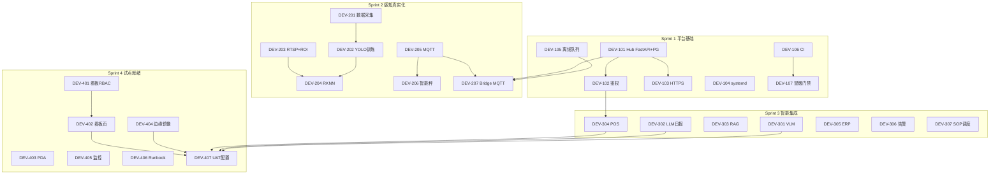

# Sprint 1~4 任务 Backlog

**Phase 1 开发 · Jira / Linear 导入模板**

| 项目 | 内容 |
|------|------|
| 版本 | V1.1 |
| 周期 | 12 周（4 Sprint × 3 周） |
| 总工时 | 约 **420 人日**（含缓冲 15%） |
| 关联 | [product_design.md](product_design.md) · [user_story_map.md](user_story_map.md) · [design_dev_implementation_plan.md](design_dev_implementation_plan.md) |

---

## 1. Epic 结构

| Epic ID | 名称 | Sprint | 负责人角色 |
|---------|------|--------|------------|
| EPIC-1 | 平台基础（Hub/边缘/CI） | S1 | 后端 + DevOps |
| EPIC-2 | 感知真实化（CV/IoT） | S2 | 算法 + 嵌入式 |
| EPIC-3 | 智能与集成（VLM/LLM/POS/告警） | S3 | 算法 + 后端 |
| EPIC-4 | 试点就绪（看板/镜像/UAT） | S4 | 前端 + DevOps + PM |
| EPIC-5 | 试点实施（并行） | S2~S4 | 区域 IT + PMO |

---

## 1.1 需求追溯说明（DEV ↔ PRD ↔ US）

| 层级 | 前缀 | 文档 |
|------|------|------|
| 产品功能 | `F-xxx` | [product_design.md](product_design.md) |
| 用户故事 | `US-xxx` | [user_story_map.md](user_story_map.md) |
| 研发任务 | `DEV-xxx` | 本文 |
| 界面组件 | `Frame/Component` | [figma_component_spec.md](figma_component_spec.md) |

**Jira/Linear 自定义字段建议**：`PRD ID`（多选）、`User Story`（链接）、`Figma Frame`

---

## 2. 任务总览（依赖图）



---

## 3. Sprint 1 任务明细（W1~W3）

**Sprint 目标**：Hub 可持久化、可鉴权；边缘可守护、可离线；CI 冒烟门禁。

| ID | 标题 | PRD | US | 负责人 | 人日 | 依赖 | 优先级 | SP |
|----|------|-----|-----|--------|------|------|--------|-----|
| DEV-101 | Hub FastAPI 重构 + PostgreSQL 事件表 | — | US-070 | 后端 A | 8 | — | P0 | 8 |
| DEV-102 | JWT/API Key 鉴权 + store_id 租户隔离 | — | US-071 | 后端 A | 5 | DEV-101 | P0 | 5 |
| DEV-103 | HTTPS staging 部署模板（docker-compose） | — | — | DevOps | 3 | DEV-101 | P0 | 3 |
| DEV-104 | 边缘 systemd 单元 + 健康检查端点 | F-H01 | US-070 | 嵌入式 | 3 | — | P0 | 3 |
| DEV-105 | SQLite 离线事件队列 + 恢复同步 | — | US-072 | 嵌入式 | 5 | DEV-104 | P0 | 5 |
| DEV-106 | GitLab CI：ruff + pytest + 构建 | — | — | DevOps | 3 | — | P0 | 3 |
| DEV-107 | run_poc.sh 纳入 CI 冒烟门禁 | — | — | 测试 | 2 | DEV-106 | P0 | 2 |

**Sprint 1 合计**：29 人日 · 29 SP

### DEV-101 验收标准
- [ ] `/v1/events` POST 写入 PostgreSQL，重启不丢
- [ ] `/v1/stores/{id}/summary` 与 PoC `/summary` 字段兼容
- [ ] OpenAPI 文档可访问
- [ ] 单元测试覆盖 CRUD ≥5 用例

### DEV-102 验收标准
- [ ] 无 Token 请求返回 401
- [ ] store_A Token 无法读写 store_B 数据
- [ ] 边缘 API Key 与看板 JWT 双通道

### DEV-105 验收标准
- [ ] Hub 不可达时事件写入 SQLite
- [ ] 恢复后 5min 内自动补传
- [ ] 断网 24h 不丢事件（压测脚本验证）

---

## 4. Sprint 2 任务明细（W4~W6）

**Sprint 目标**：RTSP 实时桌态；真实 IoT 接入；RKNN 边缘推理 v1。

| ID | 标题 | PRD | US | 负责人 | 人日 | 依赖 | 优先级 | SP |
|----|------|-----|-----|--------|------|------|--------|-----|
| DEV-201 | 试点店视频采集 + 标注规范文档 | F-T01 | US-073 | 算法 A | 5 | IMP-201 | P0 | 5 |
| DEV-202 | 桌态 YOLO v1 训练 + mAP 评测 | F-T01 | US-010, US-073 | 算法 A | 10 | DEV-201 | P0 | 13 |
| DEV-203 | RTSP 拉流 + ROI 标定 CLI | F-T01 | US-010 | 算法 B | 8 | — | P0 | 8 |
| DEV-204 | RKNN 转换 + RK3588 端到端集成 | F-T01,F-T02 | US-073 | 算法 B + 嵌入式 | 8 | DEV-202, DEV-203 | P0 | 8 |
| DEV-205 | MQTT IoTAgent（温湿度/门磁） | F-K01,F-K02 | US-020, US-021 | 嵌入式 | 5 | DEV-101 | P0 | 5 |
| DEV-206 | 收货智能秤协议对接（1 厂商） | F-P02,F-C01 | US-051 | 嵌入式 | 8 | DEV-205 | P0 | 8 |
| DEV-207 | ingredient_bridge 接 MQTT 真实读数 | F-K03 | US-022 | 嵌入式 | 5 | DEV-205, DEV-101 | P0 | 5 |
| IMP-201 | 试点店摄像头 RTSP 就绪（施工） | F-T01 | US-073 | 区域 IT | — | — | P0 | — |

**Sprint 2 合计**：49 人日 · 52 SP

### DEV-202 验收标准
- [ ] 验证集 mAP@0.5 ≥ 85%
- [ ] 四态（空/用餐/待清/待结）混淆矩阵输出
- [ ] 误报率 <10%（试点店抽样 100 帧）

### DEV-204 验收标准
- [ ] RK3588 单路推理 ≥15 FPS
- [ ] 桌态事件 1s 内写入 Hub
- [ ] 模型文件版本号可配置

### DEV-206 验收标准
- [ ] 秤重读数 3s 内入 Hub
- [ ] 与 PO 重量字段对齐（kg，2 位小数）
- [ ] 断连重连自动恢复

---

## 5. Sprint 3 任务明细（W7~W9）

**Sprint 目标**：VLM/LLM 生产 API；POS/ERP 打通；告警推送；SOP 自动调度。

| ID | 标题 | PRD | US | 负责人 | 人日 | 依赖 | 优先级 | SP |
|----|------|-----|-----|--------|------|------|--------|-----|
| DEV-301 | VLM 来料质检 API（Qwen-VL/GPT-4V） | F-C03,F-P05 | US-041 | 算法 A | 8 | DEV-101 | P0 | 8 |
| DEV-302 | LLM 日报 API + prompt + JSON schema | F-R01,F-R02,F-C04 | US-063 | 算法 A | 5 | DEV-101 | P0 | 5 |
| DEV-303 | SOP RAG 知识库 MVP | F-S07 | — | 算法 B | 8 | DEV-302 | P1 | 8 |
| DEV-304 | POS Webhook 最小集（1 平台） | F-T03 | US-012, US-013 | 后端 B | 10 | DEV-102, IMP-301 | P0 | 10 |
| DEV-305 | ERP PO 拉取 API | F-C01,F-P01 | US-040, US-050 | 后端 B | 8 | DEV-101, IMP-302 | P0 | 8 |
| DEV-306 | 企微/钉钉告警网关 | F-A03,F-A04,F-K04 | US-023, US-061, US-062 | 后端 A | 5 | DEV-101 | P0 | 5 |
| DEV-307 | SOP APScheduler 午/晚市自动跑 | F-S01,F-S03 | US-030 | 后端 A | 3 | DEV-101, DEV-207 | P0 | 3 |
| IMP-301 | POS 厂商 API 开通与测试账号 | F-T03 | US-013 | IT + 产品 | — | — | P0 | — |
| IMP-302 | ERP PO 接口联调窗口 | F-C01,F-P01 | US-050 | 采购 + IT | — | — | P0 | — |

**Sprint 3 合计**：47 人日 · 47 SP（不含 IMP）

### DEV-301 验收标准
- [ ] 输入截图 → 输出 A/B/C/D + 理由 + 置信度
- [ ] P95 延迟 <10s
- [ ] 截图存档 OSS，关联 batch_id

### DEV-304 验收标准
- [ ] 结账 Webhook 1min 内更新桌态
- [ ] 桌号映射与 ROI table_id 一致
- [ ] 失败重试 + 死信日志

### DEV-306 验收标准
- [ ] critical 告警 30s 内推送到店长
- [ ] 告警含 store、类型、时间、跳转链接
- [ ] 支持 ack 回调

---

## 6. Sprint 4 任务明细（W10~W12）

**Sprint 目标**：生产看板；边缘镜像；监控；玉环/椒江 2 店 UAT 配置包；Runbook。

| ID | 标题 | PRD | US | Figma | 负责人 | 人日 | 依赖 | 优先级 | SP |
|----|------|-----|-----|-------|--------|------|------|--------|-----|
| DEV-401 | 看板登录 + RBAC（店长/督导/总部） | — | US-071 | Web/Login | 前端 | 5 | DEV-102 | P0 | 5 |
| DEV-402 | 看板七模块分页 | F-H~F-R | US-001~060 | Web/* | 前端 | 10 | DEV-401 | P0 | 10 |
| DEV-403 | 收货 PDA 签字 H5 MVP | F-P01~P06 | US-033,050~053 | PDA/Recv-* | 前端 | 5 | DEV-102, DEV-301 | P0 | 5 |
| DEV-404 | 边缘预配置镜像 v1.0（一键刷机） | — | US-072 | — | DevOps + 嵌入式 | 8 | DEV-204, DEV-105 | P0 | 8 |
| DEV-405 | Prometheus + Grafana 基础大盘 | F-H01 | — | — | DevOps | 5 | DEV-103 | P1 | 5 |
| DEV-406 | 试点部署 Runbook + 培训课件 | — | — | — | PM + 后端 | 3 | 全部 DEV | P0 | 3 |
| DEV-407 | 2 店 UAT 配置包（玉环/椒江 ROI/MQTT/账号） | F-T01 | US-073 | — | 后端 + 算法 | 5 | DEV-402, DEV-404 | P0 | 5 |
| IMP-401 | 2 店现场施工 + 刷机 + 联调（玉环/椒江） | — | — | — | 区域 IT | — | DEV-404 | P0 | — |
| IMP-402 | Go-Live 验收（10 项 P0） | MVP 全部 P0 | US-001~063 | — | PMO | — | DEV-407 | P0 | — |

**Sprint 4 合计**：41 人日 · 41 SP

### DEV-404 验收标准
- [ ] 全新 RK3588 刷机 ≤30min 完成
- [ ] 导入店级 config 后自动连 Hub + RTSP
- [ ] 含 CV/IoT/Queue 全部 systemd 服务

### DEV-407 验收标准
- [ ] 玉环 + 椒江各 1 份 config.json + ROI + MQTT topic 表
- [ ] staging 全链路跑通 24h
- [ ] 店长/督导测试账号可用

---

## 7. 并行实施任务（EPIC-5）

与开发 Sprint 2 起并行，不阻塞 DEV 但影响 UAT。

| ID | 标题 | 负责人 | 窗口 | 依赖 |
|----|------|--------|------|------|
| IMP-101 | 确定玉环 + 椒江 2 家试点店 + PMO/IT 任命 | PMO | T-12 周 | 立项批准 |
| IMP-102 | 基线数据采集（7 天） | 店长 | T-10 周 | IMP-101 |
| IMP-103 | 硬件总部统采下单 | 总部 IT | T-10 周 | IMP-101 |
| IMP-201 | 摄像头/IoT 现场施工 | 区域 IT | S2 | IMP-103 |
| IMP-301 | POS API 开通 | IT | S3 前 | IMP-101 |
| IMP-302 | ERP PO 接口联调 | 采购+IT | S3 前 | IMP-101 |
| IMP-401 | 2 店部署刷机（玉环/椒江） | 区域 IT | S4 | DEV-404 |
| IMP-402 | Go-Live + 4 周 KPI 观测 | PMO | S4 后 | DEV-407 |

详见 [pilot_deployment_checklist_direct.md](pilot_deployment_checklist_direct.md) · [franchise](pilot_deployment_checklist_franchise.md)

---

## 8. 人力负载（按 Sprint）

| 角色 | S1 | S2 | S3 | S4 | 12 周合计 |
|------|----|----|----|----|-----------|
| 后端 A | 13d | 2d | 16d | 5d | ~36d |
| 后端 B | — | — | 18d | — | ~18d |
| 算法 A | — | 15d | 13d | 2d | ~30d |
| 算法 B | — | 16d | 8d | — | ~24d |
| 嵌入式 | 8d | 18d | — | 8d | ~34d |
| 前端 | — | — | — | 20d | ~20d |
| DevOps | 6d | — | — | 13d | ~19d |
| 测试 | 2d | 3d | 3d | 5d | ~13d |
| PM/产品 | 2d | 2d | 3d | 8d | ~15d |

---

## 9. Jira 导入 CSV

可直接导入文件：[tools/sprint_backlog_jira.csv](tools/sprint_backlog_jira.csv)（含 **PRD ID**、**User Story** 列）

在 Jira **External System Import → CSV** 导入，并映射自定义字段 `PRD ID`、`User Story`。

```csv
Summary,Issue Type,Epic Name,Story Points,Priority,Labels,Sprint,Description,Acceptance Criteria
DEV-101 Hub FastAPI重构与PostgreSQL,Story,EPIC-1平台基础,8,P0,hub;backend,Sprint 1,将event_hub从http.server迁移至FastAPI+PostgreSQL,事件持久化;OpenAPI;重启不丢数据
DEV-102 JWT与API Key鉴权,Story,EPIC-1平台基础,5,P0,security;hub,Sprint 1,门店租户隔离与双通道认证,401无Token;跨店隔离;边缘Key+看板JWT
DEV-103 HTTPS staging部署,Story,EPIC-1平台基础,3,P0,devops,Sprint 1,docker-compose staging含TLS,staging HTTPS可访问
DEV-104 边缘systemd守护,Story,EPIC-1平台基础,3,P0,edge,Sprint 1,CV/IoT/Queue systemd单元,崩溃自启;health端点
DEV-105 SQLite离线队列,Story,EPIC-1平台基础,5,P0,edge,Sprint 1,断网缓存与恢复同步,24h不丢;恢复5min补传
DEV-106 GitLab CI流水线,Story,EPIC-1平台基础,3,P0,devops;ci,Sprint 1,ruff+pytest+build,每MR自动跑
DEV-107 run_poc冒烟门禁,Story,EPIC-1平台基础,2,P0,test,Sprint 1,CI集成run_poc.sh,失败阻断合并
DEV-201 视频采集与标注规范,Story,EPIC-2感知真实化,5,P0,cv;data,Sprint 2,试点店5000+框标注,规范文档;数据集交付
DEV-202 桌态YOLO v1训练,Story,EPIC-2感知真实化,13,P0,cv;ml,Sprint 2,四态检测模型,mAP>=85%
DEV-203 RTSP拉流与ROI标定,Story,EPIC-2感知真实化,8,P0,cv;rtsp,Sprint 2,VideoIngest+CLI,多路RTSP;ROI配置
DEV-204 RKNN RK3588集成,Story,EPIC-2感知真实化,8,P0,cv;rknn,Sprint 2,边缘NPU推理,>=15FPS;1s入Hub
DEV-205 MQTT IoTAgent,Story,EPIC-2感知真实化,5,P0,iot,Sprint 2,温湿度门磁接入,3s入Hub
DEV-206 智能秤协议对接,Story,EPIC-2感知真实化,8,P0,iot;scale,Sprint 2,1厂商收货秤,重量对齐PO
DEV-207 Bridge接MQTT,Story,EPIC-2感知真实化,5,P0,iot,Sprint 2,全链路真实输入,lifecycle JSON真实
DEV-301 VLM来料质检API,Story,EPIC-3智能集成,8,P0,vlm,Sprint 3,A/B/C/D分级,P95<10s;截图存档
DEV-302 LLM日报API,Story,EPIC-3智能集成,5,P0,llm,Sprint 3,替代rule模式,结构化JSON输出
DEV-303 SOP RAG知识库,Story,EPIC-3智能集成,8,P1,llm;rag,Sprint 3,PDF转向量问答,MVP可问SOP
DEV-304 POS Webhook对接,Story,EPIC-3智能集成,10,P0,integration;pos,Sprint 3,最小集订单结账,1min更新桌态
DEV-305 ERP PO拉取,Story,EPIC-3智能集成,8,P0,integration;erp,Sprint 3,成本真实PO,收货前PO同步
DEV-306 企微钉钉告警,Story,EPIC-3智能集成,5,P0,alert,Sprint 3,分级推送,critical 30s送达
DEV-307 SOP定时调度,Story,EPIC-3智能集成,3,P0,sop,Sprint 3,午晚市自动跑,报告按时生成
DEV-401 看板登录RBAC,Story,EPIC-4试点就绪,5,P0,frontend;auth,Sprint 4,店长督导总部账号,三级权限
DEV-402 看板四业务页,Story,EPIC-4试点就绪,10,P0,frontend,Sprint 4,桌态SOP成本告警,5s轮询或WS
DEV-403 收货PDA H5,Story,EPIC-4试点就绪,5,P1,frontend;pda,Sprint 4,电子验收签字,MVP可用
DEV-404 边缘预配置镜像,Story,EPIC-4试点就绪,8,P0,edge;devops,Sprint 4,一键刷机,30min完成
DEV-405 Prometheus Grafana,Story,EPIC-4试点就绪,5,P1,devops;monitor,Sprint 4,基础大盘,Hub/边缘指标
DEV-406 试点Runbook,Story,EPIC-4试点就绪,3,P0,docs,Sprint 4,部署培训手册,IT可独立部署
DEV-407 2店UAT配置包(玉环/椒江),Story,EPIC-4试点就绪,5,P0,uat,Sprint 4,ROI/MQTT/账号,staging 24h通过
IMP-101 确定试点店,Task,EPIC-5试点实施,0,P0,impl,Parallel,玉环+椒江选址与任命,PMO签字
IMP-102 基线数据采集,Task,EPIC-5试点实施,0,P0,impl,Parallel,7天基线,模板提交
IMP-103 硬件统采,Task,EPIC-5试点实施,0,P0,impl,Parallel,BOM下单,到货清单
IMP-201 现场施工,Task,EPIC-5试点实施,0,P0,impl,Sprint 2,摄像头IoT安装,RTSP稳定24h
IMP-301 POS API开通,Task,EPIC-5试点实施,0,P0,impl,Sprint 3,测试账号,Webhook可用
IMP-302 ERP联调窗口,Task,EPIC-5试点实施,0,P0,impl,Sprint 3,PO接口,测试PO拉取
IMP-401 2店刷机联调(玉环/椒江),Task,EPIC-5试点实施,0,P0,impl,Sprint 4,现场部署,Go-Live就绪
IMP-402 Go-Live验收,Task,EPIC-5试点实施,0,P0,impl,Sprint 4,10项P0,4周KPI观测
```

---

## 10. Linear 批量创建模板

在 Linear 中创建 **Project: Hotpot Smart Ops Phase 1**，按 Epic 建 Milestone，逐条创建 Issue。字段建议：

| Linear 字段 | 填法 |
|-------------|------|
| **Team** | Engineering |
| **Project** | Hotpot Phase 1 Pilot |
| **Milestone** | Sprint 1 / 2 / 3 / 4 |
| **Priority** | P0 → Urgent；P1 → High |
| **Labels** | hub, cv, iot, llm, vlm, edge, frontend, devops, impl |
| **Estimate** | 见上表 SP（1 SP ≈ 1 人日） |
| **Blocked by** | 见 §2 依赖图 |

### Linear 描述模板（复制到每个 Issue）

```markdown
## 背景
[链接 design_dev_implementation_plan.md 对应章节]

## 任务
- [ ] ...

## 验收标准
- [ ] ...

## 依赖
- Blocked by: DEV-xxx

## 产出物
- 代码路径 / 文档 / 配置
```

### Linear 批量 JSON（API / 脚本参考）

```json
{
  "project": "Hotpot Phase 1 Pilot",
  "issues": [
    {
      "id": "DEV-101",
      "title": "Hub FastAPI 重构 + PostgreSQL",
      "priority": 1,
      "estimate": 8,
      "labels": ["hub", "backend"],
      "milestone": "Sprint 1",
      "blockedBy": []
    },
    {
      "id": "DEV-102",
      "title": "JWT/API Key 鉴权 + store 隔离",
      "priority": 1,
      "estimate": 5,
      "labels": ["hub", "security"],
      "milestone": "Sprint 1",
      "blockedBy": ["DEV-101"]
    }
  ]
}
```

完整 36 条见 [tools/linear_import.json](tools/linear_import.json)（含 `prdIds`、`userStories`、`figmaFrames`）。

---

## 12. 需求追溯矩阵（DEV ↔ PRD ↔ US）

| DEV | Sprint | PRD | User Story | Figma Frame |
|-----|--------|-----|------------|-------------|
| DEV-101 | S1 | — | US-070 | — |
| DEV-102 | S1 | — | US-071 | — |
| DEV-104 | S1 | F-H01 | US-070 | — |
| DEV-105 | S1 | — | US-072 | — |
| DEV-201~204 | S2 | F-T01,F-T02 | US-010, US-073 | Web/Tables |
| DEV-205 | S2 | F-K01,F-K02 | US-020, US-021 | Web/Kitchen |
| DEV-206 | S2 | F-P02,F-C01 | US-051 | PDA/Recv-Step2 |
| DEV-207 | S2 | F-K03 | US-022 | Web/Kitchen |
| DEV-301 | S3 | F-C03,F-P05 | US-041 | PDA/Recv-Step4 |
| DEV-302 | S3 | F-R01,F-R02 | US-063 | Web/Report |
| DEV-304 | S3 | F-T03 | US-012, US-013 | Web/Tables |
| DEV-305 | S3 | F-C01,F-P01 | US-040, US-050 | Web/Cost, PDA/Recv-Step1 |
| DEV-306 | S3 | F-A03,F-A04,F-K04 | US-023, US-061, US-062 | Push/Alert-* |
| DEV-307 | S3 | F-S01,F-S03 | US-030 | Web/SOP |
| DEV-401 | S4 | — | US-071 | Web/Login |
| DEV-402 | S4 | F-H02~F-R02 等 | US-001~060 | Web/* |
| DEV-403 | S4 | F-P01~P06 | US-033,050~053 | PDA/Recv-* |
| DEV-407 | S4 | F-T01 | US-073 | — |

完整 PRD 列表见 [product_design.md §5](product_design.md#5-功能规格feature-prd) · 用户故事见 [user_story_map.md §4](user_story_map.md#4-release-1-用户故事详表可进-jiralinear)

---

## 13. Sprint 仪式建议

| 仪式 | 频率 | 时长 | 参与 |
|------|------|------|------|
| Sprint Planning | 每 3 周初 | 2h | 全员 |
| Daily Standup | 每日 | 15min | 研发 |
| Sprint Review | 每 3 周末 | 1h | 研发 + PMO + 产品 |
| Retro | 每 3 周末 | 45min | 研发 |
| 实施同步 | 每周 | 30min | 研发 + 区域 IT |

**Definition of Done（DoD）**：
- 代码合并 main + CI 绿
- 验收标准全勾
- 相关文档/API 更新
- staging 可演示

---

## 14. 版本记录

| 版本 | 日期 | 说明 |
|------|------|------|
| V1.1 | 2026-06-12 | 增加 PRD/US/Figma 追溯列 + §12 矩阵 |
| V1.0 | 2026-06-12 | 初版：Sprint 1~4 + Jira CSV + Linear 模板 |
