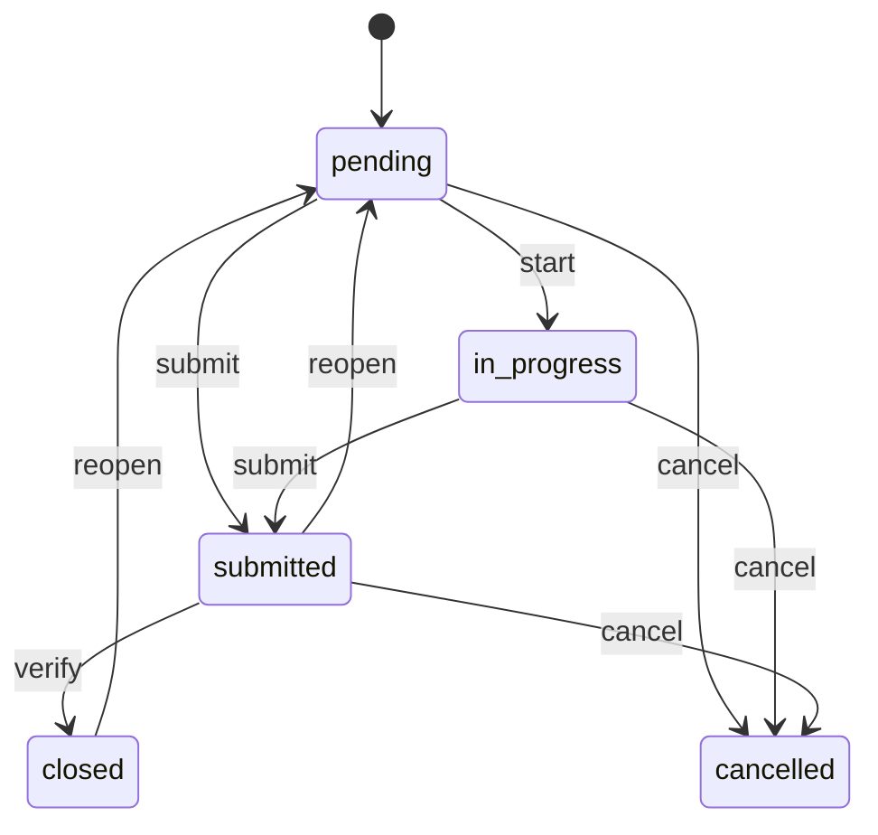

# 任务督办引擎设计

**F-TASK · P1.5 轻量任务内核**

| 项目 | 内容 |
|------|------|
| 版本 | V1.1 |
| 更新 | 2026-06-16 |
| 关联 | [org_hierarchy_coverage_assessment.md](org_hierarchy_coverage_assessment.md) · [architecture_decisions.md](architecture_decisions.md) ADR-010 |

---

## 1. 设计目标

把 SOP 违规、翻台督促、告警跟进、来料异常统一成一个轻量任务内核，解决“有异常但没人闭环”的组织执行缺口。

F-TASK **不是** Phase 1 的完整 L3 工作流中台：

- 不做 Admin 工作流编排器
- 不做跨区域复杂审批
- 不替代 BL-01~08
- 不作为 IMP-402 Go-Live 前置，除非范围缩小为 DEV-421 的兼容替代

---

## 2. 状态模型

### 2.1 主状态

| 状态 | 含义 |
|------|------|
| `pending` | 已创建/待处理 |
| `in_progress` | 处理中 |
| `submitted` | 执行人已提交，待复核 |
| `closed` | 复核通过并关闭 |
| `cancelled` | 取消，不再要求处理 |

### 2.2 SLA 派生标记

`overdue` 与 `escalated` 不是主状态，而是由 SLA 计算得到的派生标记：

| 标记 | 计算 |
|------|------|
| `overdue` | `now > due_at` 且主状态不在 `closed/cancelled` |
| `escalated` | `overdue` 超过升级阈值，或 critical 超时未 ack |

这样可同时表达 `submitted + overdue`、`in_progress + escalated`，避免状态互斥。

---

## 3. 权限边界

| 操作 | 允许角色 | 规则 |
|------|----------|------|
| `create` | 店长、厨师长、区域督导、总部 PMO、系统规则 | 必须有 `store_id/ref_type/ref_id` |
| `start/submit` | assignee、店长、班组长 | assignee 优先，代提交需审计 |
| `verify/close` | 店长、区域督导、总部 PMO | 不能由原提交人自审自关 |
| `reopen` | 店长、区域督导、总部 PMO | 仅 `submitted/closed`；必须 reason |
| `cancel` | 创建人、店长、区域督导 | `closed` 后仅 admin override |
| `reassign` | 店长、班组长、区域督导、总部 PMO | 必须写 task_event 和 SLA 策略 |

`finance_audit` 永远只读；`marketing_ops` 只管理 F-SALES 任务/规则；`shift_lead` 只能在本店范围内督促和转派。

---

## 4. Reassign 与 SLA

重新指派必须显式选择 SLA 策略，禁止隐式重置：

| 策略 | 含义 | 使用场景 |
|------|------|----------|
| `reset_from_reassign` | 从重新指派时间按模板重算 `due_at` | 原 assignee 错误、任务误派 |
| `keep_original_due_at` | 保留原截止时间 | 真实逾期追责、交接处理 |

每次 reassign 写入：

- `task_events.event_type = 'reassign'`
- `from_assignee`
- `to_assignee`
- `sla_policy`
- `old_due_at`
- `new_due_at`
- `reason`

---

## 5. 数据模型

### 5.1 tasks

| 字段 | 说明 |
|------|------|
| `task_id` | PK |
| `store_id` | 最小租户隔离 |
| `task_type` | `sop_violation` / `table_turnover` / `alert_followup` / `receiving_exception` / `sales_action` |
| `ref_type` | `ops_event` / `sop` / `table` / `alert` / `receiving_batch` |
| `ref_id` | 业务对象 ID；从旧 `event_id` 迁移 |
| `title` | 展示标题 |
| `assignee` | 责任人；可为空但需标记 triage |
| `assignee_status` | `assigned` / `needs_triage` / `unassigned` |
| `created_by` | 从旧 `assigned_by` 迁移 |
| `status` | 主状态 |
| `due_at` | SLA 截止时间 |
| `priority` | `p0/p1/p2` |
| `created_at/updated_at/closed_at` | 时间戳 |

### 5.2 task_events

| 字段 | 说明 |
|------|------|
| `event_id` | PK |
| `task_id` | FK |
| `event_type` | create/start/submit/verify/reopen/cancel/reassign/comment |
| `actor` | 操作人 |
| `from_status/to_status` | 状态变更 |
| `payload` | reason、SLA 策略、截图、备注 |
| `created_at` | 审计时间 |

---

## 6. sop_assignments 迁移

### 6.1 状态映射

| `sop_assignments.status` | `tasks.status` |
|--------------------------|----------------|
| `open` | `pending` |
| `done` | `submitted` |
| `verified` | `closed` |

### 6.2 字段映射

| 旧字段 | 新字段 |
|--------|--------|
| `assignment_id` | `source_id` + 生成 `task_id` |
| `store_id` | `store_id` |
| `sop_id` | `ref_id` 或 `payload.sop_id` |
| `event_id` | `ref_id`，`ref_type='ops_event'` |
| `assigned_by` | `created_by` |
| `assignee` | `assignee` |
| `due_at` | `due_at` |

### 6.3 兼容与校验

迁移脚本必须满足：

- 幂等：同一 `assignment_id` 只能生成一个 task
- 可回滚：保留旧表只读至少一个版本
- 兼容旧 API：`POST /v1/sop/assign` 继续可用，内部写 tasks
- 兼容旧 dashboard 字段：返回层可提供 `sop_assignments` 视图
- 数量校验：迁移前后按 `store_id/status` 对账

缺失 assignee 不可静默随机回填。推荐：

| 场景 | 回填 |
|------|------|
| SOP/后厨上下文 | 厨师长角色队列 |
| 桌态/前厅上下文 | 班组长角色队列 |
| 未知上下文 | 店长角色队列 |

同时设置 `assignee_status='needs_triage'`，在看板显示“待分派”。

---

## 7. P1.5 排期边界

| 内容 | 进入 P1.5 | 不进入 P1.5 |
|------|-----------|-------------|
| task kernel + events | 是 | — |
| SOP 指派兼容 | 是 | — |
| 最小任务列表 UI | 是 | 完整工作流设计器 |
| SLA 派生标记 | 是 | 复杂绩效考核 |
| 企微任务卡片 | 可选 feature flag | 不阻塞 UAT |
| Admin 配置任务模板 | 否 | Phase 2 |

P1.5 必须排在独立泳道，不抢占 BL-01~08 的算法、边缘、IoT、PDA、RBAC 资源。

