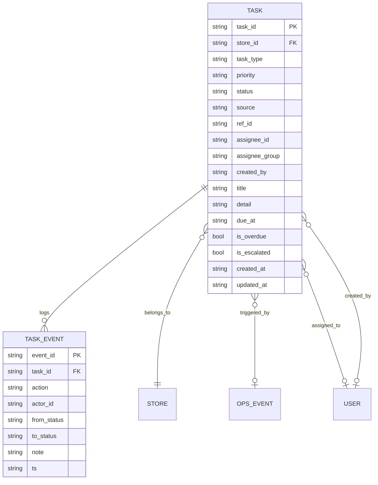
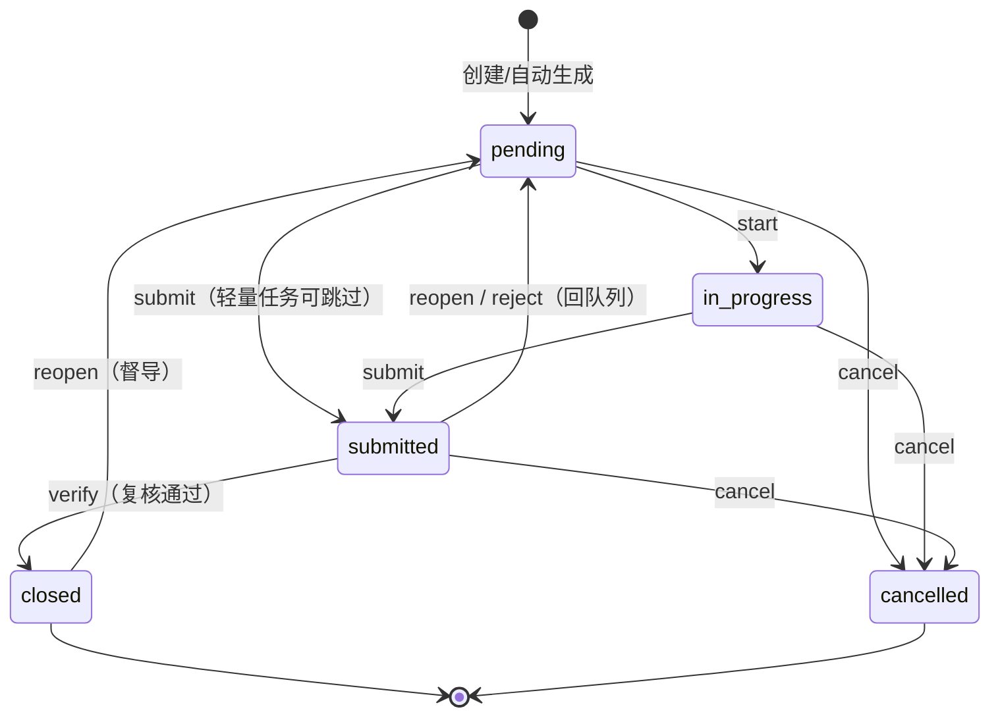
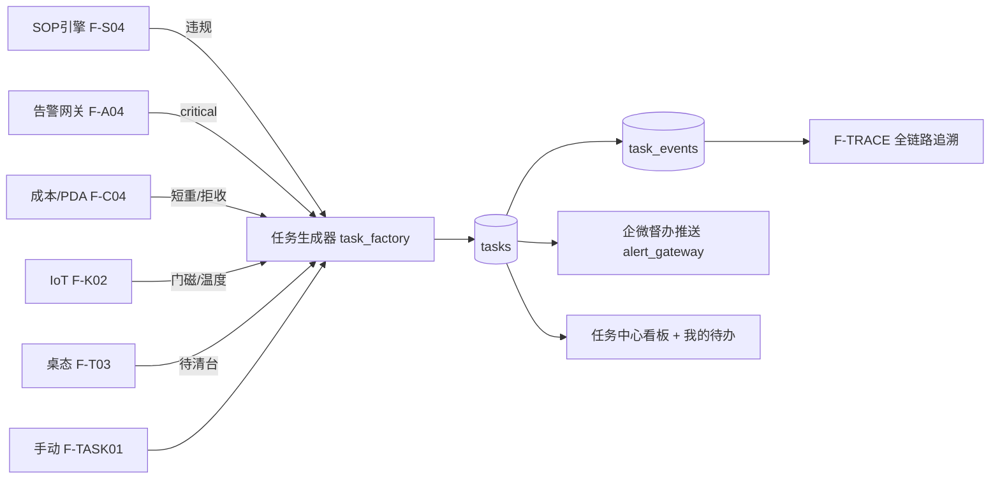

# 任务督办引擎 · 功能族与状态机设计

**冯校长火锅 · 智能运营 · 修正 A（F-TASK 功能族）**

| 项目 | 内容 |
|------|------|
| 版本 | V0.1（草案） |
| 状态 | 待评审（建议进 PM-403 / AR-402） |
| 读者 | 产品 · 架构 · 研发 · PMO |
| 关联 | `product_hierarchy_national_chain.md` §4 · `architecture_decisions.md` ADR-010 · `product_design.md` §5.4 |
| 泛化自 | `cloud/event_hub/sop_assign_store.py`（现有 3 态指派表） |
| 建议 Phase | P1.5（MVP）→ P2（全功能） |
| 更新 | 2026-06-16 |

---

## 1. 为什么要做（问题陈述）

当前"派活"能力**散落在三处、各做各的、且都停在演示级**：

| 现有分散点 | 现状 | 问题 |
|-----------|------|------|
| SOP 违规指派 F-S04 | `sop_assign_store.py` 3 态（open/done/verified） | 只 SOP 用；**无显式责任人**（只有 `assigned_by`）；无优先级/SLA |
| 翻台派保洁 F-T03 | 前端"派保洁"演示按钮 | 不落库、无回执 |
| 整改闭环 F-S06 | Should Have，未实现 | — |
| 安全告警处置 F-A03 | 仅 ack，无后续派办 | ack 了 ≠ 处理完 |

**后果**：店长/督导无法回答"**这件事派给谁了？认领了吗？做完了吗？谁复核的？超时了没？**"——也就是你要的"**班长组长督促 + 每个环节有依可查**"恰恰没有载体。

**目标**：把上述全部收口到**一套统一的工单/督办引擎**，提供"派办 → 认领 → 执行 → 回执 → 复核"的标准闭环，带 SLA、升级、全程留痕。

---

## 2. 设计原则

| # | 原则 | 体现 |
|---|------|------|
| T1 | **一个引擎收口所有派活** | SOP/清台/来料/安全/临时任务都是 `task`，靠 `task_type` 区分 |
| T2 | **责任链可查可追** | 每次状态流转写 `task_events`，不可篡改 |
| T3 | **能自动生成的不让人手建** | 告警/违规/异常自动转工单（人只确认与派办） |
| T4 | **SLA 驱动督办，而非靠人盯** | 超时自动标红 + 升级，呼应推送规则 N-04 |
| T5 | **向后兼容** | 现有 `sop_assignments` 平滑迁移为 `task_type=sop_violation` |
| T6 | **租户隔离** | 所有任务带 `store_id`；上层只读 rollup |

---

## 3. 领域模型

### 3.1 核心实体

### 3.2 任务类型（task_type）

| 类型 | 来源 | 典型场景 | 默认优先级 |
|------|------|----------|-----------|
| `sop_violation` | SOP 引擎 F-S04 | 检查点未过 → 整改 | P1 |
| `cleaning` | 桌态 F-T03 | 待清台 → 派保洁 | P2 |
| `receiving_exception` | 成本/PDA F-C04 | 短重/拒收 → 处理 | P1 |
| `safety_alert` | 告警 F-A04 | 烟雾/燃气/冷链断链 | P0 |
| `iot_anomaly` | IoT F-K02 | 门磁超时/温度异常 | P1 |
| `inspection` | 督导交办 | 区域督导→店长巡检项 | P1 |
| `adhoc` | 手动 | 店长/班组长临时派活 | P2 |

### 3.3 优先级与 SLA

| 优先级 | 含义 | 认领 SLA | 完成 SLA | 升级 SLA |
|--------|------|:--------:|:--------:|:--------:|
| **P0 紧急** | 食安/人身/财产 | 5 min | 30 min | 15 min 未认领即升级 |
| **P1 高** | 运营/成本/合规 | 15 min | 4 h（或班次内） | 30 min 未 ack 升级 |
| **P2 普通** | 一般执行 | 30 min | 班次内 | 不自动升级（看板提醒） |

> SLA 可按 `task_type` 在配置中心覆盖（P2 起，呼应 F-HQ03 阈值 OTA）。

---

## 4. 状态机（核心 · 已与 Codex 调和）

> **融合决策**：采用 Codex 的 **5 个主状态**（更精简、便于 MVP 实现）。原设计的 `draft`（草稿）与 `accepted`（已认领）**降级处理**：`draft` 为可选前态（MVP 不做，手动建直接进 `pending`）；**认领（accept）不再是主状态，而是一个 `task_event`**——这样既简化状态集，又保留"平均认领时长"指标（pending → 首个 accept 事件）。

### 4.1 主生命周期

> `accept`（认领）、`reassign`、`comment` 不改变主状态，仅写 `task_events`；`reopen` 统一回 `pending`（需重新认领，比直接回 in_progress 更稳妥）。

### 4.2 状态定义

| 状态 | 含义 | 谁能推进 | 终态 |
|------|------|----------|:----:|
| `pending` | 已创建/待处理（含待认领、回队列） | 责任人/班组长 | — |
| `in_progress` | 处理中 | 责任人 | — |
| `submitted` | 待复核（已提交回执） | 复核人 | — |
| `closed` | 已复核·闭环 | — | ✅ |
| `cancelled` | 已取消·作废 | 创建人/店长/督导 | ✅ |

**主状态集合（权威）**：`status ∈ {pending, in_progress, submitted, closed, cancelled}`，**互斥且穷尽**；`closed`/`cancelled` 为终态。`draft`（草稿）与 `accepted`（认领）不在主状态集——前者 MVP 不做，后者降为 `task_event`。任何写操作前先校验目标 status 在 §4.4 允许的 from→to 内，否则拒绝（HTTP 409）。

**reopen 规则**：仅 `店长 / 区域督导 / 总部 PMO` 可发起，来源态限 `submitted` 或 `closed`，**必须带 `reason` 且写 `task_events: reopen`**；reopen 后统一回到 `pending`（需重新认领）。
**cancel 规则**：仅 `创建人 / 店长 / 区域督导` 可在**未达终态前**发起；`closed` 后仅 `admin` 例外（带 `admin_override=true`）。cancel 必须带 `reason` 并写 `task_events: cancel`。
**verify 规则（防自审自关）**：`verify/close` 限 `店长 / 区域督导 / 总部 PMO`，且**不能由原提交人自审自关**（提交人 ≠ 复核人）。

### 4.3 叠加状态（overlay，由 SLA 派生，非独立状态）

一个任务可以同时是 `in_progress` 且 `overdue`，因此超时/升级用**派生标记**而非主状态：

| 标记 | 计算规则 | 触发动作 |
|------|----------|----------|
| `is_overdue` | `now > due_at` 且 status ∉ {closed, cancelled} | 看板标红 + 角标 |
| `is_escalated` | `is_overdue` 且超过升级 SLA | 推送上一层级（班组长→店长→督导），写 `task_events: escalated` |

**派生标记查询语义（权威）**：`is_overdue`/`is_escalated` **不落库为可写字段**，而是查询/读取时按上式实时计算（或由定时器每 N 分钟物化到只读列供看板筛选）。即：写路径只改主状态与 `due_at`，读路径派生标记；二者不互相覆盖。看板筛选 `?overdue=true` = `status ∉ 终态 AND now>due_at`。

> 这样设计避免"超时态/升级态"与处理态互斥的建模错误，也让一条任务"做着做着超时了"能被正确表达。

### 4.4 动作 → 流转对照表

| 动作 action | from → to | 权限 | 写 task_event |
|-------------|-----------|------|:-------------:|
| `create` | ∅ → pending | 创建者/系统 | ✅ |
| `assign` | pending → pending（变更 assignee） | 店长/班组长/督导 | ✅ |
| `accept`（不改主状态） | — | 责任人 | ✅ 记录认领时刻 |
| `start` | pending → in_progress | 责任人 | ✅ |
| `submit` | pending/in_progress → submitted | 责任人 | ✅ |
| `verify`（复核通过） | submitted → closed | 店长/督导/PMO（≠提交人） | ✅ |
| `reject`（复核驳回） | submitted → pending | 复核人 | ✅ |
| `reassign`（不改主状态） | — | 店长/班组长/督导/PMO | ✅ 必写 + 变更 assignee + 应用 SLA policy |
| `cancel` | pending/in_progress/submitted → cancelled | 创建人/店长/督导（closed 后仅 admin） | ✅ 必带 reason |
| `reopen` | submitted/closed → pending | 店长/督导/PMO | ✅ 必带 reason |
| `escalate`（系统） | overlay | system | ✅ |

> `accept`/`reassign` 不改变主状态，只写 `task_events`；`平均认领时长` = pending → 首个 `accept` 事件。

**§4.4-R · reassign 的 SLA 策略（必须显式，避免 SLA 被刷或统计不一致）**：
字段 `sla_policy ∈ {reset_from_reassign, keep_original_due_at}`：
- `reset_from_reassign`：从重新指派时间按模板重算 `due_at`（适合原 assignee 错误、任务误派）。
- `keep_original_due_at`：保留原 `due_at`（适合真实逾期追责、仅换执行人/交接）。
默认 `keep_original_due_at`；每次 reassign 写 `task_events`（`event_type=reassign` + `from_assignee` + `to_assignee` + `sla_policy` + `old_due_at`）。**禁止隐式重置 due_at**。

---

## 5. 功能规格（F-TASK 功能族）

优先级：**P0** MVP 必做 · **P1** 强烈建议 · **P2** 二期

| ID | 功能 | 优先级 | 用户故事 | 验收标准 |
|----|------|--------|----------|----------|
| F-TASK01 | 工单创建（手动） | P0 | 作为**班组长**，我想手动派一个临时任务给组员，**以便**安排现场活 | 选类型/责任人/优先级/截止 → 生成 pending 工单 |
| F-TASK02 | 自动生单 | P0 | 作为**系统**，我想把违规/告警/短重自动转工单，**以便**不漏派 | 触发事件 → 按 `task_type` 建 pending 工单 + 关联 `ref_id` |
| F-TASK03 | 派办 / 改派 | P0 | 作为**店长**，我想把工单派给某人或某班组，**以便**明确责任人 | assign/reassign 写 `assignee_id` 或 `assignee_group` |
| F-TASK04 | 认领 | P0 | 作为**责任人**，我想认领派给我的工单，**以便**接手 | accept 事件（不改主状态）；超认领 SLA 未认领进升级队列 |
| F-TASK05 | 执行回执 | P0 | 作为**责任人**，我想提交处理结果（文字/照片），**以便**复核 | submit 写 `detail` + 可选附图 → submitted |
| F-TASK06 | 复核 | P0 | 作为**店长/督导**，我想复核回执通过或驳回，**以便**闭环 | verify→closed（≠提交人）；reject→pending |
| F-TASK07 | SLA 与超时督办 | P0 | 作为**店长**，我想超时工单自动标红并升级，**以便**督促 | is_overdue 标红；超升级 SLA 推上级 |
| F-TASK08 | 任务中心看板 | P0 | 作为**店长**，我想一页看本店所有工单及状态，**以便**统筹 | 列表 + 状态/类型/责任人筛选 + 看板视图 |
| F-TASK09 | 我的任务（移动端） | P0 | 作为**组员**，我想在手机看我的待办，**以便**随时处理 | H5 我的待办 Tab，可认领/回执 |
| F-TASK10 | 督办推送 | P1 | 作为**责任人**，我想被派单/超时时收企微提醒，**以便**不遗漏 | 派单/认领超时/升级三类企微卡片 |
| F-TASK11 | 任务时间线 | P1 | 作为**督导**，我想看一条任务从派到关的全程，**以便**追责 | 渲染 `task_events` 时间线 |
| F-TASK12 | 班组/区域 rollup | P1 | 作为**督导**，我想看跨店工单按时完成率，**以便**对标 | 区域聚合：未关闭数、超时数、平均闭环时长 |

---

## 6. 角色与权限

### 6.1 新增角色（边界细化 · Codex 评审二次补充）

| 角色 | role_id | data_scope | 可做 | 不可做 |
|------|---------|------------|------|--------|
| **班组长** | `shift_lead` | **store**（本店·本班组，权限 < 店长） | 桌态查看、任务 ack/认领/回执/reassign（本组） | 收货提交（PDA submit）、任何 admin 写、跨店 |
| **营销/运营岗** | `marketing_ops` | region / zone / national（默认 region） | 写 F-SALES 规则/内容、看增收看板 | 改 SOP/阈值、用户管理、任务 ack/复核 |
| **财务/审计岗** | `finance_audit` | **store/region/national 只读** | 看成本/追溯/日报/audit | ack / reassign / cancel / 任何写操作 |

> `shift_lead` 直接补上"**班长组长督促**"层。三角色均须**同步落到实现层**（见 §6.3），否则文档与代码不一致。

### 6.1b 角色计数与命名归一（Codex 评审 · 已调和）

以**实际代码**为准归一：
- 当前实现 `DEMO_USERS` 共 **7 个角色，且不含「加盟业主」**（含 CEO/集团决策者）；
- 「加盟业主」是 **P3 规划角色**，进入加盟 SaaS 简版时再纳入 `rbac.json`——**Phase 1/2 不强行补入**（修正之前"立即补入"的说法，采 Codex 口径）。

**归一动作**：文档统一表述为"现 7 角色（不含加盟业主）+ 本次新增 3（shift_lead/marketing_ops/finance_audit）"；CEO 命名统一为 `exec_viewer`/集团决策者；加盟业主标注 P3，不计入当前 `rbac.json`。文档角色清单与 `rbac.json` 条目逐一对齐。

### 6.3 实现层同步清单（新增 3 角色必须一并改）

| 落点 | 改动 |
|------|------|
| `cloud/event_hub/auth.py` `DEMO_USERS` | 增 shift_lead/marketing_ops/finance_audit 演示账号 |
| `auth.py` `data_scope_for_role` | 映射三角色 scope（store/region/national） |
| `dashboard/assets/rbac.json` | 增三角色菜单/操作矩阵 + 补 `加盟业主` |
| 后端 `can_write_store` / `can_read_store` | 纳入三角色判定（finance_audit 只读、marketing_ops 不写门店） |
| PRD 角色矩阵 | 同步三角色行 |

### 6.2 任务权限矩阵

| 操作 | 班组长 | 店长 | 领班 | 厨师长 | 收货员 | 督导 | 加盟业主 |
|------|:------:|:----:|:----:|:------:|:------:|:----:|:--------:|
| 创建/派办 | ✓ | ✓ | ✓(前厅) | ✓(后厨) | — | ✓(交办) | — |
| 认领/回执 | ✓ | ✓ | ✓ | ✓ | ✓ | — | — |
| 复核 | ✓(本组) | ✓ | — | ✓(后厨) | — | ✓ | — |
| 改派 | ✓ | ✓ | — | — | — | ✓ | — |
| 取消 | — | ✓ | — | — | — | ✓ | — |
| 重开 | — | — | — | — | — | ✓ | — |
| 跨店看 | — | — | — | — | — | ✓ | 本店只读 |

---

## 7. 数据模型

### 7.1 `tasks` 表（泛化自 sop_assignments）

| 字段 | 类型 | 说明 |
|------|------|------|
| `task_id` | TEXT PK | `T-{store}-{YYYYMMDD}-{6hex}` |
| `source_id` | TEXT UNIQUE | 幂等键；迁移时 = 旧 `assignment_id`（杜绝重复迁移） |
| `store_id` | TEXT | 租户隔离键 |
| `task_type` | TEXT | §3.2 七类 |
| `priority` | TEXT | P0/P1/P2 |
| `status` | TEXT | §4.2 主状态（5 态） |
| `source` | TEXT | auto / manual |
| `ref_type` / `ref_id` | TEXT | 关联 OpsEvent / 批次 / SOP 检查点类型与 id |
| `assignee_id` | TEXT | 责任人（**新增，原表缺**；可空，配合 `assignee_status`） |
| `assignee_status` | TEXT | `assigned` / `needs_triage`（迁移或无主时）/ `unassigned` |
| `assignee_group` | TEXT | 班组（前厅/后厨/保洁） |
| `created_by` | TEXT | 派办人 |
| `sla_policy` | TEXT | `reset_from_reassign` / `keep_original_due_at`（默认后者，见 §4.4-R） |
| `title` / `detail` | TEXT | 标题 / 详情+回执 |
| `due_at` | TEXT | 截止时间（按 SLA 计算） |
| ~~`is_overdue` / `is_escalated`~~ | — | **不落库为可写字段**，读时派生（见 §4.3）；可选物化为只读列供筛选 |
| `created_at` / `updated_at` | TEXT | ISO 时间戳（迁移时保留原值，不以迁移时间覆盖） |

### 7.2 `task_events` 表（审计/追溯，对应 T2）

| 字段 | 说明 |
|------|------|
| `event_id` PK · `task_id` FK · `event_type` · `actor_id` · `from_status` · `to_status` · `from_assignee` · `to_assignee` · `sla_policy` · `old_due_at` · `note` · `ts` |

`event_type ∈ {create, start, submit, verify, reject, reopen, cancel, accept, reassign, escalate, comment}`。

> 每一次流转一行，永不更新——这就是"**每个环节有依可查**"的物理载体，也是 F-TRACE（修正 C）的数据源之一。

### 7.3 与现有表的迁移映射

| 旧 `sop_assignments` | 新 `tasks` |
|----------------------|-----------|
| `status=open` | `pending`（未派给具体人时） |
| `status=done` | `submitted` |
| `status=verified` | `closed` |
| `sop_name` | `title` |
| `assigned_by` | `created_by` |
| `event_id` | `ref_id`（task_type=sop_violation） |

迁移脚本：`scripts/migrate_sop_assign_to_tasks.py`（一次性 + 双写过渡期）。

**迁移硬性要求（Codex 评审 + 二次融合）**：
1. **幂等**：脚本可重复执行，以旧 `assignment_id` 作 **`source_id`** 派生稳定 `task_id`，重跑不产生重复行（UPSERT by `source_id`）。
2. **唯一 source 映射**：`tasks.source_id` 唯一索引，保证 1:1，杜绝重复迁移。
3. **数量校验**：迁移前后比对 `count(sop_assignments)` 与 `count(tasks where task_type=sop_violation)`，并对 status 分布做断言；不一致则回滚并报错。
4. **API/看板向后兼容（双保险）**：① 保留旧 `/v1/sop/assign`、`/v1/sop/assignments`、`PUT .../status` 端点作为**适配层**代理到 `/v1/tasks/*`；② 返回层提供 **`sop_assignments` 兼容视图**（把 tasks 投影回旧字段），dashboard 旧调用与旧字段均不破。
5. **缺失 assignee 回填策略**（不静默塞随机用户）：
   - 后厨/SOP 类 → 回填责任角色 `chef`（厨师长）；
   - 上下文未知 → `store_manager`；
   - 一律置 `assignee_status='needs_triage'`，并进入**显式待清理队列**（看板"待分派"分组暴露），由店长二次确认真正责任人。

| 旧 `sop_assignments` 字段 | 处理 |
|------|------|
| `assignment_id` | → `source_id`（幂等键） |
| `assigned_by` | → `created_by` |
| `event_id` | → `ref_id`（task_type=sop_violation） |
| 无显式 `assignee` | 按上述策略回填 + `needs_triage` 标记 |
| `note` | 并入 `tasks.detail` |
| `created_at/updated_at` | 原样保留，不以迁移时间覆盖 |

---

## 8. API 设计（/v1/tasks）

延续现有 `/v1` 约定与 `store_id` 强制。

| 方法 | 路径 | 权限 | 说明 |
|------|------|------|------|
| POST | `/v1/tasks` | task:create | 创建（手动或系统） |
| GET | `/v1/tasks` | task:read | 列表，支持 `?status=&type=&assignee=&overdue=` |
| GET | `/v1/tasks/{id}` | task:read | 详情 + 时间线 |
| POST | `/v1/tasks/{id}/assign` | task:assign | 派办/改派 |
| POST | `/v1/tasks/{id}/accept` | task:accept | 认领 |
| POST | `/v1/tasks/{id}/start` | task:accept | 开始 |
| POST | `/v1/tasks/{id}/submit` | task:accept | 回执 |
| POST | `/v1/tasks/{id}/review` | task:review | `{result: pass\|reject}` |
| POST | `/v1/tasks/{id}/cancel` | task:cancel | 取消 |
| POST | `/v1/tasks/{id}/reopen` | task:reopen | 重开 |
| GET | `/v1/region/tasks/overview` | scope:region | 区域 rollup（F-TASK12） |

**鉴权**：复用 ADR-009 `data_scope` 中间件；写操作校验角色 + 本店/本组 scope。
**实现落点**：`cloud/event_hub/task_store.py`（泛化 `sop_assign_store.py`）+ `app.py` 路由组。

---

## 9. 与现有系统的收口（关键集成点）

| 现有功能 | 收口方式 |
|----------|----------|
| F-S04 SOP 违规指派 | 改为生成 `sop_violation` 工单（淘汰独立 3 态） |
| 翻台派保洁 | 生成 `cleaning` 工单，替换演示按钮 |
| F-A04 告警 ack | ack 后可"转工单"派处置（ack≠完结） |
| F-C04 拒收建议 | 生成 `receiving_exception` 工单 |
| F-S06 整改闭环 | 直接由本引擎实现，不再单列 |

---

## 10. 督办推送（企微卡片，新增 3 类）

延续 `push_notification_templates.md` 风格与规则 N-04（30min 未处理升级）。

| 卡片 | 触发 | 收件人 |
|------|------|--------|
| **派单卡** `【任务】{store} · {title}` | assign | 责任人 |
| **认领超时升级卡** `【督办】{title} 超 {sla} 未认领` | 认领 SLA 超时 | 班组长→店长 |
| **完成超时升级卡** `【超时】{title} 已逾期 {mins}min` | 完成 SLA 超时 | 上一层级 |

> P0 安全类工单走 critical 通道（N-01 30s 必达）；P2 默认仅看板（呼应 N-05）。

---

## 11. 指标与埋点

### 11.1 与北极星的关系

现北极星"有效告警处理率"是**ack 率**；工单引擎让它进化为**真正的"处置闭环率"**——ack 只是认领，closed 才算处理完。

### 11.2 工单健康指标

| 指标 | 定义 | Phase 1.5 目标 |
|------|------|----------------|
| 按时完成率 | due_at 前 closed / 总数 | >85% |
| 平均认领时长 | pending→首个 accept 事件 | P0<5min |
| 平均闭环时长 | created→closed | 按类型分档 |
| 超时升级率 | escalated / 总数 | <10% |
| 督办闭环率 | closed / (closed+cancelled+逾期未关) | >90% |

### 11.3 埋点事件

`task_create` · `task_accept` · `task_submit` · `task_review` · `task_escalate`（属性含 task_type, priority, duration, store_id）。

---

## 12. 分阶段交付

> **P1.5 排期门禁（Codex 评审二次补充 · 重要）**
> "2~3 周"仅在范围收窄为 **轻量任务内核 + SOP 兼容路径 + 最小 UI 改动** 时成立。约束：
> - **不抢 BL 资源**：BL-01~08 为 Go-Live P0（约 48 工程人日 + PM），F-TASK **不得**占用算法/边缘/IoT/PDA/RBAC 工程资源。
> - **非 Go-Live 前置**：F-TASK 仅作为 **feature-flag**（默认关）或独立的设计/基础设施泳道并行推进，**不纳入 IMP-402 前置条件**。
> - **依赖门槛**：先完成 **BL-05（签字/ack 持久化）与 BL-07（RBAC 按角色）基础能力**，再把 F-TASK 作为 feature-flagged P1.5 落地。
> - **唯一例外**：若把范围缩小到**只替代 DEV-421**（签字持久化那一小块），方可考虑并入 UAT 窗口。

| 阶段 | 范围 | DEV | 验收 |
|------|------|-----|------|
| **P1.5 MVP**（feature-flag，非 Go-Live 前置） | tasks/task_events 表 · 状态机 · F-TASK01~09 · SOP/清台/告警三类收口 | DEV-520~524 | 店长能派/组员能认领回执/店长能复核；超时标红；**flag 关闭时不影响 UAT 主流程** |
| **P2 全功能** | SLA 升级推送 · F-TASK10~12 · 区域 rollup · 配置中心 SLA OTA · strict 鉴权 | DEV-525~528 | 跨店督办对标；30s 升级推送；审计可查 |
| **P3 增强** | 任务模板库 · 周期任务（巡检排程）· 与排班/考勤桥接 | — | — |

---

## 13. DEV 追溯

| DEV | 内容 | Phase | 依赖 |
|-----|------|-------|------|
| DEV-520 | `task_store.py` + 表 + 迁移脚本 | P1.5 | sop_assign_store |
| DEV-521 | 状态机 + `/v1/tasks/*` 路由 | P1.5 | DEV-520 |
| DEV-522 | task_factory 自动生单（SOP/告警/清台） | P1.5 | DEV-521, F-S04, F-A04 |
| DEV-523 | 任务中心看板页 `dashboard/tasks.html` | P1.5 | DEV-521 |
| DEV-524 | 移动端"我的待办" | P1.5 | DEV-521 |
| DEV-525 | SLA 计算 + 超时升级调度 | P2 | DEV-521 |
| DEV-526 | 企微督办三卡片 | P2 | DEV-525, alert_gateway |
| DEV-527 | 区域 rollup `/v1/region/tasks/overview` | P2 | DEV-521, F-HQ06 |
| DEV-528 | `shift_lead` 角色 + 权限矩阵入库 | P2 | DEV-503(RBAC) |

---

## 14. ADR-010 草案（待 AR-402 拍板）

> **ADR-010：统一任务督办引擎，泛化 SOP 指派**
>
> - **背景**：派活能力散落 SOP/翻台/告警三处，无显式责任人、无 SLA、无统一追溯。
> - **决策**：以 `tasks` + `task_events` 建统一工单引擎；`sop_assignments` 迁移为 `task_type=sop_violation`；超时/升级用派生标记而非独立状态。
> - **后果**：F-S04/F-S06/翻台派保洁全部收口；新增 `shift_lead` 角色；P1.5 出 MVP，P2 接 SLA 升级与区域 rollup。
> - **备选（未采纳）**：继续各模块各自指派 → 否（无法统一追溯与督办）。

---

## 15. 验收勾选（MVP）

- [ ] 手动 + 自动均可生成工单，带责任人与优先级
- [ ] 状态机 5 主态流转正确，非法流转被拒
- [ ] 每次流转写入 `task_events`，时间线可查
- [ ] 超时工单 is_overdue 标红、进升级队列
- [ ] 责任人手机可见待办、可认领回执
- [ ] 店长/督导可复核通过或驳回，闭环可统计
- [ ] SOP 违规/清台/告警三类已收口到本引擎
- [ ] `sop_assignments` 迁移无数据丢失

---

*本设计为修正 A 草案，配套修正 B（增收）/C（追溯）/E（角色补全）见《组织架构覆盖度评估与修正建议》。*
