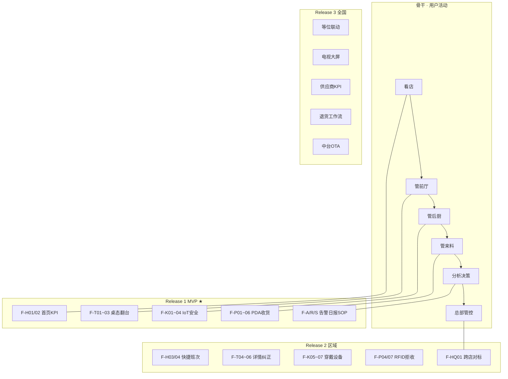

# 用户故事地图（User Story Map）

**冯校长火锅智能运营 · Phase 1**

| 项目 | 内容 |
|------|------|
| 关联 PRD | [product_design.md](product_design.md) |
| 关联 Backlog | [sprint_task_backlog.md](sprint_task_backlog.md) |
| 方法 | Jeff Patton Story Mapping |
| 更新 | 2026-06-12 |

---

## 1. 地图总览

**骨干（Backbone）**：用户活动从左到右 = 时间/流程顺序  
**切片（Release Slice）**：从上到下 = 优先级（Release 1 = MVP）

```
                    感知运营          前厅执行        后厨执行        来料验收        分析决策        总部管控
                    ────────          ────────        ────────        ────────        ────────        ────────
Release 3 (全国)    │ 会员联动        │ 等位预测      │ 电视大屏      │ 供应商KPI     │ 区域narrative │ OTA/中台
Release 2 (区域)    │ 服务SLA         │ 桌态纠正      │ 穿戴CV        │ RFID追溯      │ 历史日报      │ 跨店对标
Release 1 (MVP) ★   │ 连接/KPI        │ 桌态+翻台     │ IoT+SOP       │ PDA收货       │ 告警+日报     │ —
PoC (已完成)        │ 单页summary     │ 8桌演示       │ IoT摘要       │ 成本JSON      │ rule日报      │ —
```

---

## 2. 完整故事地图（按角色 × 活动）

### 2.1 店长（Store Manager）

| 用户活动 → | **看店** | **管前厅** | **管后厨** | **管成本** | **收尾** |
|------------|----------|------------|------------|------------|----------|
| **用户任务** | 知道系统在线 | 提升翻台 | 保食安合规 | 控来料偏差 | 看日报派整改 |
| | | | | | |
| **Release 1** | F-H01 设备状态 | F-T03 翻台建议 | F-K04 安全告警 | F-C02 偏差高亮 | F-R01 自动日报 |
| | F-H02 KPI 卡片 | F-T01 桌态图 | F-S03 合规率 | F-C01 批次列表 | F-A03 告警 ack |
| | | F-T02 实时刷新 | F-K01 冷链 | F-C04 拒收建议 | F-S04 违规清单 |
| **Release 2** | F-H04 班次切换 | F-T06 桌态纠正 | F-K05 穿戴告警 | F-C05 出成率 | F-R04 历史日报 |
| | F-H03 快捷入口 | F-T04 单桌详情 | F-S06 整改闭环 | | F-R05 区域对标 |
| **Release 3** | 多店切换 | F-T07 等位联动 | 大屏模式 | F-C06 供应商榜 | 自动派工单 |

---

### 2.2 前厅领班（Floor Lead）

| 用户活动 → | **午晚高峰** | **清台** | **响应告警** |
|------------|--------------|----------|--------------|
| **Release 1** | F-T01 看哪桌待清 | F-T03 优先级列表 | F-A04 企微推送 |
| | F-T02 5s 刷新 | | F-A03 确认处理 |
| **Release 2** | F-T05 VLM 清台分 | F-T06 误识别纠正 | F-A06 静默降频 |
| **Release 3** | 等位屏联动 | 保洁任务自动派 | — |

---

### 2.3 厨师长（Head Chef）

| 用户活动 → | **收货** | **保存** | **加工** | **SOP** |
|------------|----------|----------|----------|---------|
| **Release 1** | F-P02 秤重 | F-K01 温湿度 | F-K03 全链路 | F-S01 SOP 列表 |
| | F-P05 VLM 质检 | F-K02 门磁 | F-K06 解冻温度 | F-S02 检查点 |
| | F-P06 签字 | | | F-S03 合规率 |
| **Release 2** | F-P04 RFID | F-K07 设备在线 | | F-S07 RAG 问答 |
| | F-P07 拒收流 | | | F-S06 整改闭环 |
| **Release 3** | | | | F-S08 SOP OTA |

---

### 2.4 收货员（Receiver）

| 用户活动 → | **选 PO** | **称重测温** | **留证** | **提交** |
|------------|-----------|--------------|----------|----------|
| **Release 1** | F-P01 选批次 | F-P02 自动称重 | F-P05 拍照分级 | F-P06 双人签字 |
| | | F-P03 探针温度 | | |
| **Release 2** | 扫码 PO | F-P04 RFID | F-P07 拒收拍照 | |
| **Release 3** | — | 多 SKU 批量 | OCR 标签 | 对接退货单 |

---

### 2.5 区域督导（Regional Supervisor）

| 用户活动 → | **巡店（虚拟）** | **抓异常** | **对标** |
|------------|------------------|------------|----------|
| **Release 1** | 登录看单店 | F-A02 过滤 critical | — |
| | | F-S04 违规清单 | |
| **Release 2** | 多店列表 | F-A05 升级未 ack | F-HQ01 跨店看板 |
| | | F-S06 整改复核 | F-R04 历史日报 |
| **Release 3** | 移动端督导 App | 自动异常店清单 | F-R05 narrative |

---

### 2.6 总部 PMO

| 用户活动 → | **定标准** | **看全国** | **推版本** |
|------------|------------|------------|------------|
| **Release 2** | — | F-HQ01 对标 | F-HQ02 SOP OTA |
| | | | F-HQ03 阈值配置 |
| **Release 3** | 供应商政策 | F-HQ04 供应商 KPI | F-HQ05 模型 OTA |

---

## 3. 可视化故事地图（Mermaid）



---

## 4. Release 1 用户故事详表（可进 Jira/Linear）

格式：**As a / I want / So that** + PRD ID + Dev ID

### 4.1 看店

| ID | 用户故事 | PRD | Dev |
|----|----------|-----|-----|
| US-001 | 作为**店长**，我想在首页看到 Hub 和边缘是否在线，**以便**确认系统可用 | F-H01 | DEV-402 |
| US-002 | 作为**店长**，我想一眼看到严重告警数、待清台、SOP 率、成本偏差，**以便**判断今日运营健康度 | F-H02 | DEV-402 |

### 4.2 管前厅

| ID | 用户故事 | PRD | Dev |
|----|----------|-----|-----|
| US-010 | 作为**领班**，我想在平面图上看每桌四态颜色，**以便**快速定位待清桌 | F-T01 | DEV-202, DEV-402 |
| US-011 | 作为**领班**，我想桌态每 5 秒自动刷新，**以便**不用手动刷页面 | F-T02 | DEV-402 |
| US-012 | 作为**领班**，我想看到翻台优先 Top5 及理由，**以便**安排保洁顺序 | F-T03 | DEV-304, DEV-402 |
| US-013 | 作为**领班**，我想结账后 1 分钟内桌态更新，**以便**翻台建议准确 | F-T03 | DEV-304 |

### 4.3 管后厨

| ID | 用户故事 | PRD | Dev |
|----|----------|-----|-----|
| US-020 | 作为**厨师长**，我想实时看冷冻/冷藏温湿度，**以便**预防断链 | F-K01 | DEV-205, DEV-402 |
| US-021 | 作为**厨师长**，我想冷库门开太久收到告警，**以便**及时关门 | F-K02 | DEV-205, DEV-306 |
| US-022 | 作为**厨师长**，我想看来料→保存→加工三阶段状态，**以便**定位异常环节 | F-K03 | DEV-207, DEV-402 |
| US-023 | 作为**店长**，我想燃气/烟雾事件 30 秒内推送到手机，**以便**立即处置 | F-K04 | DEV-306 |

### 4.4 SOP

| ID | 用户故事 | PRD | Dev |
|----|----------|-----|-----|
| US-030 | 作为**厨师长**，我想看本班 7 套 SOP 及合规率，**以便**知道哪里没过 | F-S01~S03 | DEV-307, DEV-402 |
| US-031 | 作为**厨师长**，我想展开看每个检查点通过/失败，**以便**针对性整改 | F-S02 | DEV-402 |
| US-032 | 作为**店长**，我想对违规项指派责任人，**以便**闭环可追踪 | F-S04 | DEV-402 |
| US-033 | 作为**收货员**，我想在 PDA 上对关键项电子签字，**以便**验收可追溯 | F-S05 | DEV-403 |

### 4.5 来料与成本

| ID | 用户故事 | PRD | Dev |
|----|----------|-----|-----|
| US-040 | 作为**厨师长**，我想看今日来料批次与 PO 偏差，**以便**发现短重 | F-C01~C02 | DEV-305, DEV-402 |
| US-041 | 作为**收货员**，我想拍照后 10 秒内得到 VLM 品质等级，**以便**快速验收 | F-C03 | DEV-301, DEV-403 |
| US-042 | 作为**厨师长**，我想看系统拒收建议及理由，**以便**决定是否退货 | F-C04 | DEV-301, DEV-302 |

### 4.6 收货 PDA

| ID | 用户故事 | PRD | Dev |
|----|----------|-----|-----|
| US-050 | 作为**收货员**，我想从今日 PO 列表选批次，**以便**开始验收 | F-P01 | DEV-305, DEV-403 |
| US-051 | 作为**收货员**，我想秤重自动填入无需手输，**以便**提速并减少错误 | F-P02 | DEV-206, DEV-403 |
| US-052 | 作为**收货员**，我想录探针温度，**以便**冷链货合规 | F-P03 | DEV-403 |
| US-053 | 作为**厨师长**，我想验收完成后电子签字，**以便**双人确认 | F-P06 | DEV-403 |

### 4.7 告警与日报

| ID | 用户故事 | PRD | Dev |
|----|----------|-----|-----|
| US-060 | 作为**店长**，我想在告警中心按 critical 过滤，**以便**先处理重要事件 | F-A01~A02 | DEV-402 |
| US-061 | 作为**店长**，我想处理后点确认留痕，**以便**督导知道已处置 | F-A03 | DEV-306, DEV-402 |
| US-062 | 作为**店长**，我想 critical 告警推企微，**以便**不在店也能收到 | F-A04 | DEV-306 |
| US-063 | 作为**店长**，我想每天 22:00 收到 LLM 运营日报，**以便**复盘当天 | F-R01~R02 | DEV-302, DEV-402 |

### 4.8 平台（非界面但支撑故事）

| ID | 用户故事 | PRD | Dev |
|----|----------|-----|-----|
| US-070 | 作为**IT**，我想事件持久化且重启不丢，**以便**数据可信 | — | DEV-101 |
| US-071 | 作为**店长**，我想只有本店的人能看本店数据，**以便**数据安全 | — | DEV-102, DEV-401 |
| US-072 | 作为**IT**，我想断网 24h 事件不丢，**以便**边缘可靠 | — | DEV-105 |
| US-073 | 作为**领班**，我想桌态来自真实摄像头而非 mock，**以便**建议可信 | F-T01 | DEV-202~204 |

**Release 1 合计**：33 条用户故事（US-001 ~ US-073）

---

## 5. 故事优先级矩阵

|  | 高价值 | 低价值 |
|--|--------|--------|
| **低成本** | F-H02, F-T01, F-A01, F-S03（先做） | F-H03 |
| **高成本** | F-P01~06 PDA, DEV-202 CV（必投） | F-T07 等位 |

---

## 6. 概念测试脚本（30min · 试点店长）

| 步骤 | 展示 | 问题 |
|------|------|------|
| 1 | Web/Home KPI | 「早上打开最先关心哪 3 个数？」 |
| 2 | Web/Tables | 「待清桌这样展示够不够用？」 |
| 3 | PDA/Recv 全流程 | 「5 步能否在 3 分钟内完成？」 |
| 4 | Push/Alert | 「这种企微卡片会不会嫌烦？」 |
| 5 | Web/Report | 「日报需要哪 4 章？缺什么？」 |

记录反馈 → 回填 PRD / Figma Changelog

---

## 7. 与 Sprint 的映射

| Release | Sprint | 主要用户故事 |
|---------|--------|--------------|
| 平台支撑 | S1 | US-070~072 |
| 真实感知 | S2 | US-010, US-020~022, US-051, US-073 |
| 智能集成 | S3 | US-012~013, US-023, US-041~042, US-061~063 |
| 产品交付 | S4 | US-001~002, US-030~033, US-040, US-050~053, US-060 |

---

## 8. 文档关系

| 文档 | 用途 |
|------|------|
| [product_design.md](product_design.md) | 功能 PRD（F-xxx） |
| **user_story_map.md（本文）** | 用户故事（US-xxx）与 Release 切片 |
| [figma_component_spec.md](figma_component_spec.md) | 界面组件与 Frame |
| [sprint_task_backlog.md](sprint_task_backlog.md) | 研发任务（DEV-xxx）+ 追溯矩阵 |

---

**维护**：概念测试或 Sprint Review 后，更新 Release 切片与 US 状态。
